# 讲义-day01

## 第一阶段课程介绍

+ **CSS3新特性：2d转换、动画、3d转换**
+ **移动WEB开发-流式布局-京东**
+ **移动WEB开发-flex布局-携程**
+ **移动WEB开发-rem布局-苏宁**
+ **移动WEB开发-响应式布局-阿里百秀**


## 今日课程介绍

+ CSS3-2d转换
+ CSS3-动画
+ CSS3-3d转换


## 一. 2D转换

### 1.1 位移

- 语法：**`transform: translate(x,y);` ** 

- 代码：

  > ```css
  >     .box {
  >       width: 200px;
  >       height: 200px;
  >       background: hotpink;
  >       position: absolute;
  >       top:50%;
  >       left:50%;
  >       /* 位移 */
  >       /* transform: translate(100px,100px); */
  >       /* transform: translate(-100px,-100px); */
  >       /* transform: translate(100px); */
  >       transform: translate(-50%,-50%);
  >      }
  > ```

- 总结：

  1. translate最多设置2个值，第一个值是水平，第二个值是垂直。
  2. translate偏移的位置，参照的是自身原有的位置。
  3. translate若设置负值时，会实现逆方向移动。
  4. 若设置一个值时，只有水平方向有效。
  5. 可以设置百分比，百分比参照的是自身的大小。
  6. 特点：若仅仅只是位移，盒子不会脱标。盒子原有的位置还在标准流中 


### 1.2 旋转

- 语法： **`transform:rotate(角度) ` ** 

- 代码：

  > ```css
  >     .box {
  >       width: 200px;
  >       height: 200px;
  >       background: hotpink;
  >       margin:100px auto;
  >       /* 旋转 */
  >       /* 顺时针旋转45度 */
  >       /* transform: rotate(45deg);   */
  >       /* 逆时针旋转45度 */
  >       /* transform: rotate(-45deg);  */
  >      }
  > ```
  >
  > 

- 总结：

  1. 单位：deg
  2. 正值：顺时针旋转
  3. 负值：逆时针旋转
  4. 图解：
     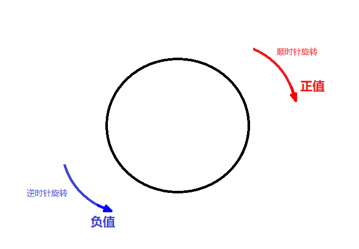

### 1.3  旋转源点设置

- 语法： **`transform-origin: 水平 垂直;` ** 

- 代码：

  > ```css
  >  .box {
  >       transform-origin: left top;
  >  }
  > ```

- 总结：

  1. 默认是按照中心点旋转的
  2. 水平取值：left| center| right |像素
  3. 垂直取值：top | center| bottom|像素

  

### 1.3 缩放

- 语法：**`transform:scale(number,number) `** 

- 代码：

  > ```css
  >     .box {
  >       width: 100px;
  >       height: 100px;
  >       background:hotpink;
  >       margin: 200px auto;
  >       /* 缩放-放大2.5倍数 */
  >       transform: scale(2.5)
  >      }
  > ```
  >
  > 

- 总结：

  1. 最多设置2个值，第一个值表示缩放宽度，第二值表示高度
  2. **缩小：**若设置的值大于0小于1表示缩小
  3. **放大：**若大于1表示放大多少倍
  4. 若设置一个值时，表示宽高一起缩放多少倍。

### 案例

1. **盒子居中** 
   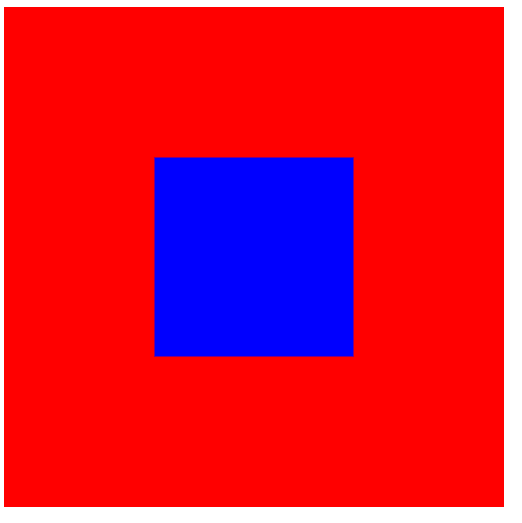

2. **旋转的扑克牌** 
   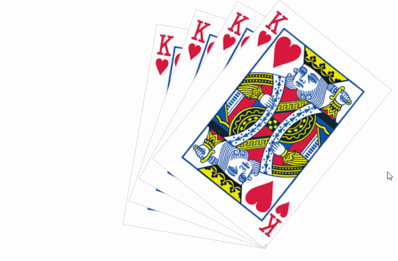

3. **放大的图片** 
   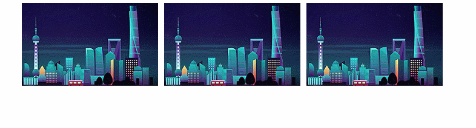

   

4. **分页按钮[作业]**
   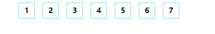
   


## 二. 动画

### 2.1 定义动画（拍电影）

```css
语法:
@keyframes 动画序列名称 {
  from {
      开始状态
  }  
  to {
      结束状态
  }
}
或者
@keyframes 动画序列名称 {
  0%{
      开始状态
  }  
  100%{
      结束状态
  }
}
或者
@keyframes 动画序列名称 {
  0%{
      开始状态
  }
  10%
  .....
  100%{
      结束状态
  }
}
```


### 2.2 调用动画（播放电影）

> | 属性                          | 描述                                                         |
> | :---------------------------- | :----------------------------------------------------------- |
> | @keyframes                    | 定义动画                                                     |
> | **animation-name**            | 规定 @keyframes 动画的名称。                                 |
> | **animation-duration**        | 规定动画完成一个周期所花费的时间。                           |
> | animation-timing-function     | 规定动画的速度曲线。默认是 "ease" 缓冲，linear匀速，steps(数字)步长。 |
> | animation-delay               | 规定动画何时开始。默认是 0。                                 |
> | **animation-iteration-count** | 规定动画被播放的次数。默认是 1。还有 infinite                |
> | animation-direction           | 动画是否在下一周期逆向地播放。默认是 "normal"，alternate逆播放 |
> | animation-play-state          | 规定动画是否正在运行或暂停。默认是 "running"。还有“paused”   |
> | animation-fill-mode           | 规定动画结束后状态，保持 forwards 回到起始 backwards         |
> | **animation**                 | 所有动画属性的简写属性                                       |

+ 简写格式：

  ```
  animation: 动画的名称 动画持续的时间 运动的曲线 延迟时间 动画的次数 是否可以逆播 是否保持结束状态;
  ```

  

### 案例

1. **动画的基本使用**
   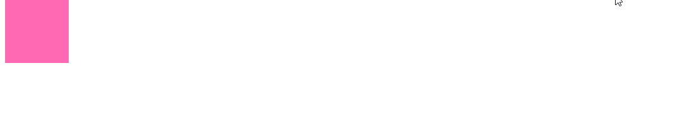

2. **多状态动画** 
   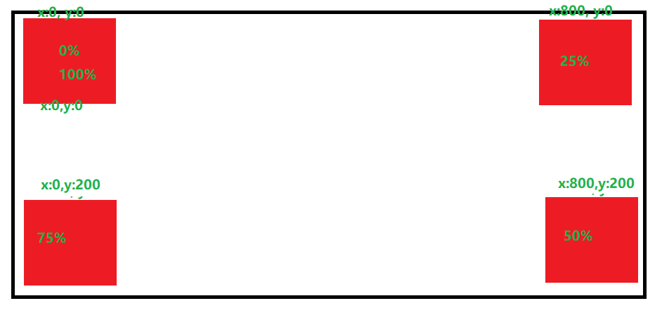
   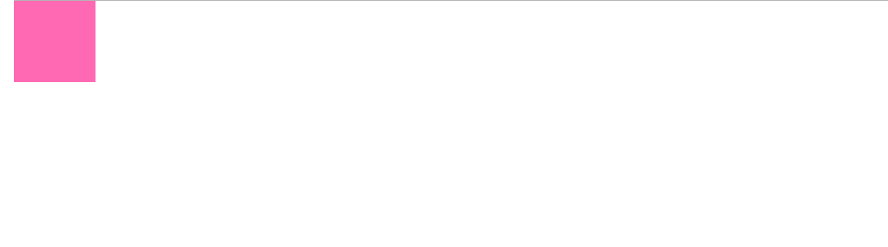


3. **打印文字效果**
   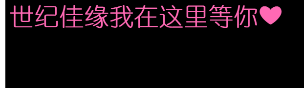

4. **滚动的轮播图**
   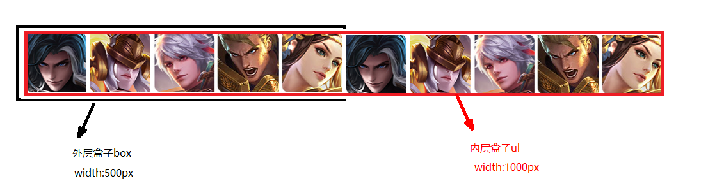
   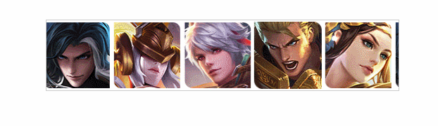

## 三. 3D转换

### 3.1 3D介绍

我们生活的环境是3D的，照片就是3D物体在2D平面呈现的例子。

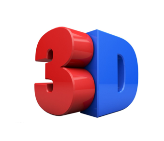

+ 特点：
  + **近大远小**。
  + 物体后面遮挡不可见

当我们在网页上构建3D效果的时候参考这些特点就能产出3D效果。


### 3.2 3维坐标系

三维坐标系其实就是指立体空间，立体空间是由3个轴共同组成的。

**x轴**：水平向右      注意： x 右边是正值，左边是负值 

**y轴**：垂直向下      注意： y 下面是正值，上面是负值

**z轴**：垂直屏幕      注意： 往外面是正值，往里面是负值  

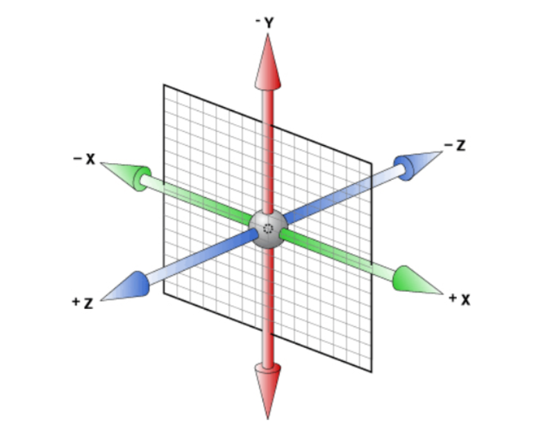


### 3.3 位移

- 语法：

  - **`transform: translateX(100px) `** 
  - **`transform: translateY(100px) `** 
  - **`transform: translateZ(100px) `** ；

- 代码：

  > ```html
  > <style>
  >     * {
  >       margin: 0;
  >       padding: 0;
  >     }
  >     body {
  >       /* 设置3d透视，可以实现近大远小效果 */
  >       perspective: 600px;
  >     }
  >     .box {
  >       width: 200px;
  >       height: 200px;
  >       background: hotpink;
  >       margin:auto;
  >       /* transform: translateX(100px) translateY(100px) translateZ(200px); */
  >       transform:translateZ(-1000px);
  >       
  >       
  > 
  >     }
  > </style>
  > <div class="box"></div>
  > 
  > ```
  >
  > 


### 3.3 透视

- 什么是透视？
  - 透视我们也称为**视距**：视距就是人的眼睛到屏幕的距离

  - 距离视觉点越近的在电脑平面成像越大，越远成像越小  

  - 透视的单位是像素

  - 目的：**实现近大远小的效果**

  - 图解1：在tranlateZ值一样的情况下

    + 视距越大，物体越小
    + 视距越小，物体越大

    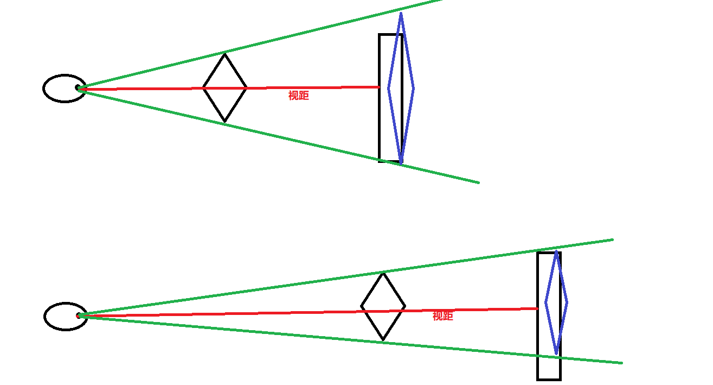
    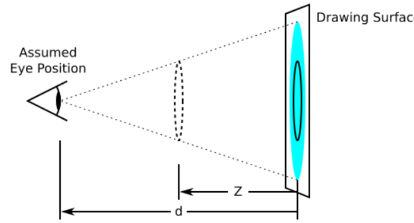

  - 图解2：在视距一致的情况下。

    + translateZ值越大，则物体越大
    + translateZ值越小，则物体越小
      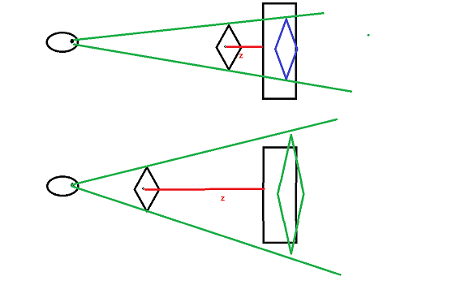

- 语法：**`perspective: 像素值;` **
  - 注意：透视要设置给父元素
- 总结：
  1. 设置3d透视，可以实现**近大远小**效果
  2. 给设置了transform属性元素的上级元素设置透视即可 


### 3.4 旋转

- 语法：

  - transform: rotateX(角度); 
  - transform: rotateY(角度); 
  - transform: rotateZ(角度); 

- 代码：

  > ```css
  >   <style>
  >     body {
  >       text-align: center;
  >       perspective: 1000px;
  >     }
  >     img {
  >       width: 300px;
  >       transition: 2s;
  >       margin-bottom:60px;
  >     }
  >     .x:hover {
  >       transform: rotateX(-100deg);
  >     }
  >     .y:hover {
  >       transform: rotateY(-60deg);
  >     }
  >     .z:hover {
  >      
  >       transform: rotateZ(60deg);
  >     }
  >   </style>
  >   
  >   <br>
  >   
  >   <br>
  >   
  > ```
  >
  > 

- 总结：

  - 对于立方体是由多个盒子旋转和位移组成的，多个盒子需要有一个父盒子
    - 若要显示并且要保持立体空间，需要给父盒子设置样式属性 **`transform-style: preserve-3d; `** 


### 案例

1. 简单的立方体
   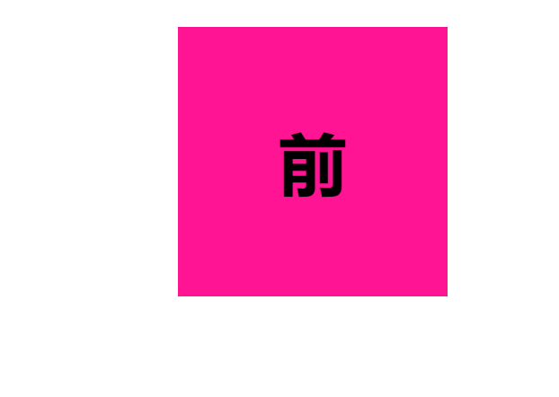
   
2. 复杂的立方体
   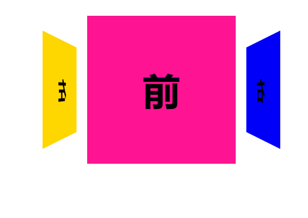
   