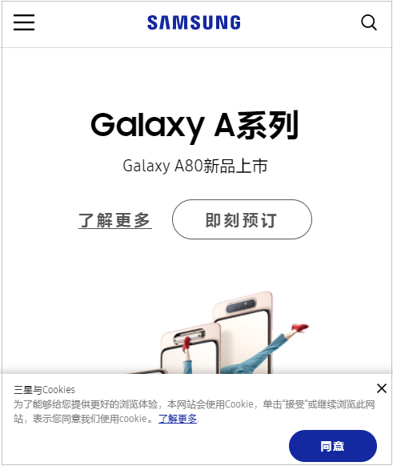
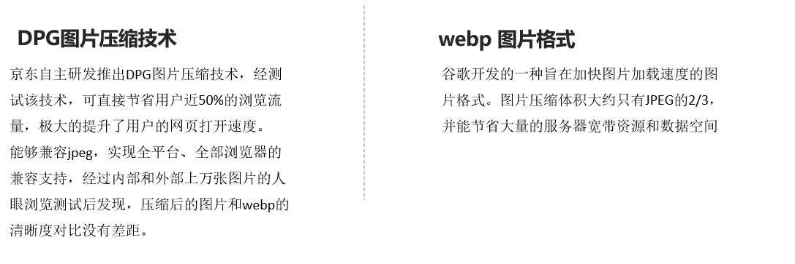

# 移动Web开发之流式布局

## 课程介绍

+ 移动端基础
+  视口 
+  二倍图
+  移动端调试
+  移动端技术解决方案 
+ 移动端常见布局
+  移动端开发之流式布局 
+ 京东移动端首页制作

## 1. 移动端基础

### 1.1 浏览器现状

#### PC端常见浏览器

​	360浏览器、谷歌浏览器、火狐浏览器、QQ浏览器、百度浏览器、搜狗浏览器、IE浏览器。


#### 移动端常见浏览器

​	UC浏览器，QQ浏览器，欧朋浏览器，百度手机浏览器，360安全浏览器，谷歌浏览器，搜狗手机浏览器，猎豹浏览器，以及其他杂牌浏览器。


#### 总结

​	国内的UC和QQ，百度等手机浏览器都是根据Webkit修改过来的内核，国内尚无自主研发的内核，就像国内的手机操作系统都是基于Android修改开发的一样。

​	==兼容移动端主流浏览器，处理Webkit内核浏览器即可== 


### 1.2 手机屏幕现状

+ 移动端设备屏幕尺寸非常多，碎片化严重。
+ Android设备有多种分辨率：480x800, 480x854, 540x960, 720x1280，1080x1920等，还有传说中的2K，4k屏。
+ 近年来iPhone的碎片化也加剧了，其设备的主要分辨率有：640x960, 640x1136, 750x1334, 1242x2208等。
+ 作为开发者无需关注这些分辨率，因为我们常用的尺寸单位是 px 。


### 1.3 移动端常见屏幕尺寸


### 1.4 移动端调试方式

+ ==Chrome DevTools（谷歌浏览器）的模拟手机调试==
+ 搭建本地web服务器，手机和服务器一个局域网内，通过手机访问服务器使用（后续讲解）
+ 外网服务器，直接IP或域名访问（后续讲解）


### 1.5 总结

+ 移动端浏览器我们主要对**webkit内核**进行兼容
+ 我们现在开发的移动端主要针对**手机端** 
+ 开发现在移动端**碎片化比较严重**，**分辨率和屏幕尺寸大小不一**
+ 学会用**谷歌浏览器**模拟手机界面以及调试


## 2. 视口

​	==视口（viewport）==就是浏览器显示页面内容的屏幕区域。 视口可以分为布局视口、视觉视口和**理想视口。** 

### 2.1 布局视口

+ 一般移动设备的浏览器都默认设置了一个布局视口，用于解决早期的PC端页面在手机上显示的问题。
+ iOS, Android基本都将这个视口分辨率设置为 980px，所以PC上的网页大多都能在手机上呈现，只不过元素看上去很小，一般默认可以通过手动缩放网页


### 2.2 视觉视口

+ 字面意思，它是用户正在看到的网站的区域。注意：是网站的区域。
+ 我们可以通过缩放去操作视觉视口，但不会影响布局视口，布局视口仍保持原来的宽度


### 2.3 理想视口

+ 为了使网站在移动端有最理想的浏览和阅读宽度而设定 
+ 理想视口，对设备来讲，是最理想的视口尺寸需要手动添写meta视口标签通知浏览器操作
+ meta视口标签的主要目的：布局视口的宽度应该与理想视口的宽度一致，简单理解就是设备有多宽，我们布局的视口就多宽


### 2.4总结

+ 视口就是浏览器显示页面内容的屏幕区域
+ 视口分为布局视口、视觉视口和**理想视口** 
+ 我们移动端布局想要的是**理想视口就是手机屏幕有多宽，我们的布局视口就有多宽**
+ 想要理想视口，我们需要给我们的移动端页面添加**meta视口标签** 


### 2.5 meta标签配置视口

+ 配置方式

  ```html
  <meta name="viewport" content="width=device-width, user-scalable=no,initial-scale=1.0, maximum-scale=1.0, minimum-scale=1.0">
  ```

+ 配置解析

  | 属性          | 解释说明                                             |
  | ------------- | ---------------------------------------------------- |
  | width         | 宽度设置的是viewport宽度，可以设置device-width特殊值 |
  | initial-scale | 初始缩放比，大于0的数字                              |
  | maximum-scale | 最大缩放比，大于0的数字                              |
  | minimum-scale | 最小缩放比，大于0的数字                              |
  | user-scalable | 用户是否可以缩放，yes或no（1或0）                    |

+ 标准视口设置

  + 视口宽度和设备保持一致
  + 视口的默认缩放比例1.0
  + 不允许用户自行缩放
  + 最大允许的缩放比例1.0
  + 最小允许的缩放比例1.0


## 3. 二倍图

### 3.1 物理像素&物理像素比

+ 物理像素点指的是屏幕显示的最小颗粒，是物理真实存在的。这是厂商在出厂时就设置好了,比如苹果6\7\8  是  750* 1334
+ 我们开发时候的1px 不是一定等于1个物理像素的
+ PC端页面，1个px 等于1个物理像素的，但是移动端就不尽相同
+ 一个px的能显示的物理像素点的个数，称为物理像素比或屏幕像素比
+ PC端 和 早前的手机屏幕 / 普通手机屏幕:  1CSS像素  =  1 物理像素的
+ Retina（视网膜屏幕）是一种显示技术，可以将把更多的物理像素点压缩至一块屏幕里，从而达到更高的分辨率，并提高屏幕显示的细腻程度


```javascript
/* 1. 什么物理像素？ */
答：屏幕分辨率
/* 2. 什么是开发像素？*/
答：css像素px
/* 3. 开发像素在PC端和屏幕分辨率比例是一致吗？*/
答：一致
/* 4. 开发像素在移动端和屏幕分辨率比例一致吗？*/
答：不一定一致，因为物理像素比可能不一样
/* 5. 什么是物理像素比？*/ 
答：1个物理像素 = 多个开发像素
/* 6. 物理像素比的影响*/
答：
	问题：未来图片在移动端，因为物理像素比的存在，图片可能会放大而失真，影响用户体验
	解决方案：设计素材人员，在设计图片时，以多倍的方式设置
```


### 3.2 多倍图

+ 问题：对于一张 50px * 50px 的图片,在手机 Retina 屏中打开，按照刚才的物理像素比会放大倍数，这样会造成图片模糊
+ 在标准的viewport设置中，使用倍图来提高图片质量，解决在高清设备中的模糊问题
+ 通常使用二倍图， 因为iPhone 6\7\8 的影响,但是现在还存在3倍图4倍图的情况，这个看实际开发公司需求背景图片 注意缩放问题


### 3.3 背景缩放

+ 语法：**==background-size: 背景图片宽度 背景图片高度;==**
+ 单位：像素|百分比|cover|contain;
  + cover把背景图像扩展至足够大，以使背景图像完全覆盖背景区域。
  + contain把图像图像扩展至最大尺寸，以使其宽度和高度完全适应内容区域
  + 百分比，参照背景图所在的盒子大小


## 4. 移动端开发选择

### 4.1 移动端主流方案

+ **单独制作移动端页面（主流）**
  + 京东商城手机版
  + 淘宝触屏版
  + 苏宁易购手机版
  + ....
+ **响应式页面兼容移动端（其次）**
  + 三星手机官网
  + ......


### 4.2 单独移动端页面（主流）

​	通常情况下，网址域名前面加 ==m(mobile)== 可以打开移动端。通过判断设备，如果是移动设备打开，则跳到==移动端页面==。


### 4.3 响应式兼容PC移动端

三星电子官网： www.samsung.com/cn/ ，通过判断屏幕宽度来改变样式，以适应不同终端。

缺点：制作麻烦， 需要花很大精力去调兼容性问题




### 4.4 总结

+ 现在市场常见的移动端开发有 **单独制作移动端页面** 和 **响应式页面 两种方案**
+ 现在市场主流的选择还是**==单独制作移动端页面==**


## 5. 移动端技术解决方案

### 5.1 移动端浏览器

+ 移动端浏览器基本以 webkit 内核为主，因此我们就考虑webkit兼容性问题。
+ 我们可以放心使用 H5 标签和 CSS3 样式。
+ 同时我们浏览器的私有前缀我们只需要考虑添加 webkit 即可


### 5.2 CSS初始化 

+ 移动端 CSS 初始化推荐使用 normalize.css
  + normalize.css：保护了有价值的默认值
  + normalize.css：修复了浏览器的bug
  + normalize.css：是模块化的
  + normalize.css：拥有详细的文档
+ 下载地址：[normalize.css](http://necolas.github.io/normalize.css/)


### 5.3 CSS3 盒子模型

+ 传统模式宽度计算：盒子的宽度 =  CSS中设置的width + border + padding 

+ CSS3盒子模型：盒子的宽度 =  CSS中设置的宽度width 里面包含了 border 和 padding 

+ 也就是说，我们的CSS3中的盒子模型， padding 和 border 不会撑大盒子了

+ 语法：

  ```css
  	/*CSS3盒子模型*/
      box-sizing: border-box;
      /*传统盒子模型*/
      box-sizing: content-box;
  
  ```

+ 传统 or CSS3 ？

  + 移动端可以全部CSS3 盒子模型
  + PC端如果完全需要兼容，我们就用传统模式，如果不考虑兼容性，我们就选择 CSS3 盒子模型


### 5.4 特殊样式

```css
    /*CSS3盒子模型*/
    -webkit-box-sizing: border-box;
    box-sizing: border-box;
    /*点击高亮我们需要清除清除  设置为transparent 完成透明*/
    -webkit-tap-highlight-color: transparent;
    /*在移动端浏览器默认的外观在iOS上加上这个属性才能给按钮和输入框自定义样式*/
    -webkit-appearance: none;
    /*禁用长按页面时的弹出菜单*/
    img,a { -webkit-touch-callout: none; }

```


```css
    a {
      /*点击高亮我们需要清除清除  设置为transparent 完成透明*/
      -webkit-tap-highlight-color: transparent;
    }
    button,input {
       /*在移动端浏览器默认的外观在iOS上加上这个属性才能给按钮和输入框自定义样式*/
      -webkit-appearance: none;
    }
    
    img,a {
        /*禁用长按页面时的弹出菜单*/
       -webkit-touch-callout: none; 
    }
```


## 6. 移动端常见布局

### 6.1 移动端技术选型


### 6.2 流式布局

+ 流式布局，就是**百分比布局**，也称非固定像素布局。 
+ 通过**盒子的宽度设置成百分比**来根据屏幕的宽度来进行伸缩，不受固定像素的限制，内容向两侧填充。
+ 流式布局方式是移动web开发使用的比较常见的布局方式。
+ max-width   最大宽度 （max-height  最大高度）  
+ min-width    最小宽度 （min-height  最小高度）


### 6.3 案例-京东首页

#### 示例图


#### 技术选型

方案：我们采取单独制作移动页面方案

技术：布局采取流式布局


#### 搭建相关文件夹结构


#### 视口设置及样式引入

```html
<meta name="viewport" content="width=device-width, user-scalable=no,         initial-scale=1.0, maximum-scale=1.0, minimum-scale=1.0">

<link rel="stylesheet" href="css/normalize.css">
<link rel="stylesheet" href="css/index.css">
```


#### 常用初始化样式

```css
* {
    margin:0;
    padding:0
}
body {
    margin: 0 auto;
    min-width: 320px;
    max-width: 640px;
    background: #fff;
    font-size: 14px;
    font-family: -apple-system, Helvetica, sans-serif;
    line-height: 1.5;
    color: #666;
}

```


#### 二倍图精灵图使用方式

+ 在firework里面把精灵图等比例缩放为原来的一半
+ 之后根据大小 测量坐标 
+ 注意代码里面background-size也要写： 精灵图原来宽度的一半


#### 图片格式




## 扩展：

+ H5新增标签：
  + H5具有语义的布局标签：
    + header 头部标签
    + footer  底部标签
    + section 区块标签
    + article  文本内容标签
    + aside   侧边标签
    + nav 导航
  + 以往的布局标签：
    + div   `division单词简写` 仅仅具有分割的作用，没有语义。

