# 移动web开发—flex布局

## 课程介绍

+ flex 布局体验  
+ flex 布局原理 
+ flex 布局父项常见属性 
+ flex 布局子项常见属性
+  携程网首页案例制作


## 1. flex布局体验

### 1.1 传统布局 和 flex布局

+ **传统布局**：
  + 兼容性好 
  + 布局繁琐
  + 局限性，不能再移动端很好的布局
+ **flex布局**
  + 操作方便，布局极为简单，移动端应用很广泛
  + PC 端浏览器支持情况较差
  + IE 11或更低版本，不支持或仅部分支持
+ **建议**
  1. 如果是PC端页面布局，我们还是传统布局。
  2. 如果是移动端或者不考虑兼容性问题的PC端页面布局，我们还是使用flex弹性布局


### 1.2 初体验

+ **需求**
  

+ **结构** 

  ```html
    <div>
      <span>1</span>
      <span>2</span>
      <span>3</span>
    </div
  ```

  

## 2. flex布局原理

### 2.1 flex介绍

​	flex 是 flexible Box 的缩写，意为"**弹性布局**"，用来为盒状模型提供最大的灵活性，任何一个容器都可以指定为 flex 布局。

+ 当我们为父盒子设为 flex 布局以后，子元素的 float、clear 和 vertical-align 属性将失效。
+ 伸缩布局 = 弹性布局 = 伸缩盒布局 = 弹性盒布局 =flex布局


### 2.2 布局原理

​	采用 Flex 布局的元素，称为 Flex 容器（flex container），简称"**容器**"。它的所有子元素自动成为容器成员，称为 Flex 项目（flex item），简称"**项目**"。

+ 体验中 div 就是 flex父容器。
+ 体验中 span 就是 子容器 
+ flex项目子容器可以横向排列也可以纵向排列

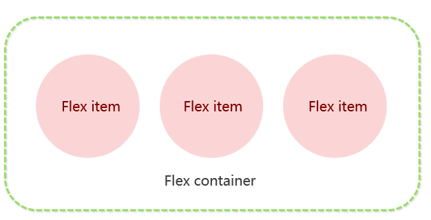

### 2.3 总结

**==布局原理就是通过给父盒子添加flex属性，来控制子盒子的位置和排列方式==**

```css
/*问：如何让一个盒子变成flex容器？*/
答：display:flex
```


## 3. flex 布局父项常见属性

### 3.1 父项属性介绍

+ flex-direction：设置主轴的方向
+ justify-content：设置主轴上的子元素排列方式
+ flex-wrap：设置子元素是否换行  
+ align-content：设置侧轴上的子元素的排列方式（多行）
+ align-items：设置侧轴上的子元素排列方式（单行）
+ flex-flow：复合属性，相当于同时设置了 flex-direction 和 flex-wrap


### 3.2 flex-direction 设置主轴的方向

#### 主轴和侧轴

​	在 flex 布局中，是分为主轴和侧轴两个方向，同样的叫法有 ： 行和列、x 轴和y 轴

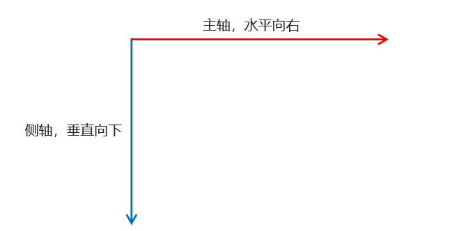

+ 默认主轴方向就是 x 轴方向，水平向右
+ 默认侧轴方向就是 y 轴方向，水平向下


#### 属性值

​	flex-direction 属性**决定主轴的方向**（即项目的排列方向）

​	注意： 主轴和侧轴是会变化的，就看 flex-direction 设置谁为主轴，剩下的就是侧轴。而我们的子元素是跟着主轴来排列的

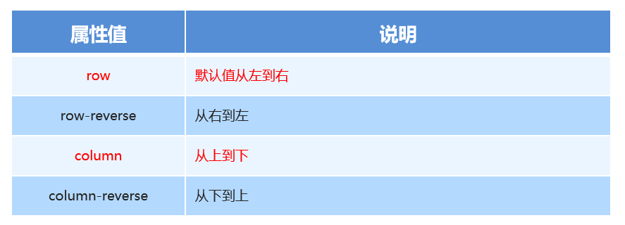


### 3.3 justify-content 设置主轴上的子元素排列方式

​	justify-content 属性定义了**子项目在主轴上的对齐方式** 

​	注意： 使用这个属性之前一定要确定好主轴是哪个

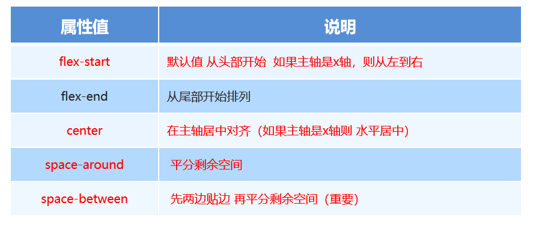


### 3.4 flex-wrap 设置子元素是否换行

​	默认情况下，项目都排在一条线（又称”轴线”）上。

​	flex-wrap属性定义，flex布局中默认是不换行的。

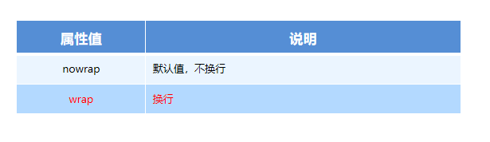


### 3.5 align-items 设置侧轴上的子元素排列方式（单行 ）

该属性是控制子项在侧轴（默认是y轴）上的排列方式  在子项为单项（单行）的时候使用

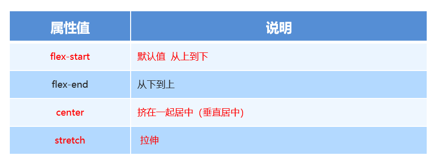


### 3.6  align-content  设置侧轴上的子元素的排列方式（多行）

设置子项在侧轴上的排列方式 并且只能用于子项出现 换行 的情况（多行），在单行下是没有效果的。

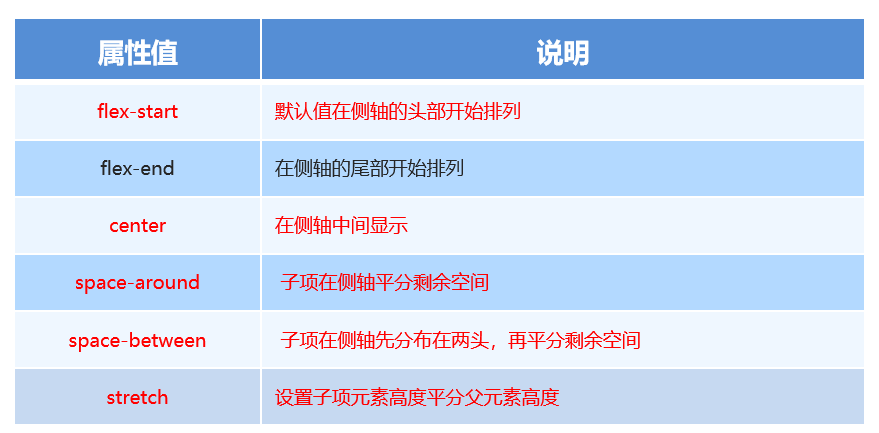

+ **align-items 和 align-content的区别？**

  + align-items  适用于单行情况下， 只有上对齐、下对齐、居中和 拉伸
  + align-content 适应于换行（多行）的情况下（单行情况下无效）， 可以设置 上对齐、 下对齐、居中、拉伸以及平均分配剩余空间等属性值。 
  + 总结就是单行找 align-items  多行找 align-content

+ **测试：**

  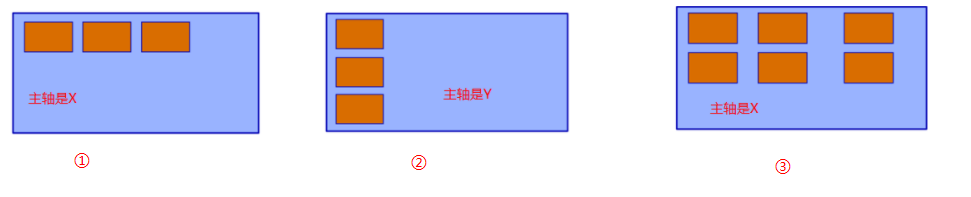

  + ① 找？ align-items
  + ② 找？ align-items
  + ③ 找？ align-content


### 3.7  flex-flow

 flex-flow 属性是 flex-direction 和 flex-wrap 属性的复合属性

`flex-flow:row wrap;`


## 4. flex布局子项常见属性

### 4.1 子项属性介绍

+ **flex 子项目占的份数**
+ align-self 控制子项自己在侧轴的排列方式
+ order属性定义子项的排列顺序（前后顺序）


### 4.2 flex属性

​	flex 属性定义子项目==分配容器的剩余空间==，用flex来表示占多少==份数==。

```css
.item {
    flex: <number> | 百分百; /* default 0 */
}

```


### 4.3 align-self 控制子项自己在侧轴上的排列方式

align-self 属性允许单个项目有与其他项目不一样的对齐方式，可覆盖 align-items 属性。默认值为 auto，表示继承父元素的 align-items 属性，如果没有父元素，则等同于 stretch。

```css
span:nth-child(2) {
      /* 设置自己在侧轴上的排列方式 */
      align-self: flex-end;
 }

```


### 4.4 order 属性定义项目的排列顺序

数值越小，排列越靠前，默认为0。

注意：和 z-index 不一样。

```css
.item {
    order: <number>;
}

```


## 5. 携程网首页制作


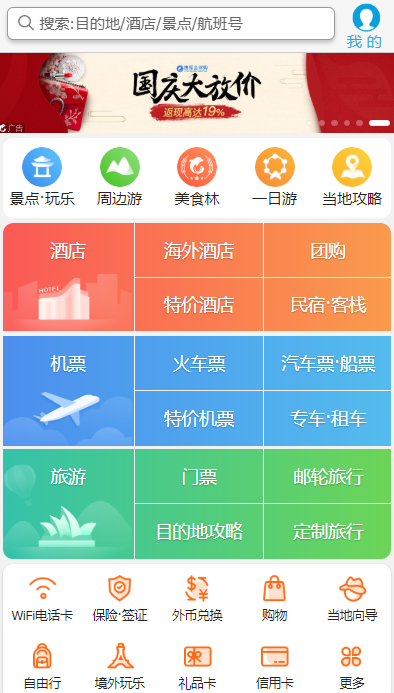


### 5.1 技术选型

方案：我们采取单独制作移动页面

方案技术：布局采取flex布局

+ flex为主，其他为辅


### 5.2 项目搭建

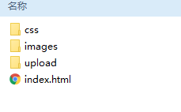

### 5.3 视口及初始化设置

```html
  <meta name="viewport" content="width=device-width, user-scalable=no,         initial-scale=1.0, maximum-scale=1.0, minimum-scale=1.0">

  <link rel="stylesheet" href="css/normalize.css">
  <link rel="stylesheet" href="css/index.css">
```


### 5.4  常用初始化样式

```css
body{
    max-width: 540px;
    min-width: 320px;
    margin:0 auto;
    font:normal 14px/1.5 Tahoma,"Lucida Grande",Verdana,"Microsoft Yahei",STXihei,hei;
    color: #000;
    background: #f2f2f2;
    overflow-x: hidden;
    -webkit-tap-highlight-color: transparent;
}
```


### 5.5 常见模块命名1

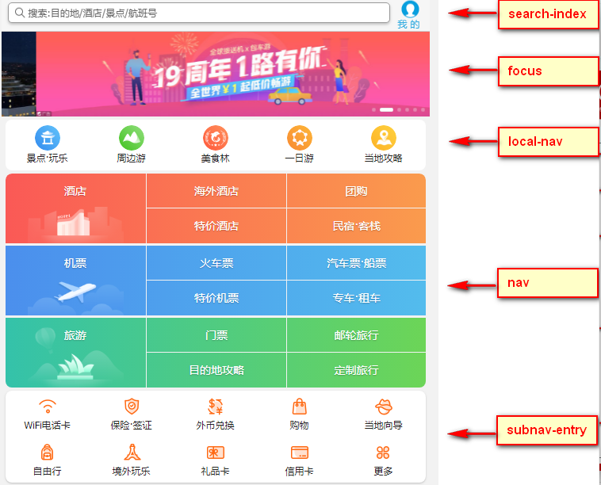


### 5.6 常见模块命名2

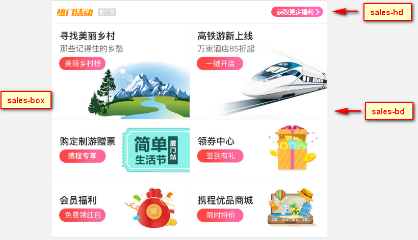


### 5.7 常见flex布局思路

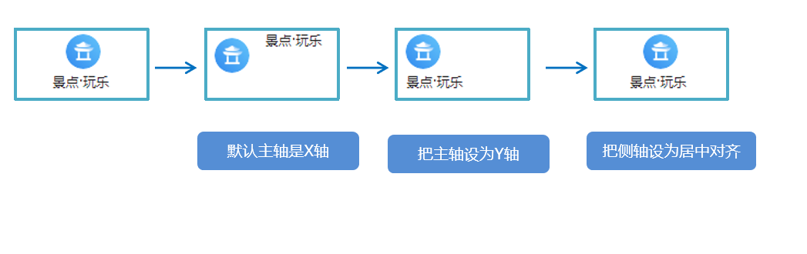

### 5.8 背景线性渐变

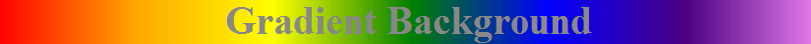

+ 语法：

  ```css
  background: linear-gradient(起始方向, 颜色1, 颜色2, ...);
  /*在谷歌中使用【to 方向】的方式，加私有前缀可能会出现错误*/
  background: linear-gradient(to 方向, 颜色1, 颜色2, ...);
  background: -webkit-linear-gradient(left, red , blue);
  background: -webkit-linear-gradient(left top, red , blue);
  ```

+ 注意：

  + 背景渐变的值必须添加浏览器私有前缀
  + 起始方向可以是： 方位名词  或者 度数 ， 如果省略默认就是 top