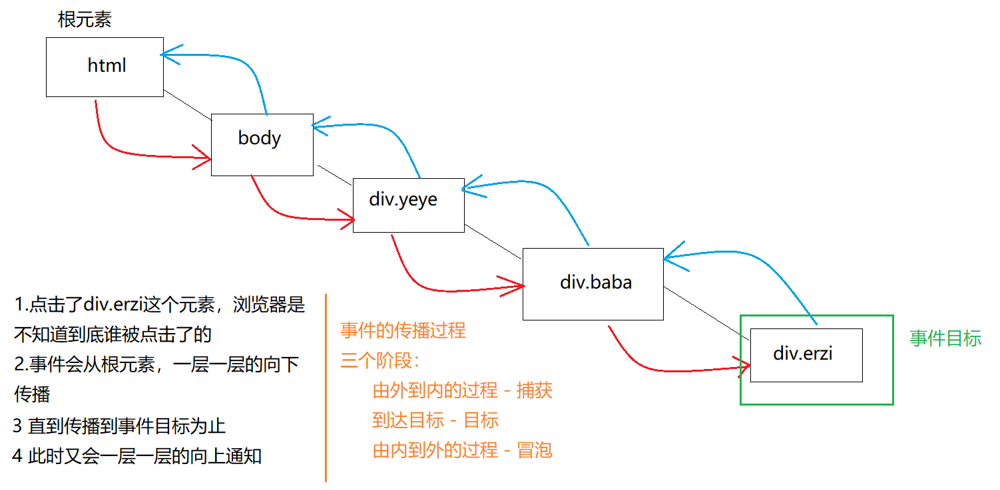

# 00-反馈

* 按钮是否禁用
* 在笔记上标注一下啥是必须掌握的，啥是理解；
* 不懂第一个if 和 最后一个else有啥区别
* for循环中的事件绑定：事件什么时候执行？点击的时候才会执行；


# 01-DOM-获取-CSS选择器

* 语法：

```js
// 作用： 根据指定的选择器获取从上到下的第一个元素，获取不到返回个null对象；
document.querySelector(css选择器);

// 作用：根据选择器获取所有满足条件的元素，这个使用的比较多；
// 参数：多个css选择器，以逗号隔开，都是字符串
// 返回值：伪数组；for，但是这个伪数组上面有forEach方法
document.querySelectorAll(css选择器1,css选择器2...);
// 一般用于类名和标签名的DOM节点获取；
```


# 02-DOM-属性-操作属性的方法

* 重点：**推荐大家用于自定义属性的操作；**

```js
  // -----------------------------------获取
  // 自定义属性
  var abc = box.getAttribute("abc");
  // console.log(abc);

  // 标准属性
  // console.log(box.id);
  var id = box.getAttribute("id");
  // console.log(id);


  //---------------------------------设置
  // 通过JS操作自定义属性
  box.setAttribute("key", "你好");
  box.setAttribute("index", "你好");


  // ---------------------------------删除属性
  box.removeAttribute("abc");
```


# 03-DOM-事件-注册addEventListener

* y语法：可以多次注册事件，不会前后覆盖；

```js
  // 方法：
  btn.addEventListener("click", function() {
    // 
    console.log(1);
  });

  // 
  btn.addEventListener("click", function() {
    // 
    console.log(2);
  });
```


# 04-DOM-事件-三个阶段-冒泡与捕获

* 客观存在事情：**不用想为什么，先接受客观的这些事情；**
  - 捕获：从根部往目标DOM节点上，一层一层的找，捕获是用户点击了那个DOM节点；
  - 冒泡：从目标节点到跟接单；
  - 冒泡执行：**事件默认是在冒泡阶段执行；**当我们目标DOM节点注册了事件，冒泡往上的DOM节点也注册了同样的事件话，也会执行；




# 05-DOM-事件-默认冒泡执行的原因-阻止冒泡

* 语法：

```js
box_3.addEventListener('click', function(e) {
    // 阻止冒泡：在冒泡阶段执行的后面的事件，不再执行；
    e.stopPropagation();
    
    alert('我是最里面');
  });
```

* 注意：

  * 一定要传入形参，e;
  * 方法写在函数里面，位置无所谓；

  

# 06-DOM-事件对象-属性

* 语法：

```js
  box.onclick = function(e) {
    // alert(1)
    // e：把点击这个行为看做一个对象
    // console.log(e);
    // 对象上，有几个属性可以标识当前鼠标点击的位置；

    // 相对于当前窗口；
    // console.log(e.clientX, e.clientY);

    // // 相对于：body的左上角
    // console.log(e.pageX, e.pageY);


    // 点击的哪个DOM节点，反给我的就是哪个DOM节点；
    // 哪怕有子元素；
    // console.log(e.target);

    // 返回事件源
    // console.log(e.currentTarget);

    // this: 代表当前事件注册的DOM节点，事件源；
    console.log(e.currentTarget == this);

  }
```


# 07-DOM-事件对象-方法

* 语法：阻止默认行为；

```js
// var dom_a = document.querySelector("#box_a");
// dom_a.addEventListener('click', function(e) {
//   // 
//   e.preventDefault();
// });


// 阻止冒泡
事件对象.stopPropagation();
```

* 事件对象：一个集合体，用来描述我点击的行为（点击位置、点击了谁、注册给谁这些）；


# 08-DOM-事件-mousedown-mousemove-mouseup

```js
  // 鼠标落下的时候，触发
  box.addEventListener("mousedown", function() {
    console.log(1);
  });


  // 鼠标移动
  box.addEventListener("mousemove", function() {
    console.log(2);
  });

  // 鼠标弹起
  box.addEventListener("mouseup", function() {
    console.log(3);
  });
```


# 09-案例-跟随鼠标飞

* 语法：

```
  document.onmousemove = function(e) {
    // 描述鼠标移动的行为e 拿到了
    // 相对于：当前可视窗口；
    // console.log(e.clientX, e.clientY);

	// clientY：当前可视窗口；
    // img.style.top = `${e.clientY}px`;
    // img.style.left = `${e.clientX}px`;


    // 相对于body 鼠标位置 因为上面设置的 position: absolute;
    img.style.top = `${e.pageY}px`;
    img.style.left = `${e.pageX}px`;

  }
```

* 重点：知道自己用的是哪一套 事件对象 的坐标系；  
* 事件对象：就是描述事件行为；


# 10-DOM-属性-元素位置

* 语法：获取元素距离参考父亲的左边和上边的值；

```js
// 得到的是某个元素距离他的offsetParent元素的水平距离
// 元素.offsetLeft = marginLeft + left
元素.offsetLeft 

// 得到的是某个元素距离他的offsetParent元素的垂直距离
// 元素.offsetTop = marginTop + top
元素.offsetTop 

// 找到一个有定位的父亲元素进行参考，如果亲生父亲没有定位，会一直往上找，直到找打有定位的父亲，或者body；
元素的offsetParent
```


# 11-案例-鼠标拖盒子动-演示及初始化


# 12-案例-鼠标拖盒子动-实现

* **核心点：**
  - **位置特点**：拖到时，鼠标在盒子内的位置不变；`盒子新的位置=新的鼠标位置-鼠标在盒子内的一开始位置；`
    - `鼠标在盒子内的一开始位置 =鼠标的位置-盒子的位置（offsetLeft）`
  - **执行特点**：**先**鼠标落下在盒子内，**再**在页面上进行移动，**最后**鼠标键弹起；完成一次拖到；开关思想
    - 鼠标落下之前，设置 开关 为 关的状态，**状态：没有点击 isClick = false;**
    - **先**鼠标落下在盒子内，**状态：已经点击， isClick = true;**
    - **再**在页面上进行移动
      - **条件判断：看你isClick 状态是否为点击：**
        - true：移动计算；
        - false：不进行移动计算；
    - **最后**鼠标键弹起：**状态：恢复到没有点击， isClick = false;**

* 步骤：
  - 获取元素：盒子
  - 注册事件：onmousedown、 onmousemove、onmouseup
  - 事件之后：
    - onmousedown：
      - 记录：注册给要拖到的盒子
        - 鼠标在盒子内部的位置；
          - 为什么要记录？因为鼠标在盒子内部的位置一直没变；
          - 记录什么？鼠标在盒子内的点击的位置
        - 鼠标键已经点击；
    - onmousemove：注册给document;
      - 判断：鼠标键是否已经落下；
        - 没有落下：无操作
        - 落下：**计算盒子应该出现的位置 = 用新的鼠标位置 - 记录在内的一开始的位置；**
    - onmouseup：移动结束
      - 记录：鼠标键已经弹起；

# 13-案例-开关思想-抽奖

* 在全局设置变量，初始化没有点击
* 点击事件内部：
  * 如果没有点击：旋转下，点击的证明；
  * 点击过了：没有任何反应；

* 缺点：就是因为你设置的全局开关，在控制台可以获取到，可以重新；


# 14-DOM-事件-解绑-抽奖

* 语法：事件解绑更为安全；

```js
var btn = document.getElementById('btn');
btn.onclick = function(){
  btn.onclick = null;
  console.log('谢谢惠顾');
}

var btn = document.getElementById('btn');
btn.addEventListener('click',function fn(){
  // 解绑 当前的函数
  btn.removeEventListener('click',fn);
  console.log('抽奖了');
})
```


# 15-DOM-事件-委托-引入

* 不友好：每次新的时候，都要重新获取全部LI，重新每个都注册一次事件；

# 16-DOM-事件-委托-实现

* 什么是事件委托？
  - 把事件注册在父级的元素身上，
  - 利用事件冒泡执行，当事件传播到已经注册了事件的父级元素身上，
  - 判断  触发事件的DOM  （e.target）节点是否是指定的元素，e.target.nodeName=="LI"
    - 如果是，就执行逻辑，
    - 否则什么都不管；
* **什么时候用？**
* **当我们需要给动态创建（不是一开始写死的，是后期可能会变的元素）的元素实现注册事件的效果的时候；**
* 把原理理解一下就行，不需要自己实现，还需要理解事件委托的使用场景，以后我们会在jq阶段学习一个别人封装好的事件委托;