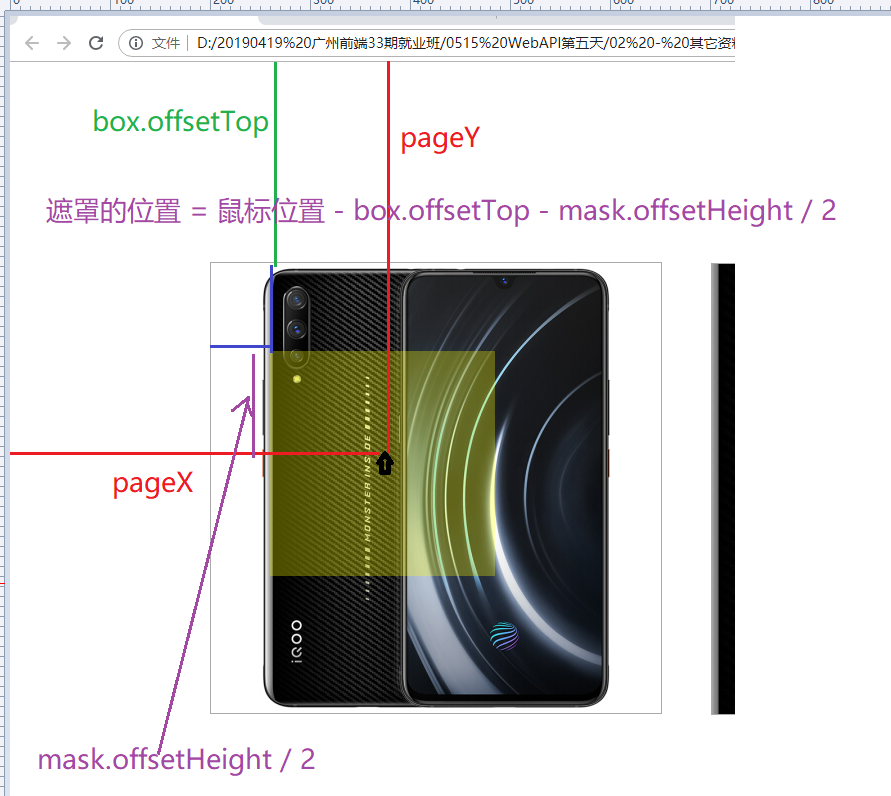

# day-05


# 案例：手风琴特效

## 需求

* 鼠标移入，鼠标当前的图片变宽，其他变小（排他思想）
* 鼠标移出，所有图片大小恢复原状

## 移入

* 获取元素：所有的li元素
* 注册事件：鼠标移入
* 移入之后：排他
  * 所有的li变为一个值100；
  * 当前单独变为一个值800；

```js
var lis = document.querySelectorAll('#box li');

  for (var i = 0; i < lis.length; i++) {


    // 注册鼠标移入事件
    lis[i].onmouseover = function() {
      // 排他的设置每个li的宽度
      lis.forEach(function(element) {
        element.style.width = 100 + 'px';
      })
      this.style.width = 800 + 'px';
    };

  }
```

## 移除

* 获取元素：所有的li元素
* 注册事件：鼠标移出
* 移出之后：所有的元素回复原来的宽度240

```js
  for (var i = 0; i < lis.length; i++) {

    // 注册鼠标的移出事件
    lis[i].onmouseout = function() {
      // 把所有的li恢复原状
      lis.forEach(function(element) {
        element.style.width = 240 + 'px';
      });
    };

  }
```


# 案例：点击按钮切换位置

* 需求：点击按钮切换盒子的位置；
* 需知：**控制盒子的位置和大小的类名为数组；**
* 实现：
  * 初始化：把数组按照盒子的循环，改变类名；
  * 点击按钮，改变类名数组的位置，重新给盒子循环赋值类名；

```js
  var pos_arr = ["pos_1", "pos_2"];
  var boxs = document.querySelectorAll("p");
  // 初始化
  setTimeout(function() {
    for (var i = 0; i < boxs.length; i++) {
      boxs[i].className = pos_arr[i];
    }
  }, 1000);
  
  // 点击切换；
  var btn = document.querySelector("#btn");
  // 点击后，位置发生改变；
  // 实质上为 控制位置类名的数组发生改变；
  btn.onclick = function() {
    // 
    var last = pos_arr.pop();
    pos_arr.unshift(last);

    // console.log(pos_arr);

    for (var i = 0; i < boxs.length; i++) {
      boxs[i].className = pos_arr[i];
    }

  }
```

* 函数优化：

```js
  var pos_arr = ["pos_1", "pos_2"];
  var boxs = document.querySelectorAll("p");

    function change(){
        for (var i = 0; i < boxs.length; i++) {
          boxs[i].className = pos_arr[i];
        }
    }
  // 初始化
  setTimeout(function() {
    change();
  }, 1000);
  
  // 点击切换；
  var btn = document.querySelector("#btn");
  // 点击后，位置发生改变；
  // 实质上为 控制位置类名的数组发生改变；
  btn.onclick = function() {
    // 
    var last = pos_arr.pop();
    pos_arr.unshift(last);

    change();
  }
```

* 特点：HTML结构不变，变的是类名数组；


# 案例：旋转木马

## 需求

* 让所有的图片从中间展开
* 点击右边按钮，让图片可以逆时针旋转
* 点击左边按钮，让图片可以顺时针旋转

## 初始化

* 初始化布局：给每个li分别设置一个可以控制位置、大小、层级的类名，给类名使用一个数组的方式管理起来，直接按照索引对应的方是设置位置即可；

* 获取元素：获取所有的li
* 注册事件：无
* 初始化：使用循环设置所有的li的大小、位置、层级->只是设置一个已经准备好的类名

```js
var lis = document.querySelectorAll('.slide li');
var pos = ['left1', 'left2', 'middle', 'right2', 'right1'];
// 遍历所有的li，设置类名，就可以发送位置的变化
for (var i = 0; i < lis.length; i++) {
    lis[i].className = pos[i];
}
```

## 左右按钮

* 右按钮分析：第一张图
  * HTML结构：没变；
  * 变化的是：类名在数组中的位置；

* 如何变化：

```js
// 初始化：
// HTML : 1        2         3         4          5
// 位置：'left1', 'left2', 'middle', 'right2', 'right1'


// 右侧点击下：
// HTML :    1        2         3         4          5
// 位置类名：'left2', 'middle', 'right2', 'right1'  'left1',
```

* 实现：
  * 获取元素：左右按钮
  * 注册事件：click
  * 点击之后：
    * **右侧：把第一个类名拿出来，从后添加；**
    * **左侧：把最后一个类名拿出来，从前添加；**

```js
// 初始化再次设置每个li的位置
lis.forEach(function (e, i) {
  e.className = pos[i];
});
// 封装为函数
function rotate() {
  lis.forEach(function (e, i) {
    e.className = pos[i];
  });
}


// 点击右边按钮
var rightBtn = document.querySelector('.next');
// 注册点击事件
rightBtn.onclick = function () {
  // 把位置数组的第一个取出，放到最末尾
  pos.push(pos.shift());
  // 再次把每个li移动
  rotate();
}


// 左侧
leftBtn.onclick = function () {
  // 把位置数组从最后面抽取一个，放到最前面
  pos.unshift(pos.pop());
  rotate();
}
```


# 案例：360开机动画

## 知识

* 动画结束事件：专门是指c3里面的动画结束会触发的事件，c3动画有两种，结束动画事件也有两个；
* transitionend：元素的过渡动画结束的时候触发；

```js
var box = document.querySelector('.box');
box.addEventListener('transitionend',function(){
  console.log(123);
});
```

* animationend：会在帧动画结束的时候触发

```js
var box = document.querySelector('.box');
box.addEventListener('animationend',function(){
  console.log(123);
})
```

* 注意：
  * 不能使用on的方式注册，只能使用addEventListener的方式注册
  * 如果帧动画是无限次的，不会触发该事件animationend

## 需求

* 分两段**过渡动画**，先让底部的高度逐渐为0，再让整个盒子的宽度为0；

## 实现

* 获取元素：盒子底部，整体盒子
* 注册事件：盒子底部 transitionend
* 过度完成：设置整体盒子width

```js
closeButton.onclick = function() {
    // 把下半部分的高度设置为0
    bottomPart.style.height = 0;
}


var box = document.querySelector("#box");
bottomPart.addEventListener('transitionend',function(){
  // 把box盒子的宽度修改为0
  box.style.width = 0;
});
```


# 案例：放大镜效果

## 需求分析

* 鼠标移入，出现黄色的遮罩，和用来放大的盒子
* 鼠标移出，遮罩和放大的盒子消失
* 鼠标在小图片上面进行移动的时候
  * 黄色遮罩层会随着鼠标一起移动
  * 用来放大显示的图片，也跟着一起移动

## 移入移出

* 获取元素(box,遮罩，放大用的盒子)
* 注册事件：移入移出
* 之后：遮罩和放大盒子显示和隐藏

```js
//2 注册鼠标的移入和移出事件
box.onmouseover = function(){
  // 3 控制遮罩和放大的盒子显示
  mask.style.display = 'block';
  big.style.display = 'block';
}
box.onmouseout = function(){
  // 3 控制遮罩和放大的盒子隐藏
  mask.style.display = 'none';
  big.style.display = 'none';
}
```

## 遮照随鼠标移动

* 获取元素：small图
* 注册事件：mousemove
* 移动之后：鼠标的位置计算出遮罩应该在位置，设置给遮罩；
  * 应该在的位置：遮罩的位置 = 鼠标的位置 - box的位置 - mask的宽高的一半



```js
small.onmousemove = function(e){
  // 根据鼠标的位置，计算出遮罩应该在哪个位置
  var mx = e.pageX;
  var my = e.pageY;
  
  // 5 遮罩在盒子内的位置 = 鼠标位置 - box的位置 - 遮罩宽高的一半
  var x = mx - box.offsetLeft - mask.offsetWidth / 2;
  var y = my - box.offsetTop - mask.offsetHeight / 2;

  // 7 设置给mask
  mask.style.top = y + 'px';
  mask.style.left = x + 'px';
}
```

* 范围问题：遮罩只能在small里面移动；最小值和最大值
  * 最小值：0；如果遮罩的位置小于0了，强行设置为0；
  * 最大值： small的宽高 - mask的宽高；遮罩的位置大于最大值了，强行设置为最大值；

```js
small.onmousemove = function(e){
  // 4 根据鼠标的位置，计算出遮罩应该在哪个位置
  var mx = e.pageX;
  var my = e.pageY;
  
  // 5 遮罩的位置 = 鼠标位置 - box的位置 - 遮罩宽高的一半
  var x = mx - box.offsetLeft - mask.offsetWidth / 2;
  var y = my - box.offsetTop - mask.offsetHeight / 2;
  
  // 6 不让遮罩超出边界,最小值0
  x = x < 0 ? 0 : x;
  y = y < 0 ? 0 : y;
    
   
  // 算出mask移动的最大距离
  var maxX = small.offsetWidth - mask.offsetWidth;
  var maxY = small.offsetHeight - mask.offsetHeight;
  x = x > maxX ? maxX : x;
  y = y > maxY ? maxY : y;
    
  // 7 设置给mask
  mask.style.top = y + 'px';
  mask.style.left = x + 'px';
}
```

* offset属性总结：

```js
  元素.offsetTop - 得到元素距离它的offsetParent的垂直距离
  元素.offsetLeft - 得到元素距离它的offsetParent的水平距离
  元素.offsetParent - 得到一个距离我最近的定位的前代元素，如果我的前代元素都没有定位，得到body或者html
  元素.offsetWidth - 元素的实际宽度 = border+padding+width
  元素.offsetHeight - 元素的实际高度 = border+padding+height
```

## 放大效果

* 获取元素：大图片

* 注册事件：小图片移动

* 移动之后：鼠标的位置计算出大图应该在的位置，设置给大图

  * 移动比例：
    * 我在小图上移动从左到右，移动了`small.offsetWidth - mask.offsetWidth`，
    * 按照道理大图应该移动 `bigImg.offsetWidth - big.offsetWidth`；

  ```js
  (small.offsetWidth - mask.offsetWidth)/(bigImg.offsetWidth - big.offsetWidth) 
  = 
  y/big_y
  ```

  * 计算大图应该移动的位置：

  ```js
  var bigImgX = x * bigImgMaxX / maxX;
  var bigImgY = y * bigImgMaxY / maxY;
  ```

  * 设置：

  ```js
  // 10 设置给大图,注意方向是相反的
  bigImg.style.top = -bigImgY + 'px';
  bigImg.style.left = -bigImgX + 'px';
  ```
  * `bigImg.offsetWidth - big.offsetWidth`：
    * offsetWidth包括：content+padding+border；border不应该计算在内；原因：小遮照覆盖的范围是自己的offsetWidth(border+padding+width)
    * 大遮照显示的范围应该是盒子的视图宽度，不包括border值；获取盒子的视图宽高： 包括padding + content 

  ```js
  元素.clientWidth - 可视区域的宽度
  元素.clientHeight - 可视区域的高度
  
  (small.offsetWidth - mask.offsetWidth)/(bigImg.offsetWidth - big.clientWidth) 
  = 
  y/big_y
  ```

