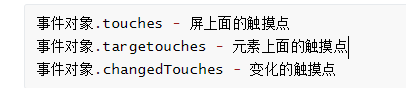
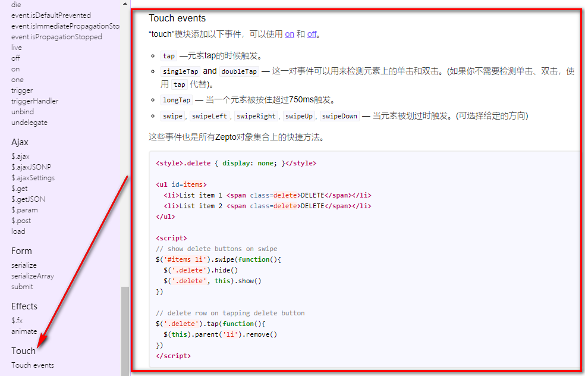

# 01-DOM-事件-移动端触摸事件-事件对象属性

* 事件：

```
touchstart - 会在手指触摸到屏幕的时候触发
touchmove - 会在手指触摸到屏幕，移动的过程中触发
touchend - 会在手指离开屏幕的瞬间触发
```

* 特点：
  * PC不生效，只能在移动端生效
  * addEventListener注册
* 事件对象：




# 02-DOM-事件-封装tap手势

* 封装：了解下就可以了。
  * 过程写出来；
  * 提炼参数；（回调函数）


# 03-Zepto-介绍-引入-API

* 对原生JS的极好的封装；

* https://www.html.cn/doc/zeptojs_api/


# 04-Zepto-touch引入及API




# 05-案例-简单轮播图

* 使用zepto，获取DOM节点；

```js
 // 初始化显示的图片为第1张；
  var index = 0;
  // 左划
  box.on("swipeLeft", function() {
    // console.log(1);
    index++;

    // 下标5：显示第6张；
    // 下标6：按照道理显示第1张；下标回归0；
    if (index == img.length) {
      index = 0;
    }

    // 计算偏移值
    var num = index * imgW;
    ul.css("transform", `translateX(-${num}px)`);
  })


  // 右划
  box.on("swipeRight", function() {
    index--;

    // 下标为0：显示第1张；
    // 下标为-1：按照道理显示第6张；下标是5；
    if (index == -1) {
      index = img.length - 1
    }

    // 计算偏移值
    var num = index * imgW;
    ul.css("transform", `translateX(-${num}px)`);

  });
```


# 06-案例-无缝轮播图-原理


# 07-案例-无缝轮播图-实现

* **无缝原理：**
  - 当我们划到6.jpg时（实际上在HTML顺序上是倒数第二张），让用户觉得已经到最后一张了。
  - 再往左划时，会划出来1.jpg（实际上在HTML顺序上是最后一张），让用户觉得到无缝到了第一张了。
  - 这个瞬间，最后一张图片会有个过渡；
* **这个时候，我们通过一个事件（当过渡结束时），我们一瞬间把整个管理图片的父亲的位置归到1.jpg（实际上在HTML顺序上是第二张）的位置；这样就无缝完成！**


# 08-swiper-插件介绍及引入及插件实现轮播

