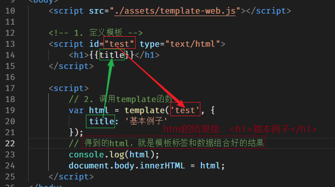

# 1. 响应数据格式

## 1.1 简介

服务器返回的数据不一定是非常简单的字符串，比如在获取留言板中的所有留言的时候，这时获取的数据就比较多，思考，如果是你，你希望返回什么格式的数据呢？希望是一大段拼接到一起的字符串还是一个JS数组或对象呢？

答案肯定是数组或对象，因为数组或对象操作起来更加方便。

```js
// 下面的字符串，表示所有的留言，是不好的
var liuyan = '王大拿：阿萨德发阿萨德发；刘老师：阿萨德饭店; 王老师: 你以为你是小子；';

// 下面的表示留言的数据格式非常好
var liuyan = [
    {name:'张三', message:'哈哈哈哈哈,我喝多了'},
    {name:'李四', message:'呵呵呵'},
    {name: 'xx', message: 'xxxxxx'},
    {name: '王老师', message: '你以为你是校长;先'}
];

// 下面是PHP数组的表示方法
array(
	array('wanglaoshi', '你以为'),
    array('wanglaoshi', '你以为'),
    array('wanglaoshi', '你以为'),
);
```

但是不同语言之间的数组和对象语法又不同，所以服务器直接返回该语言的数组或对象是不行的。

语言设计人员早已意识到这个问题，所以专门设计了两种数据表示格式，他们分别是`JSON`和`XML`。在服务器和浏览器之间传输数据的时候，需要先把数据转换成双方都能够识别的格式，即`JSON`或`XML`。这就犹如中国人和其他国家人交流时需要找个翻译一样。


## 1.2 JSON

JSON（JavaScript Object **Notation**：JS对象**表示法**） 是一种通过普通**==字符串==**描述数据的手段，用于表示有结构的数据。类似于编程语言中字面量的概念，语法上跟 JavaScript 的字面量非常类似。

> 别看JSON长得像JS中的各种数据，但JSON的本质是字符串。

### 数据类型

- null

    ```json
    null
    ```

- number

    ```json
    2048
    ```

- boolean

    ```
    true
    ```

- string

    ```
    "hello"
    ```

- object

    ```
    {
      "name": "zce",
      "age": 18,
      "gender": true,
      "girl_friend": null,
      "arr": []
    }
    ```

- array

    ```
    ["zhangsan", "lisi", "wangwu"]
    ```

### 注意

1. JSON 中属性名称==必须用双引号==包裹
2. JSON 中表述字符串（==值）必须使用双引号==
3. JSON 中不能有单行或多行注释
4. JSON 没有 `undefined` 这个值
5. 一个完整的JSON，不能有其他内容掺杂，必须是一个完整的 “数组” 或完整的 “对象”  或 完整的 字符串 或 ..........

### JSON 数据转换

- JSON 格式转JS数据
    - `JS = JSON.parse(JSON)`
- JS数据转JSON
    - `JSON = JSON.stringify(JS);`

```js
		// 定义一些JS格式的数据
        var a = ['张悦', '假冰冰', '老狗', '苏老湿'];
        var b = true;
        var o = {id: 1, name: '刘老湿', nickname: '北狗最光阴'};

        // 把JS数据转成JSON数据  （JSON.stringify()）
        var jsonA = JSON.stringify(a);
        var jsonB = JSON.stringify(b);
        var jsonO = JSON.stringify(o);
        console.log(jsonA)
        console.log(jsonB)
        console.log(jsonO)

        // 把JSON数据转成JS数据 （JSON.parse()）
        console.log(JSON.parse(jsonA));
        console.log(JSON.parse(jsonB));
        console.log(JSON.parse(jsonO));

        // console.log(JSON.parse('[]{}')); // 报错了，因为JSON格式不是一个完整的JSON
```


### JSON 表述

有了 JSON 这种格式，我们就可以更加容易的表示拥有复杂结构的数据了。

> **注意**：
>
> - 不管是 JSON 也好，还是 XML，只是在 AJAX 请求过程中用到，并不代表它们与 AJAX 之间有必然的联系，它们只是数据协议罢了。
> - 不管服务端是采用 XML 还是采用 JSON 本质上都是将数据返回给客户端。
> - 服务端应该根据响应内容的格式设置一个合理的 Content-Type。

## 1.3 XML

HTML:超文本标记语言

XML: e==X==tension ==M==arkup ==L==anguage   可扩展标记语言

一种数据描述手段

老掉牙的东西，简单演示一下，不在这里浪费时间，基本现在的项目不用了。

淘汰的原因：数据冗余太多，操作不方便

```xml
<?xml version="1.0" encoding="UTF-8" ?>
<students>
	<stu id="1">
    	<name>张三</name>
        <age>18</age>
        <sex>男</sex>
        <other height="175cm" weight="65kg" />
    </stu>
    <stu id="2">
    	<name>李四</name>
        <age>20</age>
        <sex>女</sex>
        <other height="170cm" weight="60kg" />
    </stu>
</students>
```

XML语法规范：

- 和html写法差不多
- 有且只有一个根标签
- 标签区分大小写
- 标签必须闭合
- 属性值必须加引号

==如果服务器返回的是XML格式的数据，JS收到数据之后，把收到的数据当做document对象来处理即可==。

临时测试，app.js中，添加一个接口，接口返回一段XML格式的数据，代码如下：

```js
app.get('/getXML', (req, res) => {
  res.setHeader('Content-Type', 'text/xml; charset=utf-8');
  res.send(
    `<result>
      <msg>成功</msg>
      <code>200</code>
    </result>`
  );
});
```

创建  `02-处理XML.html` 文件 ，写js代码，向 /getXML 接口发请求，得到的就是XML格式的数据了。处理方式和document对象一样。

```html
<script>
    var xhr = new XMLHttpRequest();
    xhr.open('GET', '/getXML');
    xhr.responseType = 'document'; // 设置服务器返回数据的类型
    xhr.send();
    xhr.onload = function () {
        console.log(this.response); // response属性，会根据responseType属性，自动将结果处理
        // console.log(this.responseXML)
        console.log(document);

        // 服务器返回的xml格式的数据，和document对象一样。所以处理方式也是一样的
        // 比如，要获取到 “成功”
        var msg = this.response.getElementsByTagName('msg')[0]; // 先找到msg节点
        var text = msg.childNodes[0]; // 找到成功这两个字的文本节点
        console.log(text.nodeValue); // 输出，文本节点的值
    }
</script>
```


# 2. 模板引擎

## 2.1 模板引擎介绍

客户端中拿到请求的数据过后最常见的就是把这些数据呈现到界面上。

如果数据结构简单，可以直接通过字符串操作（拼接）的方式处理，但是如果数据过于复杂，字符串拼接维护成本太大，就不推荐了。

> 模板引擎：
>
> - artTemplate：https://aui.github.io/art-template/

模板引擎实际上就是一个 API，模板引擎有很多种，使用方式大同小异，目的为了可以更容易更高效的将数据渲染到HTML字符串中。==通俗的说，模板引擎的目的就是将服务器返回的数据显示到HTML页面中==。

## 2.2 使用模板引擎步骤

1. 准备一个存放数据的盒子（不是必须的，使用body也可以）

2. 引入template-web.js文件

3. 定义模板（具体语法可以去官网查看），一定要指定script的id和type属性

4. 调用template函数，为模板分配数据，template函数有两个参数一个返回值
    1. 参数1：模板的id
    2. 参数2：分配的数据，必须是一个JS对象的形式
    3. 一个返回值：是数据和模板标签组合好的结果

5. 将 “拼接” 好的结果放到准备好的盒子中（不是必须的，console出来也可以看结果）

    

```html
<!-- 使用模板引擎-1.加载js文件 -->
<script src="./assets/template-web.js"></script>

<!-- 使用模板引擎-2.设置模板 -->
<script id="test" type="text/html">
        <h1>{{title}}</h1>
</script>

<script>
    // 使用模板引擎-3.调用template函数
    // var 模板和数据组合好的结果 = template(模板id, 模板中使用的数据必须是js对象类型);
    var data = {
        title: '这是模板引擎的例子'
    };
    // “拼接”
    // 调用插件提供的方法template。将数据和模板组合起来。
    var html = template('test', data);
    console.log(html);
    /*
        <h1>这是模板引擎的例子</h1>
        */
    document.body.innerHTML = html;

</script>
```

> 定义模板时的script标签一定好指定id和type
>
> tempalte函数语法：var html = template(模板id,  Object);

## 2.3 模板语法

- 输出普通数据（字符串、数值等）

    ```
    // 模板写法
    {{var}}
    
    // template函数写法
    var html = template('id', {
        var: 'hello world'
    });
    ```

- 条件

    ```
    // 模板写法
    {{if age > 18}}
    	大于18
    {{else}}
    	小于18
    {{/if}}
    
    // template函数写法
    var html = template('id', {
        age: 20
    });
    ```

- 循环

    ```
    // 模板写法
    {{each arr}}
    	{{$index}} -- 数组的下标
    	{{$value}} -- 数组的值
    {{/each}}
    
    // template函数写法
    var html = template('id', {
        arr: ['apple', 'banana', 'orange']
    });
    ```

完整的代码：

```html
<script src="./assets/template-web.js"></script>

    <!-- 1. 定义模板 -->
    <script id="abc" type="text/html">
        <h1>{{name}}</h1>
        <p>我是{{nickname}}，我有一辆{{car}}，我今年{{age}}岁了</p>
        {{if age >= 18}}
            <p>欢迎来玩~</p>
        {{else}}
            <p>未成年人禁止进入</p>
        {{/if}}
        <p>我有好几个女朋友，分别是：</p>
        <ul>
            {{each girls}}
            <li>{{$index}} -- {{$value}}</li>
            {{/each}}
        </ul>
    </script>


    <script>
        // 2. 调用template函数
        var str = template('abc', {
            name: '狗哥',
            nickname: '北狗最光阴',
            car: '宝马',
            age: 31,
            girls: ['王婆', '金莲', '西门大官人', '李师师', '赛金花']
        });

        console.log(str);
        document.body.innerHTML = str;
    </script>
```


## 2.4 案例中使用模板引擎处理响应数据

```html
<!-- 引入template-web.js -->
<script src="./assets/template-web.js"></script>

<!-- 定义模板 -->
<script id="moban" type="text/html">
    {{each girls}}
    <li class="media">
      
      <div class="media-body">
        <h4>{{$value.name}}</h4>
        <p>{{$value.content}}</p>
    </div>
    </li>
    {{/each}}
</script>
```

```js
xhr.onload = function () {
    // console.log(this.response);
    var data = JSON.parse(this.response);
    console.log(data);
    // 拼接字符串
    var str = template('moban', {
        girls: data
    });
    // 把变量后，拼接好的str放到 id为 messages 的ul中
    document.getElementById('messages').innerHTML = str;
}
```

# 3. 同步与异步

*Ajax* 即“**==A==synchronous** ==J==avascript ==A==nd ==X==ML”（**异步** JavaScript 和 XML）

单词：

Asynchronous -- 异步的，不同步的

synchronous -- 同步的

Deprecation -- 反对的，不赞成的，不期望的

关于同步与异步的概念在生活中有很多常见的场景，举例说明。

> - 同步：一个人在同一个时刻只能做一件事情，在执行一些耗时的操作的时候，不能去做别的事，只是等待
> - 异步：在执行一些耗时的操作的时候，同时去做别的事，而不是等待

`xhr.open()` 方法第三个参数要求传入的是一个 `bool` 值，其作用就是设置此次请求是否采用异步方式执行，默认为 `true`，表示异步操作。如果需要同步执行可以通过传递 `false` 实现：

分析下面的代码：

```javascript
console.log('111')

var xhr = new XMLHttpRequest()
// 默认第三个参数为 true 意味着采用异步方式执行
xhr.open('GET', '/time', true)
xhr.send(null)
xhr.onload = function () {
    // 这里的代码最后执行
    console.log('ajax')
}
console.log('222')
```

上述代码，先执行 `console.log('111')`，然后是发送异步的Ajax请求，最后执行 `console.log('222')`，试想，输出的顺序是怎样的？

**答**：移除输出 `111`、`222`、`ajax`。因为代码执行顺序是从上到下依次执行的，所以最先输出 `111` ，下面是执行Ajax请求，它是一个异步的耗时操作，需要等待服务器的响应，只有服务器响应的结果完整的被xhr对象接收，才会输出 `ajax`，因为它是异步操作，不会阻塞后续代码的执行，所以后续输出 `222` 这行代码的执行，无需等待 Ajax操作是否结束。

下面的代码，设置 `open` 的第三个参数为 `false`，则表示同步方式的ajax请求，如果采用同步方式执行，则代码会卡死在 `xhr.send()` 这一步：

```javascript
console.log('111')
var xhr = new XMLHttpRequest()
// 同步方式
xhr.open('GET', '/time', false)
// // 同步方式 执行需要 先注册事件再调用 send，否则 onload 事件无法触发
 xhr.onload = function () {
     // 会按代码执行顺序执行这行代码
     console.log('ajax')
}
xhr.send(null)
// 因为 send 方法执行完成 响应已经下载完成
console.log(xhr.responseText)
console.log('222')
```

> 了解同步模式即可，切记不要使用同步模式。

# 4.XHR对象其他API

## 4.1 readyState和onreadystatechange

#### readyState


既然Ajax请求是一个耗时操作，也就是从开始创建 xhr 对象，然后调用open、调用send发送请求到服务器（耗时）、·（耗时）、接收服务器返回的数据、完全接收到服务器返回的数据，这一整个过程是耗时的操作，即使网速再快也需要一定的时间。

换句话说，在执行Ajax请求响应过程中，要经过好几个阶段，xhr 对象提供了一个属性 readyState ，用它来表示 Ajax请求到哪个阶段了。

输出 xhr.readyState 会得到 0、1、2、3、4几个数字，他们分别表示 Ajax请求响应的各个阶段，每个数字表示的意思如下：

| readyState | 状态描述         | 说明                                                         |
| ---------- | ---------------- | ------------------------------------------------------------ |
| 0          | UNSENT           | 代理（XHR）被创建，但尚未调用 `open()` 方法。                |
| 1          | OPENED           | `open()` 方法已经被调用，建立了连接。                        |
| 2          | HEADERS_RECEIVED | `send()` 方法已经被调用，并且已经可以获取状态行和响应头。    |
| 3          | LOADING          | 响应体（服务器返回的数据）下载中， `responseText` 属性可能已经包含部分数据。 |
| **4**      | **DONE**         | **响应体（服务器返回的数据）下载完成，可以直接使用 `responseText`或response 获取完整的结果。** |

> 一般都不说Ajax请求响应的几个阶段，大多数都说Ajax的几个状态，也就是说readyState表示Ajax请求过程中的几个状态。

#### onreadystatechange

onload是H5之后新增的事件，在H5之前，都是使用onreadystatechange。

on... 表示一个事件，翻译过来就是“当...时候”，readystate前面说过，是一个数字，表示ajax的状态，change是改变的意思。所以这个事件的意思是，当Ajax状态发生变化的时候，就会触发这个事件。

```js
var xhr = new XMLHttpRequest()；
// 创建对象后，先打印一次XHR对象的状态，此时状态值为0
console.log(xhr.readyState); // 0

// 添加事件onreadystatechange，每当XHR对象的状态发生变化的时候，就会触发这个事件
// 比如
// xhr对象的状态从0-->1，会触发下面的事件
// xhr对象的状态从1-->2，会触发下面的事件
// xhr对象的状态从2-->3，会触发下面的事件
// xhr对象的状态从3-->4，会触发下面的事件
xhr.onreadystatechange = function () {
    console.log(this.readyState); 
    // 输出1/2/3/4
}
// open 方法的第一个参数的作用就是设置请求的 method
xhr.open('POST', '/query-post')
// 设置 Content-Type 为 application/x-www-form-urlencoded，这行代码不用死记硬背，去复制即可
xhr.setRequestHeader('Content-Type', 'application/x-www-form-urlencoded')
// 需要提交到服务端的数据可以通过 send 方法的参数传递
// 格式：name=zhangsan&age=18
xhr.send('name=zhangsan&age=18');
```

#### xhr对象分块接收数据

如果服务器返回的数据量非常大，xhr对象是分块接收数据的，一次性接收一部分（大小不确定），直至接收完毕为止。

注意的是，当xhr对象接收的数据发生变化的时候，这里readyState的值不会发生变化，一直为3，但接收到的数据变化了，也表示ajax的状态变化了，此时也会触发onreadystatechange事件。

```js
var xhr = new XMLHttpRequest()；

xhr.onreadystatechange = function () {
    conso.log('数据：' + this.responseText.length); // 数据非常长，输出它的长度看效果即可
    console.log('Ajax状态：' + this.readyState);  // 3表示正在接收数据，最后一次4表示接收完毕
}
// 这里调用 /big-data 接口，它返回100万次时间戳
xhr.open('GET', '/big-data')
xhr.send()；
```

## 4.2 onprogress

progress -- 过程，进度

这也是 xhr 对象中的一个事件，当正在接收服务器返回数据的时候，它会触发。


另外下面还有几个补充的事件及所表示的意义：

- onload -- 当readyState等于4的时候触发。只有请求成功了才触发。
- onprogress -- 当readyState等于3的时候触发（数据正在返回途中的时候触发）
- onloadstart() -- 当开始发送请求的时候触发，要放到send之前
- onloadend() -- 当请求响应过程结束的时候触发。无论成功还是失败都会触发。

```html
<p style="display: none;">玩命加载中...</p>

    <script>
        var xhr = new XMLHttpRequest();

        // 当数据正在接收的时候，会触发。它可能会触发多次
        xhr.onprogress = function () {
            // 此时，ajax的状态值为 3
            // console.log(this.response.length);
            console.log('正在下载数据，请稍后');
        }

        // 当数据完全接收后，会触发
        xhr.onload = function () {
            console.log('接收完毕，成功接收了所有的数据');
        }

        // 当ajax请求开始的时候，会触发
        xhr.onloadstart = function () {
            document.querySelector('p').style.display = 'block';
            console.log('请求开始了');
        }

        // 当ajax请求结束的时候，会触发
        xhr.onloadend = function () {
            document.querySelector('p').style.display = 'none';
            console.log('结束了，也不知道请求成功了还是失败了');
        }

        // 这里调用 /big-data 接口，它返回100万次时间戳
        xhr.open('GET', '/big-data');
        xhr.send();
    </script>
```


## 4.3 创建XHR对象的兼容方案

XMLHttpRequest 在老版本浏览器（IE5/6）中有兼容问题，可以通过另外一种方式代替。

```javascript
var xhr = window.XMLHttpRequest ? new XMLHttpRequest() : new ActiveXObject('Microsoft.XMLHTTP')
// xhr 的成员相同，即后续的open、send方法一样使用、onreadystatechange
```

## 4.4 responseType

`responseType`，表示预期服务器返回的数据的类型，当设置了该属性后，通过 `response` 接收数据的时候，会根据该属性的值来自动处理结果为JS能够识别的数据。

比如，当设置了 `responseType='json'`  后，使用 `response` 来接收服务器返回的数据时，会自动处理 JSON 数据为 JS 数组，免去了 `JSON.parse()` 这一步。

responseType的可选值为下面几个：

- “”  -- 空，表示文本，和text一样。空为默认值
- text -- 文本
- json -- JSON格式数据
- document -- 文档对象。当服务器返回的结果是XML类型的时候，需要指定为document

```js
var xhr = new XMLHttpRequest();
xhr.onload = function () {
    // 因为指定了responseType为json。所以ajax会自动将服务器返回的结果当做json来处理
    // 会自动调用JSON.parse来将结果处理成JS数据
    console.log(this.response);
}
xhr.open('GET', '/getMsg');
// send之前，指定预期服务器返回数据的类型
xhr.responseType = 'json'; // 可选的值 '' 、 text 、 json 、 document
xhr.send();
```


## 4.5 API小结

- XHR 1 版 API
    - open -- 设置请求方式、请求url、同步或异步
    - send -- 发送请求
    - readyState -- ajax的状态，值（0，1，2，3，4）
    - onreadystatechange -- 当readyState的值改变的时候，或当接收的数据发生改变的时候都会触发
    - responseText：-- 用于接收服务器返回的 `文本类型` 的结果
- XHR 2.0 新增API （h5之后新增的API）
    - onload -- 当请求响应成功了，会触发
    - onprogress -- 当响应的数据，正在接收中，会触发。数据量比较大的话，可能会触发多次，可以使用它做一个进度条
    - onloadstart -- 当请求开始的时候，会触发
    - onloadend -- 当请求结束的时候，会触发
    - response ：可以接收任何的响应结果
    - responseType：配合response使用的一个属性

# 5. jQuery 中封装的 AJAX

jQuery 中有一套专门针对 AJAX 的封装，功能十分完善，经常使用，需要着重注意。

> 一个你会用我会用他会用到的点，就一定有一个已经封装好的

> 参考：
>
> - http://www.jquery123.com/category/ajax/
> - http://www.w3school.com.cn/jquery/jquery_ref_ajax.asp

## 5.1 $.ajax

基本的使用：

```html
<script src="./assets/jquery.js"></script>
<script>
    // $.ajax(JS对象);
    $.ajax({
    // 属性: 值
    type: 'GET', // 请求方式
    url: '/query-get',
    // data: 'id=111&age=222&name=zs',
    data: {id: 333, age: 666, name: 'zs'}, // 发送给接口的数据，可以写成对象，jQuery内部会自动将对象转成字符串
    dataType: 'json', // 如同 responseType。
    success: function (res) {
        console.log(res);
    }
});
</script>
```

其他选项：

```javascript
$.ajax({
  url: '/time',
  type: 'get',
  dataType: 'json',
  data: { id: 1 },
  beforeSend: function (xhr) {
    console.log('before send')
  },
  success: function (data) {
    console.log(data)
  },
  error: function (xhr) {
    console.log(xhr)
  },
  complete: function (xhr) {
    console.log('request completed')
  }
})
```

常用选项参数介绍：

- cache: 设置ie浏览器的缓存问题， cache: false 不缓存
- url：请求地址
- type：请求方法，默认为 `get`
- dataType：预期服务端响应数据类型
- contentType：请求体内容类型，如果是POST请求，默认 `application/x-www-form-urlencoded`
- data：（object|string）传递到服务端的数据
- timeout：请求超时时间
- beforeSend：请求发起之前触发
- complete：请求完成触发（不管成功与否）
- success：请求成功之后触发（响应状态码 200）
- error：请求失败触发
- processData：是否让jQuery帮我们将发送给服务器的数据进行处理（默认：true表示将对象处理成字符串）

## 5.2 jQuery封装的发送Ajax请求的快捷方法

**GET 请求快捷方法**

`$.get(url, [data], [callback], [dataType])`

`$.get({settings})`

**POST 请求快捷方法**

`$.post(url, [data], [callback], [dataType])`

`$.post({settings})`

```html
<script src="./jquery.js"></script>
<script>
    // $.get(请求的接口, 发送到服务器的数据, 用于处理服务器返回结果的函数, 预期服务器返回数据的类型);

    /* $.get('/time', function (result) {
            console.log(result);
        }); */

    /* $.get('/query-get', {id: 123, age: 345}, function (result) {
            console.log(result);
        }, 'json'); */

    $.post('/query-post', {id: 123, age: 345}, function (result) {
        console.log(result);
    }, 'json');

</script>
```


## 5.3 全局事件处理

每次Ajax请求都需要的事件，比如给一个请求响应过程进度提示，可以使用全局事件处理。反过来说，通过全局事件处理的事件，**后续**的每个ajax请求都会触发。

- 语法

    - `$.ajaxSetup({事件: 处理函数, 事件:处理函数, ...});`

- 示例

    ```js
    // 设置全局事件处理
    $.ajaxSetup({
        // 设置发送请求前的事件
        beforeSend: function () {
            // 这里可以提示，玩命加载中...
        },
        // 设置完全接收响应数据后的事件
        complete: function () {
            // 这里可以去掉“玩命加载中...”
        }
    });
    ```

- 进度提示插件--NProgress

    - https://github.com/rstacruz/nprogress

参考链接：

> http://www.jquery123.com/category/ajax/global-ajax-event-handlers/

#### 自学内容（作业）

- `$(selector).load()`
- `$.getJSON()`
- `$.getScript()`

简单概括以上方法的作用和基本用法。

# 总结

- 请求响应
    - 请求：指的是浏览器向服务器发送的请求
        - GET
            - 浏览器地址栏输入地址，按回车
            - 超链接跳转
            - form表单提交（不要设置method属性）
            - `Ajax`的GET方式请求 -- 需要通过JS代码来发请求
        - POST
            - form表单提交（必须设置method属性，属性必须为POST）
            - `Ajax`的POST请求 -- 需要通过JS代码来发请求
    - 响应
        - 浏览器请求什么，服务器就响应什么
        - 服务器响应的不是文件下载，而是文件中的源代码
- 能够发送ajax的GET和POST请求（重点）
    - GET
        - 4步
        - 传参的话，参数要写到url的后面
    - POST
        - 5步
        - 传参的话，参数要当做send的参数
- GET和POST的区别（Ajax请求和非Ajax）
    - 字母意思不同，如果请求希望从服务器获取数据，则使用GET方式；如果请求是把数据提交给服务器，则使用POST方式
    - GET请求传递数据（参数）大小有限制，一般限制为2k；POST请求传参大小没有限制
    - GET请求传递的参数在url上，不是很安全；POST请求传递的数据不在url上，稍微安全一些。
    - GET请求不能上传文件；POST请求可以上传文件
- JSON （重点）
    - 两种编程语言交互数据的时候，互相不认识对方的数据，所以要把数据转成各种语言都认识的格式，就是JSON
    - var js = JSON.parse(json数据);
    - var json = JSON.stringify(JS数据);
- 模板引擎 （重点）
    - 步骤
        - 加载template-web.js
        - 定义模板
            - 要使用script标签
            - 要设置id属性
            - 要设置type属性
        - 调用template函数
            - 参数1：模板的id
            - 参数2：必须是js对象，表示模板中使用的数据
            - 返回值：模板和数据组合好的结果
    - 模板语法
        - {{title}}
        - {{if 条件}} ..... {{/if}}
        - {{each 变量}}   {{$index}} {{$value}}   {{/each}}

- 其他API （了解）
    - XHR 1 版 API
        - open -- 设置请求方式、请求url、同步或异步
        - send -- 发送请求
        - readyState -- ajax的状态，值（0，1，2，3，4）
        - onreadystatechange -- 当readyState的值改变的时候，或当接收的数据发生改变的时候都会触发
        - responseText：-- 用于接收服务器返回的 `文本类型` 的结果
    - XHR 2.0 新增API （h5之后新增的API）
        - onload -- 当请求响应成功了，会触发
        - onprogress -- 当响应的数据，正在接收中，会触发。数据量比较大的话，可能会触发多次，可以使用它做一个进度条
        - onloadstart -- 当请求开始的时候，会触发
        - onloadend -- 当请求结束的时候，会触发
        - response ：可以接收任何的响应结果
        - responseType：配合response使用的一个属性
- 同步异步 （理解）
    - 同步：同一个时间点，只能有一个操作，只能有一行代码在执行，如果代码没有执行完，后续的代码都需要等待。
    - 异步：同一个时间点，可以执行多个操作，当前文档中的js代码正在执行，ajax的代码可以同时执行，二者互不影响
- jQuery中封装的方法 （重点）
    - $.ajax();
    - $.get();
    - $.post();
    - $.ajaxSetup();