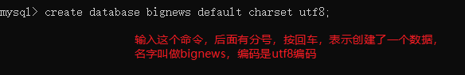

# Git 回顾

## 基本使用

- 工作区 --> 暂存区 --> 本地仓库 --> 远程仓库
    - 工作区 --> 暂存区
        - git add .
        - git add 文件名 文件名 文件夹 ....
    - 暂存区 --> 本地仓库
        - git commit -m '注释'
    - 工作区 --> 本地仓库
        - git commit -a -m '注释'  （这个文件必须被git管理过，才可以执行这个操作）
    - 本地仓库 --> 远程仓库
        - git remote add 远程地址别名  远程仓库地址 （和远程仓库建立一个关系）
        - git push -u 别名 本地分支[:远程分支]  （首次推送）（首次推送还会让我们填写远程仓库的账号和密码）
        - git push （后续的推送）

- 拉取&克隆
    - 首次获取远程仓库的文件，使用克隆
        - git clone 远程仓库地址
    - 下次推送代码到远程仓库之前，应该先拉取，然后再推送
        - git pull
- 回退
    - 暂存区 --> 工作区
        - git checkout .
        - git checkout 文件名 ...
    - 本地仓库 --> 暂存区
        - git reset 文件名
    - 本地仓库 --> （暂存区和工作区）
        - git reset --hard
    - 回退到指定版本
        - git checkout 版本号
- 分支
    - 查看分支
        - git branch
    - 创建分支
        - git branch 分支名
    - 切换分支
        - git checkout 分支名
    - 创建并切换分支
        - git checkout -b 分支名
    - 删除分支
        - git branch -d 分支名 （必须先切换到另外一个分支上，然后在删除当前分支）
    - 合并分支
        - git merge 分支名
- 其他命令
    - 查看文件的状态
        - git status
    - 查看历史记录（会得到版本号）
        - git log
        - git log --oneline 

## 可能的错误

在创建远程仓库的时候，选择了 “`创建一个初始化的README.md`” 。在拉取或推送的时候都会不成功。这个时候，需要先和远程仓库建立一个关系，然后重置基点，进行拉取，最后推送即可。

```bash
git remote add origin 远程仓库地址
git pull --rebase origin master
git push -u origin master

git push
....
```


## 图形化管理界面

略

# 大事件

## 1 安装MySQL软件

MySQL是一个数据库。存储数据的，大事件项目的数据就是存放在数据库中的，所以先要创建数据库。


选择 `MySQL控制台` ，弹出的窗口中，让我们输入MySQL的密码，默认的密码是 `空` 。直接按回车即可。


创建数据库，在上面的黑色窗口中，执行 `create database bignews default charset utf8;`



显示如下，表示创建成功：


到此为止，数据库就创建好了。

## 2 导入数据到数据库

解压 `大事件服务器端代码.zip` 得到  `bigNews_orm` ，它就是服务端的代码。

找到   `bigNews_orm` 里面的 `config/index.js` ，用编辑器打开，完成数据库的配置：


在  `bigNews_orm` 里面，按住 `shift` 键，点击鼠标右键，点击 `在此次打开PowerShell窗口` 。


提示 `搞定` 表示成功将数据导入到了数据库。

## 3 开启服务

仍然像以前一样，运行 `node app.js` ，Windows系统，还可以双击 `开始.bat` 即可表示服务启动了。


# 开发前台首页

文件夹 `大事件静态页面\web_front` 里面的页面就是前台页面。

用编辑器打开这些页面编辑。

##  1. 焦点关注

在 `大事件静态页面\web_front\index.html` 中，编写代码，向服务器的接口发送请求，获取数据，并将获取到的数据通过模板引擎渲染到页面中。

下面是JS代码：

```js
/********************************************************************
        ******************************* 完成 焦点关注 *************************************
        ********************************************************************/
$.get('http://localhost:8080/index/attention', function (res) {
    // console.log(res);
    // 调用template函数
    var str = template('jiaodian', {
        // 属性: 值
        // 属性模板循环使用，自定义
        // 值就是服务器返回的数据
        arr: res.data
    });
    // 将str放到类名为guanzhu_list的ul中
    $('.guanzhu_list').html(str);
}, 'json');
```

下面是模板的代码：

```html
<!-- 定义焦点关注的模板 -->
<script id="jiaodian" type="text/html">
        {{each arr}}
        <li><a href="article.html?id={{$value.id}}">{{$value.title}}</a></li>
        {{/each}}
</script>
```

## 2. 热点图

略，做法和前面一样。


# 开发前台详情页

## 1. 给首页的文章标题挂超链接

在完成的首页模板中，给==所有的==文章标题挂超链接，链接到article.html，并挂id参数，比如：


## 2. article.html中，根据文章id调用接口完成开发

接下来的开发到article.html中。无论是获取当前文章的详情，还是获取当前文章的评论，都需要地址栏的id参数。所以首先将地址栏的id获取下来。然后继续调用接口获取数据，并通过模板引擎将数据渲染到页面中即可。


