# 前台列表页开发

>  每天开发前，都应该先开启数据库服务器（打开 W 的软件），然后开启web服务器（运行 开始.bat）

- 先到首页，给 导航条部分的分类 挂超链接，链接到 list.html ，并且挂id参数

    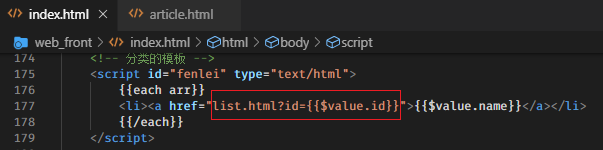

- 到list.html 中，获取地址栏的分类id。调用接口 /index/search 接口，获取当前分类的文章，并渲染到页面中

    - js代码

        ```js
        /************************************************************
                ********************** 获取当前分类的文章 **********************
                ************************************************************/
        /* var id = location.search; // id = ?id=2
                id = id.replace(/\D/g, ''); // id = 2 */
        var id = location.search.replace(/\D/g, '');
        $.get('http://localhost:8080/index/search', {type: id}, function (res) {
            console.log(res);
            var str = template('list', {
                arr: res.data.data
            });
            // 把 str 放到 类名为 list_title 的后面
            $('.list_title').after(str);
            // 更换分类名称
            $('.list_title h3').text(res.data.data[0].category);
        }, 'json');
        ```

    - 模板代码

        ```html
        <script src="./js/template-web.js"></script>
        
        <script id="list" type="text/html">
                {{each arr}}
                <div class="common_news_list">
                    <a href="#" class="list_pic"></a>
                    <h4><a href="#">{{$value.title}}</a></h4>
                    <p>
                        {{$value.intro}}
            </p>
                    <div class="new_info">
                        <span>
                            标签：{{$value.category}}&nbsp;&nbsp;&nbsp;|&nbsp;&nbsp;&nbsp;<i class="fa fa-eye"></i>&nbsp;
                            阅读( {{$value.read}} )&nbsp;&nbsp;&nbsp;<i class="fa fa-commenting"></i>&nbsp;
                            评论( {{$value.comments}} )
            </span>
                        <b>发布于 {{$value.date}}</b>
            </div>
            </div>
                {{/each}}
        </script>
        ```

- 给 列表页的文章标题挂超链接，也应该跳转到详情页

    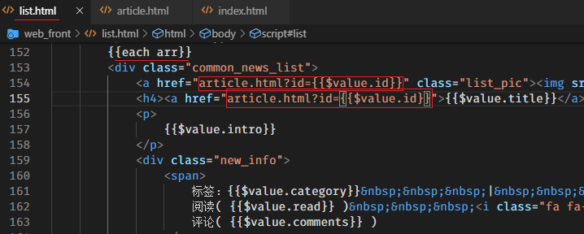

- 为了让整个网站能够相互跳转，所以将列表页和文章详情页的导航条数据也获取出来

    - 做法是到index.html 中，复制获取分类的js代码和模板代码即可。

> 前台目前还差 搜索、分页、添加评论

# 前台和后台说明

前台：

- 普通的用户或游客可以直接看到的页面。
- 我们上网的时候，看到的页面都是前台页面
- 前台页面就是展示数据的

后台：

- 管理员需要登录才能访问的页面，普通的游客是不能访问的
- 后台是管理整个网站的页面（比如可以添加分类、添加文章、审核评论等等）

# 后台登录

login.html 中，编码代码，将账号和密码提交给登录接口即可。

```js
// 点击登录的时候，将账号和密码提交给服务器的接口
$('.input_sub').click(function (e) {
    e.preventDefault();
    // 获取账号和密码
    // var u = $('.input_txt').val();
    // var p = $('.input_pass').val();
    // 一项一项的获取数据，非常麻烦，使用 jQuery提供的一个 $('form').serialize(); 方法来获取表单中的所有数据
    // $('form').serialize(); 也是根据表单各项的name属性获取的，所以表单各项应该有name属性
    // $('form').serialize(); 获取的结果就是一个字符串，类似于 username=xxx&password=yyy

    /**
    serialize() 和 FormData的区别
    ***/
    // $('form').serialize();  获取的数据是一个字符串，适用于编码格式为 application/x-www-form-urlencoded 的表单数据
    // FormData ,获取的数据是一个对象，适用于编码格式为 multiple/form-data 的表单数据

    // $('form').serialize(); 只能收集文本类型的数据，不能用于上传文件
    // FormData , 既能够获取到文本类型的数据，也能够获取到文件类型的数据，适用于上传文件

    var data = $('form').serialize();
    console.log(data); // username=lisi&password=123

    // $.post('http://localhost:8080/admin/user/login', {username: '', password: ''}, function (res) {
    $.post('http://localhost:8080/admin/user/login', data, function (res) {
        // 判断是否登录成功了
        // 无论成功，还是失败，都应该给出提示
        alert(res.msg);

        if (res.code === 200) {
            // 说明登录成功
            location.href = 'index.html';
        }
    }, 'json');
});

```


# 后台分类管理

## 1 查询

到后台 分类 页面 （`article_category.html`），向接口 (`/admin/category/list`) 发送请求，获取所有的分类，并渲染到页面中

js代码：

```js
/************************************************/
/***************** 获取所有的分类 *****************/
/************************************************/
$.get('http://localhost:8080/admin/category/list', function (res) {
    var str = template('category', {
        arr: res.data
    });
    // 把 str 放到tbody里面即可
    $('tbody').html(str);
}, 'json');
```

模板代码：

```html
<script src="./js/template-web.js"></script>

<!-- 显示分类列名的模板 -->
<script id="category" type="text/html">
        {{each arr}}
        <tr>
            <td>{{$value.name}}</td>
            <td>{{$value.slug}}</td>
            <td class="text-center">
                <a href="" class="btn btn-info btn-xs">编辑</a>
                <a href="javascript:;" class="btn btn-danger btn-xs">删除</a>
    		</td>
    	</tr>
        {{/each}}
</script>
```


## 2 新增

新增使用的是 bootstrap的模态框，点击 “新增分类” 的时候，会有一个模态框弹出，我们通过模态框完成新增分类。

- 修改模态框中的分别别名的id（因为它和分类名称的id重复了）

    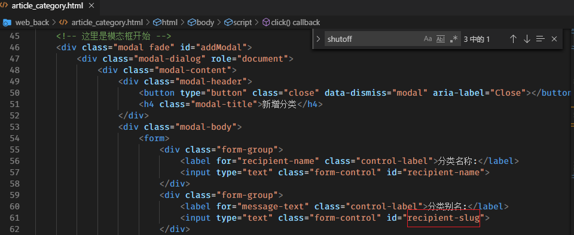

- 找到 “新增” 按钮的单击事件，在单击事件内部，完成ajax请求，完成添加。

    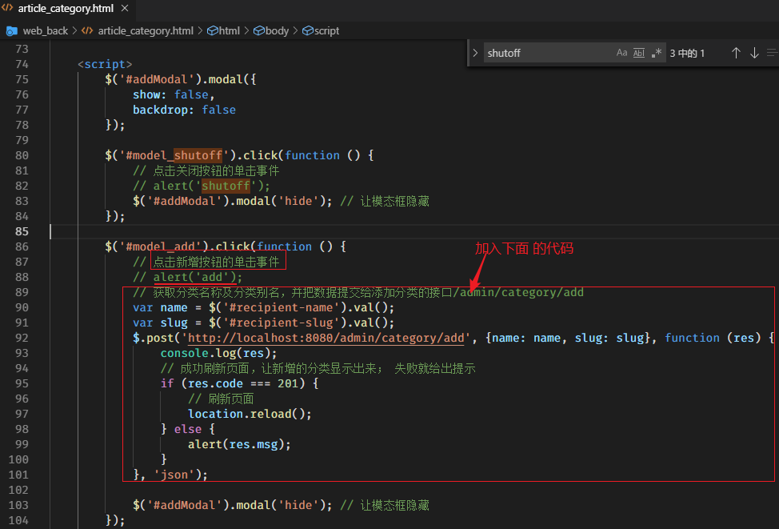

## 3 修改

- 复制一份和新增一样的模态框，用于修改分类使用

    - 找到新增的模态框的div （id为addModal），复制一份。复制一份之后，修改重复的id及里面的字样

        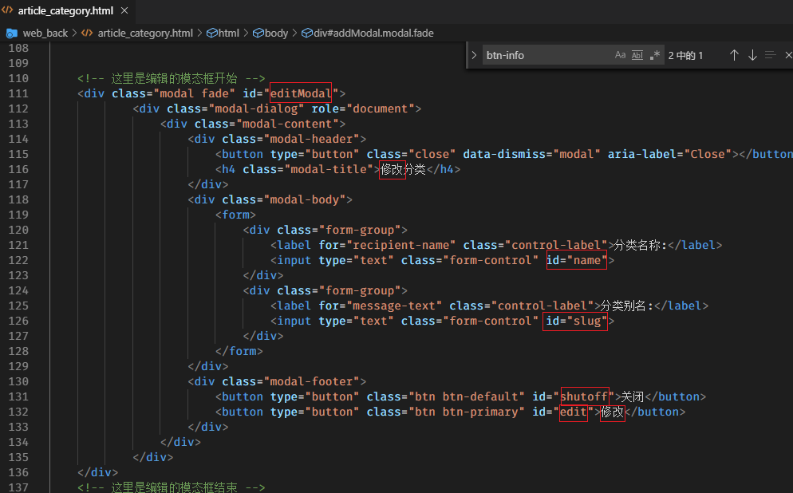

    - 找到控制模态框显示的js代码（原来模板自带的一段js代码），复制一份。修改里面的代码和编辑的模态框对应上即可

        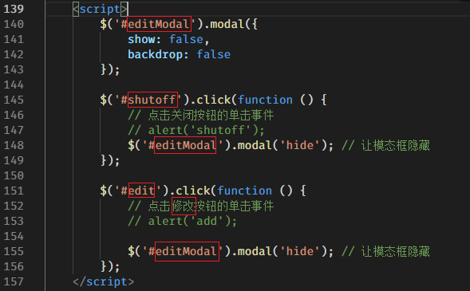

- 给所有的 “编辑” 超链接，注册单击事件，当点击 “编辑”的时候，让修改的模态框显示

    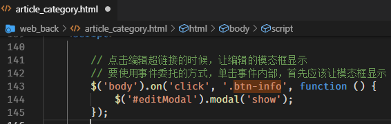

    > 到此为止，点击每个 “编辑” 都会弹出模态框； 点击 “新增分类” 也会弹出另一个模态框，而且二者不冲突。

- 先给每个 “编辑” 设置属性，值分别是当前分类的id、name、slug

    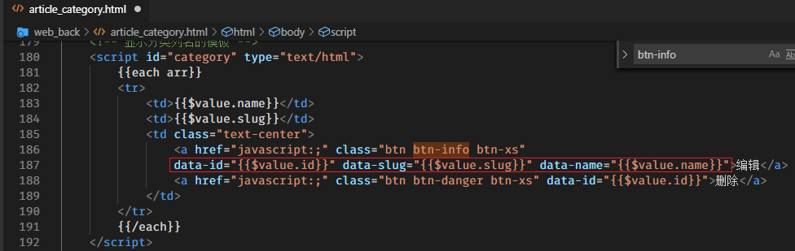

- 给模态框中的form中，增加一个保存id的input

    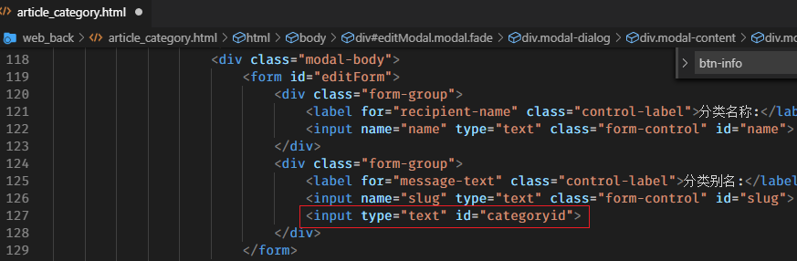

- 单击 “编辑” 的时候，获取三个属性的值，并设置 模态框的input的value值

    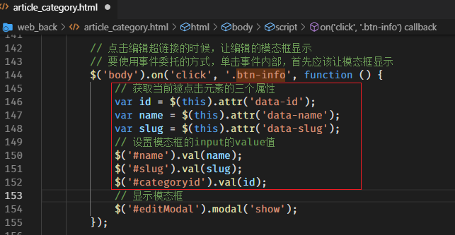

    使用dataset属性，一次性获取元素的所有data-xxx属性：

    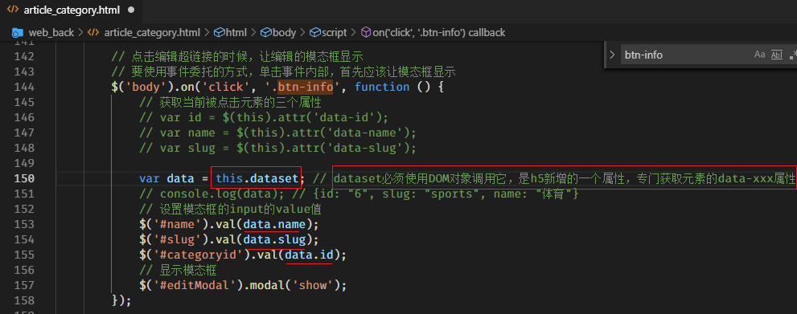

> 到此为止，点击 “编辑” 不但可以弹出模态框，而且模态框中的input还有默认值

- 设置编辑模态框中的form及input的name属性

    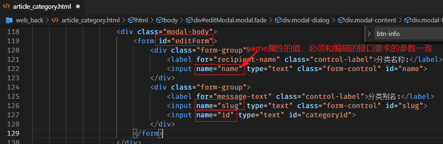

- 点击 “修改” 的时候，将表单中的值，提交给编辑的接口，完成修改即可

    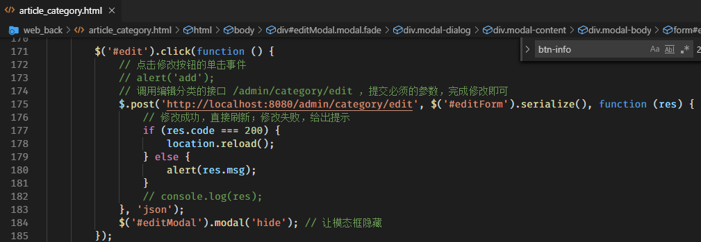

> 到此为止，完成了编辑。

## 4 删除

- 循环模板的时候，给每个删除超链接，添加一个data-id属性，值就是当前分类的id

    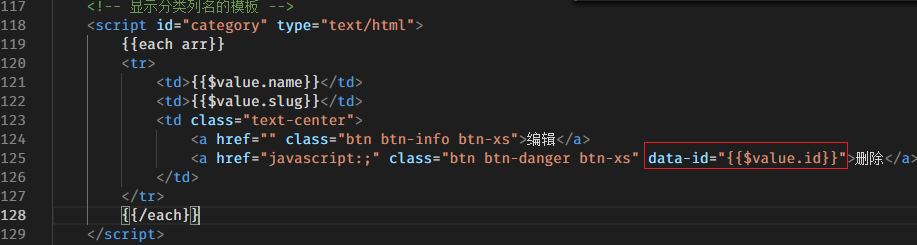

- 给删除超链接，以事件委托的方式添加单击事件，单击事件内部，获取id，向删除分类的接口发送请求，完成删除即可

    ```js
    /************************************************/
    /******************** 删除分类 *******************/
    /************************************************/
    $('body').on('click', '.btn-danger', function () {
        // confirm() ，有一个返回值； 用户如果点击了确定，该函数返回true；用户点击了取消，该函数返回false
        if (!confirm('你确定不要我了吗？')) {
            return;
        }
        // 获取当前分类的id
        var id = $(this).attr('data-id');
        var that = $(this);
        // 发送ajax请求
        $.post('http://localhost:8080/admin/category/delete', {id: id}, function (res) {
            // console.log(res);
            // 无论删除成功还是失败，都提示
            alert(res.msg);
            // 删除成功，以DOM的方式，移除掉当前的元素
            if (res.code === 204) {
                that.parents('tr').remove();
            }
        }, 'json');
    });
    ```

    

# 后台文章管理

## 1 查询

到文章列表页面（`article_list.html`），向文章搜索接口 （`/admin/article/query`） 发送请求，获取文章列表数据，并通过模板引擎渲染到页面中。

```js
/***********************************************************/
/*********************** 文章列表 ************************/
/***********************************************************/
$.get('http://localhost:8080/admin/article/query', function (res) {
    var str = template('moban', {
        arr: res.data.data
    });
    $('tbody').html(str);
}, 'json');
```

模板代码：

```html
<script src="./js/template-web.js"></script>

<!-- 文章列表的模板 -->
<script id="moban" type="text/html">
        {{each arr}}
        <tr>                      
            <td>{{$value.title}}</td>
            <td>{{$value.author}}</td>
            <td>{{$value.category}}</td>
            <td class="text-center">{{$value.date}}</td>
            <td class="text-center">{{$value.state}}</td>
            <td class="text-center">
                <a href="article_edit.html" class="btn btn-default btn-xs">编辑</a>
                <a href="javascript:deleteTr( 1005 );" class="btn btn-danger btn-xs">删除</a>
    		</td>
    	</tr>
        {{/each}}
</script>
```


## 2 新增

到 新增文章的页面 （`article_release.html`） 中，处理好表单。将表单中的各项数据提交给 发布文章的接口 （`/admin/article/publish`）。

提交数据的时候，数据中有文件上传，所以必须使用FormData收集数据。

- 处理表单

    - 表单中有接口要求的参数，则不用处理
    - 表单中缺少的项，需要自己添加
    - 表单中多余的项，需要删除调用
    - ==检查表单各项的name属性的值是否和接口要求的参数名一致==。

- 获取分类，循环option

    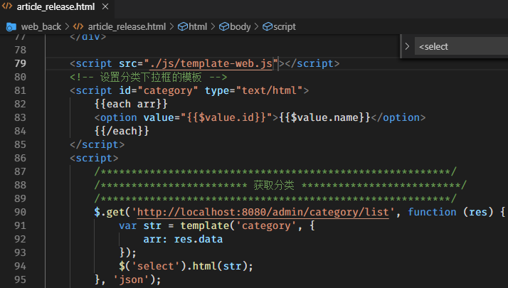

- 查找获取富文本编辑器的内容的办法

    百度查找到的方法是： `tinyMCE.activeEditor.getContent()`

- 点击发布的时候，将表单各项数据提交给 发布文章的接口（会有错误发生，原因看下面）

    ```js
    /*********************************************************/
    /************************ 添加文章 **************************/
    /*********************************************************/
    // 给发布添加单击事件
    $('.btn-success').click(function (e) {
        e.preventDefault();
        // 获取表单数据
        // var formdata = new FormData(表单的DOM对象);
        var formdata = new FormData($('form')[0]);
        // 单独加入 state
        formdata.append('state', '已发布');
        // 单独加入 content 
        formdata.append('content', tinyMCE.activeEditor.getContent());
        // console.log(tinyMCE.activeEditor.getContent()); // 测试可用
        // 调用发布文章的接口，实现添加文章即可
        $.ajax({
            processData: false, // 不让jQuery将data处理成字符串
            contentType: false, // 不让jQuery自动设置Content-Type
            type: 'POST',
            url: 'http://localhost:8080/admin/article/publish',
            data: formdata,
            dataType: 'json',
            success: function (res) {
                // console.log(res);
                alert(res.msg);
                if (res.code === 200) {
                    location.href = 'article_list.html';
                }
            }
        });
    });
    ```

- 解决一个错误

    - 上述添加文章失败，因为表单中的内容是用 textarea表示的，使用formdata的时候，会收集到这项值，虽然这是一个空的值。
    - 点击发布按钮的时候，使用JS代码获取了富文本编辑器的值，并追加到了formdata中
    - 此时，formdata中，会有两个content，所以会报错
    - 解决办法是：将表单中的textarea的name属性去掉。

## 3 删除

## 4 修改

后台评论管理