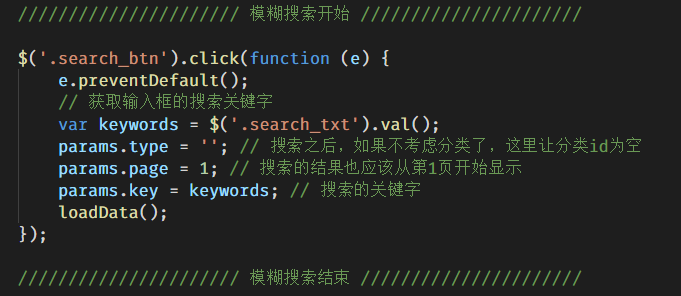

# 后台文章添加

## 修改文章内容字段

原来的文章内容，只能存储255个字符。是不合理的，我们把数据表进行修改，让内容可以存储无限多的数据。修改办法如下。


## 完成代码高亮

我们的编辑器，使用的代码高亮插件是 `prism` 。

用法：

- 在需要代码高亮的页面引入 `prism.css` 文件

- 在保证页面有代码的情况下，然后去加载 `prism.js` 文件

    

## 完成文章内容区图片上传

找到 下面的文件：


这个文件是富文本编辑器的配置文件。我们在里面修改，配置上传文件的路径即可。


# 后台文章修改

## 到文章列表页，给“编辑”挂超链接


## 到文章编辑页面，获取一篇文章，设置表单各项的默认值

article_edit.html 页面。

```js
///////////////////////////////////////////////////////////////////////////
        /////////////获取地址栏的id，根据id获取一篇文章，并设置表单各项的默认值/////////////
        //////////////////////////////////////////////////////////////////////////
        var id = location.search.replace(/\D/g, ''); // 210
        // 调用接口，获取一篇文章
        $.get('http://localhost:8080/admin/article/search', {id: id}, function (res) {
            // 设置表单各项的默认值
            $('#inputEmail3').val(res.data.title); // 设置标题
            $('.article_cover').attr('src', res.data.cover); // 设置图片
            // 文章类别
            $('#dateinput').val(res.data.date); // 设置发布时间
            $('#rich_content').val(res.data.content);
        }, 'json');
```

## 处理分类

调用获取分类的接口，获取所有的分类，并将分类渲染到页面中。

JS代码：

```js
///////////////////////////////////////////////////////////////////////////
/////////////  查询所有的类别，并渲染到页面中  /////////////
//////////////////////////////////////////////////////////////////////////
$.get('http://localhost:8080/admin/category/list', function (res) {
    var str = template('category', {
        arr: res.data
    });
    // 把str 放到select中
    $('select').html(str);
}, 'json');
```


模板代码：

```html
<script src="./js/template-web.js"></script>
<script id="category" type="text/html">
        {{each arr}}
        <option value="{{$value.id}}">{{$value.name}}</option>
        {{/each}}
</script>
```

到现在，页面中，可以正常显示所有的分类。但是默认勾选哪个分类不正常。

想要显示正常的分类，需要在文章列表页 （article_list.html），给编辑挂超链接的时候，不但要传递文章id参数，也要传递categoryId参数（分类的id）。


当点击编辑的时候，就会跳转到编辑页面，并且地址栏就会有两个参数了。我们要做的是将地址栏的id和categoryId获取下来。

```js
// var url = new URL('aadfa.html?id=111&categoryId=223');
var url = new URL('aadfa.html' + location.search, 'http://www.sfsf.com');
// console.log(url.searchParams.get('categoryId'));
var id = url.searchParams.get('id'); // 得到地址栏的文章id
var categoryId = url.searchParams.get('categoryId'); // 得到地址栏的分类id
```

然后在获取到所有分类之后，不但要分配分类的数据到模板，也要将当前文章所属分类的id也分配到模板。


最后，在模板中，循环option的时候，判断，哪一个分类的id等于categoryId，就给这个分类设置selected。


## 完成修改

点击 “修改” 的时候，调用接口，完成修改即可。

过程和添加的过程一样。

- 查看表单各项有没有name属性（文章内容的textarea不能有name属性）
- 实例化FormData之后，单独加入id和content两项（因为接口要求）

```js
// 点击 修改 的时候，提交表单数据到编辑文章的接口
// 和添加几乎一样
/*********************************************************/
/************************ 编辑文章 **************************/
/*********************************************************/
// 给修改 添加单击事件
$('.btn-success').click(function (e) {
    e.preventDefault();
    // 获取表单数据
    // var formdata = new FormData(表单的DOM对象);
    var formdata = new FormData($('form')[0]);

    // 单独加入一个id
    formdata.append('id', id);
    // 单独加入 content 
    formdata.append('content', tinyMCE.activeEditor.getContent());

    // console.log(tinyMCE.activeEditor.getContent()); // 测试可用
    // 调用发布文章的接口，实现添加文章即可
    $.ajax({
        processData: false, // 不让jQuery将data处理成字符串
        contentType: false, // 不让jQuery自动设置Content-Type
        type: 'POST',
        url: 'http://localhost:8080/admin/article/edit',
        data: formdata,
        dataType: 'json',
        success: function (res) {
            // console.log(res);
            alert(res.msg);
            if (res.code === 200) {
                location.href = 'article_list.html';
            }
        }
    });
});
```


## 后台文章的删除

自己完成。

# 关于删除分类的问题

==默认的5个分类不能删除的==。因为每个分类中，都有很多文章。如果分类删除了，剩下的文章就没有分类了，在查询这些文章的时候就会出错。


# 分页和模糊搜索

## 分页

首先，先将获取数据的代码封装成loadData函数，并且页面刷新先调用一次。

按照接口要求，传递不同的page参数，即可获取不同页的数据。默认肯定先获取第一页的数据，所以先让params.page = 1

```js
var id = location.search.replace(/\D/g, '');

// 设置获取数据的参数
var params = {
    type: id,
    page: 1
}
function loadData () {
    $.get('http://localhost:8080/index/search', params, function (res) {
        console.log(res);
        var str = template('list', {
            arr: res.data.data
        });
        // 把 str 放到 类名为 list_title 的后面
        $('.list_title').after(str);
        // 更换分类名称
        $('.list_title h3').text(res.data.data[0].category);
    }, 'json');
}
loadData();
```

寻找单击页码的事件，通过点击页面中的页码，发现弹出来一个 “OK!” ,通过搜索，可以查看到 list.html 中，有一段代码，就是单击页码的单击事件。


到此，能够实现，通过点击不同的页码获取不同页的数据。但是页面中的数据会越来越多，并没有把上一页的数据覆盖掉。所以我们在放数据的位置，自己创建一个 id为neirong的div，存放数据。


修改loadData，将渲染好的数据放到 neirong中。


到此为止，分页基本实现了。最后解决一下当前页和总页数不对的问题即可。

将显示页码的那段js，封装成函数，并将当前页和总页数设置为形参：


在loadData函数中，渲染数据之后，调用page函数，显示页码：


## 模糊搜索

点击搜索按钮的时候，设置请求参数（搜索关键字、当前页、分类），设置好的请求参数之后，继续调用loadData函数即可。



如果是搜索状态的话，列表页的标题，应该显示成 “搜索 xxx 的结果：”


前台添加评论

后台审核评论

修改管理员信息

获取后台首页的统计数据