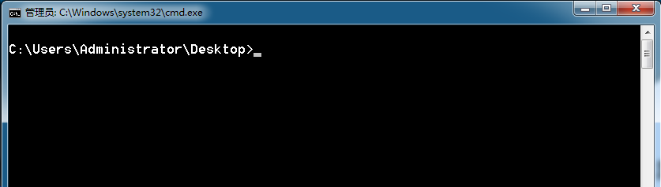
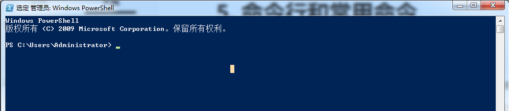
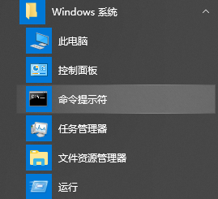
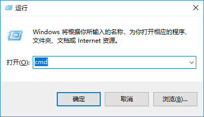
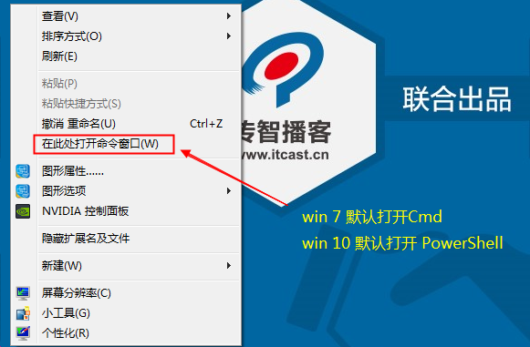
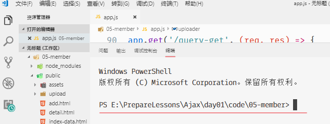
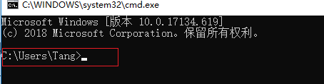
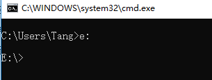

# 命令行

## 1. 命令行介绍

- windows未发布之前，人们都是用DOS（磁盘操作系统）来操作计算机。
- DOS系统内置了很多命令（例如：cd、dir等），我们可以通过调用不同的命令来操作计算机。
- windows发布之后保留了命令行操作模式，内置了两种命令行： Cmd 和 PowerShell，我们可以使用命令行来操作计算机。 win 7默认Cmd， win 10 默认 PowerShell

Cmd：



PowerShell：




## 2. 为什么要学习命令行

- 学习 Node.js 离不开命令行环境

- 作为一名前端开发工程师，**日常工作是离不开命令行的**，因为有**一些工作只有通过命令才能完成**。其中包括：

    1. 使用 Node.js 开发的工具
    2. 从服务器获取或提交源代码
    3. 开启测试 Web 服务器
    4. 代码压缩、合并
    5. ...


## 3. 打开命令行的方式

>  不同系统，命令行工具不一样，但是都不影响使用

- **方式 1**：**开始菜单**|**Windows 系统**|**命令提示符**，如下图所示：

    

- **方式2**：找到上图中的运行，或按快捷键 `win+r`，找到运行，然后输入 `cmd`，回车。如下图所示：

    

- **方式3**：在任何文件夹，按住shift键，然后右键，选择命令行工具

    

- **方式4**：代码编辑器内置命令行工具

    - VSCode

        - `Ctrl + 反引号`

            

    - WebStorm

        - `Alt + F12`

## 4. 使用命令

### 4.1 命令格式（了解）

```bash
command [/options] [parameter]
```

### 4.2 命令行中的路径

打开命令行窗口后，在**窗口的左上角位置**，会显示**当前所在的位置**，如下图所示：



上图中C:\Users\Tang>表示当前执行命令的目录，其中：

- `C:` 表示**盘符**；
- `\`表示**目录的层次关系**；
- `>` 在后面输入命令。

### 4.3 切换盘符（windows系统）

直接输入盘符后面跟一个冒号，回车即可。



**提示**：

1. 盘符的**字母不区分大小写**；
2. 盘符的冒号 `:` 后面不要使用 `\`。

### 4.4 cd 命令

> 切换目录的命令，它只能切换目录，但是不能切换盘符

| 命令        | 含义               |
| ----------- | ------------------ |
| `cd \`      | 切换到**根目录**   |
| `cd .`      | 保持在当前目录不变 |
| `cd ..`     | 切换到**上级目录** |
| `cd [目录]` | 切换到指定目录     |

#### 相对目录和绝对目录

- **相对路径**：从当前目录开始的路径描述。例如：
    - `cd dev` 表示切换到当前目录下的 `dev` 目录；
    - `cd ..\css` 表示切换到上级目录下的 `css` 目录。
- **绝对路径**：从**盘符**开始的完整路径描述。例如：
    - `cd C:\Users\黑马程序员` 表示切换到 `C:\Users\黑马程序员`。
    - 注意：使用绝对路径，不能直接从一个盘切换到另外的盘，必须先切换盘符

### 4.5 常用命令（掌握）

|  序号  | 命令                         | 英文                     | 作用                       |
| :----: | ---------------------------- | ------------------------ | -------------------------- |
| ==01== | `dir [目录名]`  `苹果系统ls` | **dir**ectory            | 列出目录中的所有文件       |
| ==02== | `cd [目录名]`                | **c**hange **d**irectory | 切换目录                   |
| ==03== | `盘符:`，如：`c:`、`d:` 等   |                          | 切换盘符                   |
|   04   | `md [目录名]`                | **m**ake **d**irectory   | 创建文件夹（知道）         |
|   05   | `rd [目录名]`                | **r**emove **d**irectory | 删除文件夹（知道）         |
| ==06== | `cls`                        | clear                    | 清屏                       |
|   07   | `exit;`                      | **exit**                 | 退出命令行，关闭命令行窗口 |

### 4.6 小技巧（掌握）

- **粘贴和复制**

- (c) 2018 Microsoft Corporation。保留所有权利

    - **粘贴**：**点击鼠标右键**，可以将之前在其他位置复制过的文本**粘贴到当前命令行**。

        > **提示**：从资源管理器粘贴很长的目录时尤其有用！

    - **复制**：在命令行窗口中选中一段文本后，**点击鼠标右键**，可以复制选中的文本。

- **自动补全**

    - 在敲出**文件/目录**的前几个字母后，按下 **tab** 键；
        - 如果**有以这前几个字母开头的**文件/目录，系统**会自动补全**；
        - 如果补全的文件/目录不是想要的，**可以再次按 tab 键**，会**切换下一个**文件/目录，只到切换到想要的文件/目录为止。

- **历史命令**

    - 按**上/下光标键**可以在曾经使用过的命令间来回切换；
    - 如果不想执行当前的命令可以按 **CTRL + C**。

### 4.7 小结

- **本小节重点**
    1. 会打开命令行窗口，对命令行窗口建立第一印象；
    2. 知道使用 `cd` 切换目录，盘符切换磁盘；
    3. 如果执行的程序时间比较长，终止正在执行的程序 `CTRL + C`，退出终端窗口 `exit`。

