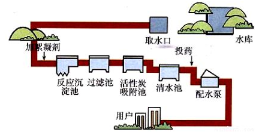
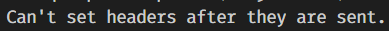

# 1. npm概述

## 1.1 第三方模块

- Node安装过后，就可以使用一些模块，比如fs、path、http等，这些模块叫做内置模块或核心模块
- 第三方模块，它不是Node软件自带的模块，是其他人编写的模块。不过我们可以下载下来使用。
- 使用第三方模块，多数都是为了简化开发，将复杂的代码封装后，形成的模块
- 使用第三方模块，需要先安装（从网上下载）
- 第三方模块也叫做  ”包“  或  第三方库。

## 1.2 npm概述

- npm（node package manager）翻译过来就是node包管理器
- npm就是安装、卸载第三方模块的管理工具
- npm不用单独安装，安装完node，npm默认就安装好了
- 试着执行 `npm -v` 命令，看下能否看到npm的版本

## 1.3 使用npm安装第三方模块

### 1）全局安装

全局安装的一般都是==命令==，所以全局安装的模块，在任何文件夹都可以调用这个命令。

全局安装的内容一般都是在系统盘，可以通过 `npm root -g` 查看全局安装路径。

全局安装的语法格式：

```bash
# 安装语法
npm install -g 模块名

# 新版Mac系统，如果提示权限不足，可以使用 sudo su npm install -g 模块名
```

执行下面的命令，全局安装第一个第三方模块

```bash
npm install -g nodemon
```

- npm 表示使用npm工具
- install 表示安装
- -g 表示全局安装
- nodemon是第三方模块的名字

> nodemon是一个用于自动启动服务的工具，是一个类似node的命令
>
> 全局安装之后，在任何位置都可以使用这个命令
>
> 全局安装的第三方模块，一般都是命令

### 2）本地安装

本地安装的都是能够直接使用的模块，他们不是命令，是类似于 `fs` 等可以通过 `require()` 加载的模块。

在需要使用第三方模块的文件夹，执行下面的命令，本地安装第三方模块

```bash
npm install 模块名
```

- npm 表示使用npm工具
- install 表示安装

> 后续马上就会大量的使用本地安装了

下面本地安装express

- 在今天的写代码的文件夹中，打开终端
- 执行命令 `npm install express`
- 安装完毕，在code中会生成 node_modules 文件夹和 package-lock.json文件
    - node_modules --- 我们刚刚下载的第三方模块express的文件都在这里面
    - package-lock.json --- 里面记录了express中的内容下载的地址、版本等等
- 在code文件夹中，安装了express，这就属于本地安装，安装完成之后，只能在code文件夹中或code的子（后代）目录中来使用express，在其他文件夹中就不能使用express。

> 后续的学习中，我们基本上都是使用第三方模块开发，因为他们封装的方法更简单，更好用。

# 2. express框架

## 2.1 express 介绍

- Express 是一个第三方模块，用于搭建服务器
- Express 是一个基于 Node.js 平台，快速、开放、极简的 **web 开发框架**。
- express保留了http模块的基本API，也就是说使用express时也能使用req和res对象
- express还额外封装了一些新方法，能让我们更方便的搭建服务器
- express提供了中间件功能，其他很多强大的第三方模块都是基于express开发的
- [Express 官网](http://expressjs.com/)
- [Express 中文文档（非官方）](http://www.expressjs.com.cn/)
- [Express GitHub仓库](https://github.com/expressjs/express)

## 2.2 使用Express构造Web服务器

使用Express构建Web服务器步骤：

  1) 加载 express 模块

  2) 创建 express 服务器

  3) 开启服务器

  4) 监听浏览器请求并进行处理


```js
// 使用express 搭建web服务器
// 1) 加载 express 模块
const express = require('express');

// 2) 创建 express 服务器
const app = express();

// 3) 开启服务器
app.listen(4000, () => console.log('express服务器开始工作了'));

// 4) 监听浏览器请求并进行处理

app.get('GET请求的地址', 处理函数);
或
app.post('POST请求的地址', 处理函数);
```


总结：

 1) 使用express构造服务器也是4步流程： 

```
① 加载express模块         const  express = require('express');
② 创建express服务器       const  app = express();
③ 开启express服务器       app.listen(3000, () => {})
④ 注册服务器事件           app.get(url, callback)   app.post(url, callback)
```

 2) 注册服务器事件有两个方法： app.get() 和 app.post()

```
get方法用来接收get请求，浏览器地址栏发起的请求都是get请求

post方法用来接收post请求，接收post表单提交的请求
```

 3) express框架封装了一些额外的API（例如:send），可以让我们更方便的构造Web服务器

​	3.1 ）使用send方法响应数据的话，会自动设置content-type。但有时候会错误设置

​	3.1 ）注意send不能直接响应数字，需要加引号，否则会将数字当做响应状态码处理

 4) 浏览器请求的每一个url地址都会由一个独立方法接收并处理，没有了 if ... else if ... else 这样的分支，程序结构
     更加清晰

5）sendFile(文件路径); -- 功能是读取文件，并将读取到的结果响应给浏览器。它的参数==必须是绝对路径==。

## 2.3 中间件

为了理解中间件，我们先来看一下我们现实生活中的自来水厂的净水流程。



- 在上图中，自来水厂从获取水源到净化处理交给用户，中间经历了一系列的处理环节
- 我们称其中的每一个处理环节就是一个中间件。
- 这样做的目的既提高了生产效率也保证了可维护性。


express中间件是一个特殊的url地址处理函数

- 中间件是 express 的最大特色，也是最重要的一个设计
- 一个 express 应用，就是由许许多多的中间件来完成的
- 中间件就是一个函数，中间件函数要当做 `app.use();` 的参数，这样来使用
- 中间件函数中有三个基本参数， req、res、next
- req就是请求相关的对象，它和后面用到的req对象是一个对象
- res就是响应相关的对象，它和后面用到的res对象也是一个对象
- next：它是一个函数，调用它将会跳出当前的中间件函数，执行后续代码；如果不调用next，则会在当前中间件卡住


## 2.4 自定义中间件处理静态资源文件的读取及响应



如果发现上述错误，是因为一次请求，有多次响应。多次会出现在next() 那行代码。

思路：

- 如果发现请求的是静态资源（url以 `/assets/` 开头），则读取他们，并返回。
- 如果不是静态资源，则交给下一个中间件处理（next）

==必须单独处理index.html，中间件函数处理的是纯的静态资源文件==

方案一：写一个中间件，处理静态资源；但是 /index.html 要单独写。

```js
const express = require('express');
const app = express();
app.listen(3000, () => console.log('服务器开启了'));

// app.use(中间件函数);
app.use((req, res, next) => {
    console.log(req.url);
    // 判断，如果是静态资源文件，则读取他们，并响应结果；如果不是静态资源文件，则next()
    if (req.url.startsWith('/lib') || req.url.startsWith('/images')) {
        res.sendFile(__dirname + '/manager' + decodeURIComponent(req.url));
    } else {
        next(); // --  表示当前的中间件处理完毕，程序向后执行
    }
});

// 处理 /index.html 请求
app.get('/index.html', (req, res) => {
    res.sendFile(__dirname + '/manager/index.html');
});

app.get('/time', (req, res) => {
    res.send(Date.now() + '');
});
```

方案二：写两个中间件，分别处理 /lib 文件夹 和 /images 文件夹中的静态资源

```js
// 
const express = require('express');
const app = express();
app.listen(3000, () => console.log('服务器开启了'));

// 使用app.use() 处理静态资源文件
// app.use([请求的url的开头部分], 中间件函数);
app.use('/lib', (req, res, next) => {
    // console.log(req.url);
    // next();
    res.sendFile(__dirname + '/manager/lib' + decodeURIComponent(req.url));
});

app.use('/images', (req, res, next) => {
    res.sendFile(__dirname + '/manager/images' + decodeURIComponent(req.url));
});

// 处理 /index.html 请求
app.get('/index.html', (req, res) => {
    res.sendFile(__dirname + '/manager/index.html');
});

app.get('/time', (req, res) => {
    res.send(Date.now() + '');
});
```

方法三：一个中间件，即处理css、js、images，也处理html

```js
const fs = require('fs');
const express = require('express');
const app = express();
app.listen(3000, () => console.log('开启服务'));

// 写一个中间件，处理所有的文件
// app.use([url的开头部分], 中间件函数);
app.use((req, res, next) => {
    console.log(req.url);
    // 判断文件是否存在；存在则读取，并响应；如果不存在则next
    fs.access(__dirname + '/manager' + decodeURIComponent(req.url), (err) => {
        if (err) {
            next();
        } else {
            res.sendFile(__dirname + '/manager' + decodeURIComponent(req.url));
        }
    });
});

app.get('/time', (req, res) => {
    res.send(Date.now() + '');
});
```


## 2.5 使用express自带的中间件静态资源文件

前面，为了理解中间件，都是自定义的中间件，其实，关于处理静态资源文件，express自带了更好的办法

```js
const express = require('express');
const app = express();
app.listen(3000, () => console.log('服务器开启了'));

// 通过如下代码就可以将 manager 目录下的图片、CSS 文件、JavaScript 文件对外开放访问了
app.use(express.static('manager'));

/**
 * 现在，你就可以访问 manager 目录中的所有文件了：
    http://localhost:3000/images/kitten.jpg
    http://localhost:3000/css/style.css
    http://localhost:3000/js/app.js
    http://localhost:3000/images/bg.png
    http://localhost:3000/hello.html
 */
```


## 2.6 自定义中间件处理post提交的数据

思路：

- 如果是POST方式的请求，则接受数据。并将数据绑定到req对象的body属性上，然后next
- 如果不是POST方式的请求，则直接next

```js
app.use((req, res, next) => {
    // 判断，看是否是POST方式的请求
    if (req.method === 'POST') {
        // 这里的代码和之前一样，还是接收数据
        let str = '';
        req.on('data', (chunk) => {
            str += chunk;
        });
        req.on('end', () => {
            // 将接收到的数据，赋值给req.body
            // req.body属性本来不存在，是自定义的，你也可以用其他的名字
            req.body = querystring.parse(str);
            next();
        });
    } else {
        // 不是POST方式的请求，继续向下走
        next();
    }
})
```

```js

```


## 2.7 使用body-parser中间件处理post提交数据

前面，为了理解中间件，都是自定义的中间件，其实，关于接收POST请求体的中间件也早就存在了，它就是body-parser

```js
// 安装
// 找好文件夹
npm install body-parser
```

代码：

```js
// 如果请求头的 Content-Type为application/x-www-form-urlencoded，则将请求体赋值给req.body
app.use(bodyParser.urlencoded({extended: false}));
```


npm和第三方模块（初始化、包安装卸载、演示安装jquery包、淘宝镜像、全局安装（nodemon）、查找包的路径）
express
中间件
art-template
body-parser
moment
mime
使用第三方包，重做留言板，MySQL，模块化，导出MySQL模块，加入学生管理案例，练习接收各种类型的表单项，使用路由区分两个功能，会话控制登录才能评论，中间件，npm和第三方模块，ajax跨域请求


会话

案例-留言板，登录后才能发表留言

路由

跨域

npm（命令、淘宝镜像、查找包的路径）ES6降级