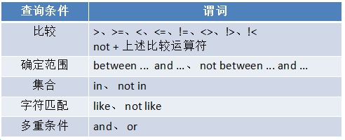

# 1. MySQL数据库

## 1.1 什么是数据库

存储数据的仓库。

常见的数据库: MySQL、 Oracle、 Sqlserver、 DB2等。

之前，没学MySQL之前，我们将数据放到db.json中；学习了数据库，就可以将数据存储到数据库中。

## 1.2 MySQL简介

MySQL是一个关系型数据库管理系统，由瑞典MySQL AB 公司开发，目前属于 Oracle 旗下产品 

数据库分为三级关系：

- 数据库服务器：已经安装过了，曾经安装的wampserver，里面已经包含了MySQL服务器

- 数据库

- **数据表**

    

数据表的结构和excel一模一样。


表结构:  

   和excel表的结构是一样的。
   每一列都是一类数据 --- 字段
   每一行代表一条数据 --- 记录

 

## 1.3 安装MySQL服务

> 之前，我们安装过一个集成软件WampServer，其实安装完它，我们的计算机上就已经安装好MySQL了，不必从新安装了。当然也可以单独安装MySQL，不过得去官网下载MySQL。

安装完MySQL，我们的计算机又变成服务器了，不过不是Web服务器，而是MySQL数据库服务器了。我们可以将数据存储到MySQL服务器中，让它帮我们将数据永久保存。

## 1.4 安装操作MySQL的图形化处理界面

其实操作MySQL不使用图形化界面，只使用命令行窗口也可以，但是操作起来不方便，所以我们安装一个图形化管理软件。

管理MySQL的图形化界面有很多:  Navicat、 Sqlyog、 phpmyadmin等等

课上，我们使用的是Nacicat。


1) 解压

2) 选择版本

3) 安装 --- 傻瓜操作

注意： **==安装路径不能有中文==**


4) 安装完成后会在桌面上产生该图标


破解


## 1.5 使用客户端链接MySQL服务器


使用Navicat 连接到MySQL服务器：


左侧的localhost下的内容都是数据库名称。

==information_schema、mysql、performance_schema 这三个是系统数据库（千万别动）==。
其他的都是自建数据库。

# 2. 创建数据库


# 3. 创建表


# SQL语句

 使用SQL语句就能很方便对数据库进行增删改查操作


# 4. 数据查询

语法格式: 

 ```sql
-- 基本的查询语法
SELECT 字段1,字段2,... FROM 表名

-- 查询所有的字段
SELECT * FROM 表名

-- 带条件的查询
SELECT * FROM 表名 [WHERE 条件] [ORDER BY 排序字段[, 排序字段]] LIMIT [开始位置,]长度

.....
 ```


## 4.1 基本查询

格式:  select  字段名1, 字段名2,....  from  表名 


 案例1: 查询所有英雄的姓名和昵称

```sql
select name,nickname from heroes
```


 案例2: 查询全部英雄的全部信息

 ```sql
select * from heroes
 ```


## 4.2 带where子句的查询

select  field1, field2... from 表名  查询表中的所有数据

where 可以使用条件来筛选查询出的结果

 

```sql
-- 查询所有的英雄的名字和昵称
-- select name,nickname from heroes

-- 查询所有的英雄的所有信息
-- select * from heroes

-- 查询所有女英雄
-- select * from heroes where 条件
-- select * from heroes where sex = '女'

-- 查询年龄小于20岁的女英雄
-- select * from heroes where sex='女' and age<20

-- 查询年龄大于等于20岁并且小于等于30岁的英雄
-- select * from heroes where age>=20 and age<=30
-- select * from heroes where age between 20 and 30
```


## 4.3 模糊查询

通配符:

-   %: 代表任意长度(包括0)的任意字符

-   _:  代表1位长度的任意字符


like: 在执行模糊查询时，必须使用like来作为匹配条件

```sql
-- 查询名字中带有 “斯” 字的英雄
-- select * from heroes where name like '%斯%'

-- 查询名字中带有斯字的英雄，但是要求斯在最后
-- select * from heroes where name like '%斯'

-- 查询名字中带有斯，但是要求斯是第二个字
select * from heroes where name like '_斯%'
```


## 4.4 查询结果排序

order by 可以对查询结果按某个字段进行升序或者降序排列

- 升序 asc （默认值）
- 降序 desc 

可进行排序的字段通常是  整型  英文字符串型  日期型  (中文字符串也行,但一般不用)

```sql
-- 查询所有的英雄，按年龄升序排序
-- select * from heroes order by age asc
-- select * from heroes order by age

-- 查询所有的英雄，按年龄降序排序
-- select * from heroes order by age desc

-- 查询所有的英雄，先按年龄降序排序；如果年龄相同的，再按id降序排序
-- select * from heroes order by age desc, id desc

-- 查询年龄大于50岁的英雄，并按年龄降序排序
select * from heroes where age>50 order by age desc
```

**==注意：如果SQL语句中，有where和order by，where一定要放到order by之前==**。


## 4.5 限制查询结果

limit 用来限制查询结果的起始点和长度

- 格式:  limit  start, length
    - start: 起始点。 查询结果的索引，从0开始。 0代表第一条数据。如果省略start，则默认表示从0
    - length: 长度

```sql
-- 查询前5个英雄
-- select * from heroes limit 开始位置, 长度
-- select * from heroes limit 0, 5
-- 如果查询从0的位置开始，则可以省略0
-- select * from heroes limit 5

-- 查询第6到第10个英雄
-- select * from heroes limit 5, 5

-- 查询年龄最大的三个英雄
-- select * from heroes order by age desc limit 3

-- 查询年龄最大的三个男英雄
select * from heroes where sex='男' order by age desc limit 3
```

**==注意：where、order by、limit如果一起使用，是有顺序的，where在最前面、其次是order by、limit要放到最后==。**

# 5. 添加数据

基本的格式： insert  into  表名 .....

**方式一**：指定字段和值，只要字段和值对应即可。和顺序无关

```sql
insert into heroes (字段, 字段, ...) values (值, 值, ...)
insert into heroes (nickname, age, name) values ('虚空恐惧', 98, '科加斯')
```


方式二：和顺序有关，因为没指定字段，所以值必须是所有的值，而且顺序和表中字段的顺序要一致

```sql
insert into heroes values (null, '拉克丝', '光辉女郎', null, '动感光波', 28, '女')
```


==**方式三**==：使用set里设置新数据的值，没有顺序关系

```sql
insert into heroes set 字段=值, 字段=值, ....
insert into heroes set name='李青', nickname='盲僧', skill='一库'
```


# 6. 修改数据

格式:  

  `update  表名   set   字段1=值1, 字段2=值2,...  where  修改条件`

  修改表中的哪一条（几条）数据的 字段1=值1...

> 不指定修改条件会修改所有的数据

```sql
-- 加条件修改
update heroes set age=28, skill='在地上打滚' where id=19
-- 如果不指定条件，则会修改所有的行
update heroes set sex='妖'
```


# 7. 删除数据

格式:  delete  from 表名  where ==删除条件==

 ==注意：不指定条件将删除所有数据==

```sql
-- delete from heroes where id=19
-- 不加条件，将删除所有的数据，危险操作
-- delete from heroes
```


> drop table stu; -- 删除stu表
>
> drop database qishiwu -- 删除库，加入反引号可以防止出现问题，否则MySQL可能会将70当做关键字或其他意思解释


# 8. 连接查询

连接查询意思是将两个表或更多张表连接到一起查询。查询的结果一般会包含有两个表的全部结果。

不是说任意的两个表都可以连接查询；能够连接查询的两个表必须有关系才行。

连接查询的语法：

```mysql
select * from 表1 连接 表2 on 两个表的关系

-- select * from 表1 连接 表2 on 关系 [连接 表3 on 关系]

-- 内连接，查询的结果是两个表的交集
select * from boy join girl on boy.flower = girl.flower

-- 左连接
-- select * from boy left join girl on boy.flower = girl.flower
-- 右连接
-- select * from boy right join girl on boy.flower = girl.flower
```

可以在查询的过程中，为表定义别名：

```sql
-- 通过 boy b 为boy定义别名为b表。后面的关系中就可以使用b代替boy了
select * from boy b join girl g on b.flower = g.flower
```

可以在查询(不单单是连接查询，前面学习的查询也可以)过程中，为字段定义别名：

```sql
-- select id i,name n from heroes limit 2
select b.name bn,b.flower bf,g.name gn,g.flower gf from boy b join girl g on b.flower = g.flower
```

# 小结：

- 查询

    select * from heroes  [where 条件]   [order by  字段  排序规则]   [limit   开始位置, 长度]

- 添加

    insert into heroes  set  字段=值, 字段=值,.....

- 修改

    update heroes set 字段=值, 字段=值,..... [where  条件]

- 删除

    delete  from  heroes  where  条件

# 9. node中的mysql模块

## 9.1 mysql模块的作用

mysql模块是一个第三方模块，专门用来操作MySQL数据库。 可以执行增删改查操作。

```shell
# 如果前面没有安装过其他模块，需要先初始化
npm i mysql
```


curd: 就代表数据库的增删改查

c: create 就是添加 （增）

u: update 就是修改 （改）

r: read 就是查询 （查）

d: delete 就是删除 （删）


## 9.2 mysql基本用法

在Node中使用MySQL模块一共需要5个步骤：

1) 加载 MySQL 模块

2) 创建 MySQL 连接对象

3) 连接 MySQL 服务器

4) 执行SQL语句           

5) 关闭链接                

```js
// 1. 加载mysql模块
const mysql = require('mysql');
// 2. 创建连接对象（设置连接参数）
const conn = mysql.createConnection({
    // 属性：值
    host: 'localhost',
    port: 3306,
    user: 'root',
    password: '',
    database: 'yingxiong'
});

// 3. 连接到MySQL服务器
conn.connect();

// 4. 完成查询（增删改查）
/*
conn.query(SQL语句, [SQL中占位符的值], (err, result, fields) => {
    err: 错误信息
    result: 查询结果
    fields: 当前查询过程中涉及到的字段信息，一般用不着
});
*/

// 5. 关闭连接，释放资源
conn.end();
```


## 9.3 查询 --- read

==执行查询类型的SQL语句，查询结果（result）是一个数组，每个单元是对象，对象的属性是数据表的字段名==

- ==基本的查询==

```js

// 1. 加载mysql
const mysql = require('mysql');

// 2. 创建连接对象（填写连接参数）
const conn = mysql.createConnection({
    host: 'localhost',
    port: 3306,
    user: 'root',
    password: '',
    database: 'yingxiong',
    multipleStatements: true // 表示可以一次性执行多条SQL
})

// 3. 连接到MySQL服务器
conn.connect();

// 4. 完成查询
// conn.query(SQL语句, 给占位符的值, 回调函数);

/////////////// 4.1 基本的查询
conn.query('select * from heroes limit 2', (err, result) => {
     if (err) throw err;
     console.log(result);
});

// 5. 关闭连接
conn.end();
```

- ==占位符模式==


当SQL语句中使用了占位符，则query方法需要使用参数2

```js
let sql = 'select * from heroes where id < ?';
conn.query(sql, 3, (err, result) => {
    if (err) throw err;
    console.log(result);
});
```

如果SQL中有多个占位符，则传递数组

```js
/////////////// 4.3 有多个占位符的查询
let sql = 'select * from heroes where id < ? and sex = ?';
conn.query(sql, [3, '女'], (err, result) => {
    if (err) throw err;
    console.log(result);
});
```

- 一次性执行多条SQL：
    - 需要在连接参数那里，设置一个配置

    

    - 多条SQL之间使用 分号 （;） 隔开

    ```js
    /////////////// 一次性执行多条SQL
    let sql = `select id,name from heroes limit 2;
                select * from boy;
                select * from girl`;
    conn.query(sql, (err, result) => {
        if (err) throw err;
        console.log(result);
    });
    ```

    - 查询的结果是一个二维数组

    ```js
    [ 
        // 下面是第一条SQL查询的结果
        [
            { id: 1, name: '薇恩' },
            { id: 2, name: '赵信' } 
    	],
        // 下面是第二条SQL查询的结果
      	[ 
          	{ name: '犀利哥', flower: '百合' },
        	{ name: '周杰伦', flower: '桃花' },
        	{ name: '小沈阳', flower: '梅花' },
        	{ name: '张三丰', flower: '荷花' },
        	{ name: '刘德华', flower: '狗尾巴花' } 
        ],
        // 下面是第三条SQL查询的结果
      	[ 
            { name: '凤姐', flower: '仙人掌' },
        	{ name: '林志玲', flower: '荷花' },
            { name: '大S', flower: '梅花' },
        	{ name: '西施', flower: '桃花' },
        	{ name: '芙蓉姐姐', flower: '百合' } 
        ] 
    ]
    ```

    

## 9.4 添加 --- create

==执行添加类型的SQL语句，查询结果（result）是一个对象，该对象中有两个属性需要记住==

- affectedRows： 受影响行数
- insertID： 查询数据的主键值

下面演示添加：

- 基本添加


```js
// 前面有三步（require('mysql')    conn    conn.connect())

let sql = 'insert into heroes set name="派克", nickname="血港鬼影"';
conn.query(sql, (err, result) => {
    if (err) throw err;
    // console.log(result);
    if (result.affectedRows > 0) {
        console.log('添加成功，最新添加的id为：' + result.insertId);
    } else {
        console.log('添加失败');
    }
});
// 后面有conn.end()
```


- ==占位符形式==


  数据添加时，占位符需要一个对象。 对象的属性是数据表字段名，值是要写入数据表的数据

```js
// 有占位符的形式
// 如果SQL语句中有  字段=值, 字段=值, ....  可以使用一个 ? 表示；要为这个问号传递一个对象
let sql = 'insert into heroes set ?';
let values = {
    // 字段: 值
    name: '艾克',
    nickname: '时间刺客',
    age: 34
};
conn.query(sql, values, (err, result) => {
    if (err) throw err;
    // console.log(result);
    if (result.affectedRows > 0) {
        console.log('添加成功，最新添加的id为：' + result.insertId);
    } else {
        console.log('添加失败');
    }
});
```


## 9.5 修改 --- update

==执行修改类型的SQL语句，查询结果（result）是一个对象，该对象中有 affectedRows 属性==

- 基本修改

```js
略
```

- 占位符模式


  数据修改通常需要两个占位符。 占位符1是要修改的数据，对象形式，属性是数据表字段；占位符2是修改条件，通常是主键值

```js
let sql = 'update heroes set ? where id = ?';
let values = {
    skill: '时光倒流',
    sex: '男'
}
conn.query(sql, [values, 36], (err, result) => {
    if (err) {
        console.log('修改失败');
    } else {
        console.log('修改成功');
    }
});
```


## 9.6 删除 --- delete

==执行删除类型的SQL语句，查询结果（result）是一个对象，该对象中有 affectedRows 属性==

- 基本删除

```js
略
```


- 占位符模式


```js
// 4. 完成删除
let sql = 'delete from heroes where id = ?';

conn.query(sql, 36, (err, result) => {
    if (err) {
        console.log('删除失败');
    } else {
        console.log('删除成功');
    }
});
```


# 10. Node中的模块化

## 10.1 什么是模块化

- js设计之初只是为了实现表单验证这样的简单功能，没设计模块化方案，所以js天生不支持模块化
- 不支持模块化简单来说就是在一个js文件内不能引入其他js文件
- 为了让js支持模块化，一些大神自己编写底层库文件，让js开始支持模块化
- js模块化规范有四种标准： AMD   CMD   **CommonJS**   ES6
- Node属于CommonJS标准
- 使用模块化可以很好的解决变量、函数名冲突问题，也能灵活的解决文件依赖问题

- 没有模块化，不允许一个js文件引入另外的JS，有了模块化，就允许一个js文件引入其他的js文件

## 10.2 全局作用域和局部作用域

局部作用域（模块的作用域）：

- 一个js文件就是一个模块
- 在一个js文件中定义的属性（变量、常量）和方法默认都只能在当前js文件中使用

全局作用域：

- 在js文件中声明的属性和方法如果都挂载到global对象下；当其他js文件导入该模块后，就能使用该模块下的属性和方法了。

     bb.js 中定义一些变量，并且把变量当做global的属性：

    ```js
    // 定义一些变量
    let abc = 'hello';
    
    let fn = (x, y) => {
        console.log(x + y);
    }
    
    
    // 把abc和fn当做global的属性
    global.abc = abc;
    global.fn = fn;
    ```

    aa.js 中，通过require加载另外的js文件，就可以使用bb中定义的变量了：

    ```js
    // 加载 b.js
    require('./bb.js');
    
    // console.log(global.abc); // hello
    
    console.log(abc); // hello
    fn(3, 4); // 7
    ```

    ==这个方案可以实现模块化，但是可能会造成全局环境污染==。

## 10.3 module.exports 导出属性和方法

- 将变量、对象、函数等挂载到global对象上并不推荐，因为容易造成变量污染。
- 推荐使用 module.exports 导出模块中定义好的变量、对象、方法
- 使用require加载（导入）模块后，就能使用模块中定义好的变量、对象、方法了

bbb.js 中定义一些变量，然后使用 `module.exports导出`：

```js
// 定义一些变量
let abc = 'hello';

let fn = (x, y) => {
    console.log(x + y);
};

// Node提供一套方案：
// 使用 module.exports 来导出模块（导出的只能是对象或函数）

module.exports = {
    abc: abc,
    fn: fn
};
```

aaa.js 加载 bbb.js ，然后就得到了 bbb 中导出的对象：

- 导入自己定义的js文件，必须加  `./`

```js
// 导入模块(基本上和之前加载模块一样)
const bbb = require('./bbb.js');

// console.log(bbb); // { abc: 'hello', fn: [Function: fn] }

console.log(bbb.abc); // hello
bbb.fn(7, 8); // 15
```


## 10.4 封装 db.js 模块

核心思想： mysql操作流程是固定的，尤其是前三步。将前三部封装到一个模块，导出链接对象。 链接对象就可以调用query方法执行sql语句，也能执行end方法关闭链接

下面是封装的db.js

```js
// 封装 mysql 查询的代码；并导出模块

function abcd (sql, values, cb) {
    const mysql = require('mysql');
    const conn = mysql.createConnection({
        host: 'localhost',
        port: 3306,
        user: 'root',
        password: '',
        database: 'yingxiong',
        multipleStatements: true
    });
    conn.connect();
    conn.query(sql, values, cb);
    conn.end();
}

// 导出模块(只能导出 对象和函数 )
module.exports = abcd;

```

test.js中可以测试一下：

```js
// 加载db.js
const db = require('./db.js');

// db 是一个函数
db('select id, name from heroes limit 2', null, (err, result) => {
    if (err) throw err;
    console.log(result);
});
```


