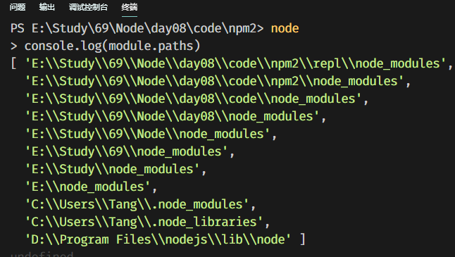
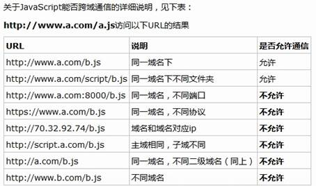
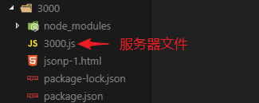
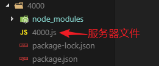

# 1. npm相关

## 1.1 已经学过的

npm（node package manager）是node包管理器，我们之前学习过安装卸载包，**首次==本地==**安装，需要先初始化。

初始化：

```shell
npm init -y
npm init --yes
npm init
```

全局安装：

全局安装的一般都是命令，全局安装之后，在任何文件夹都可以使用这个命令。

==全局安装的东西，不能通过require加载==。

```shell
# 安装命令
npm i 包名 -g
npm install 包名 -g
# 卸载命令
npm un 包名 -g
npm uninstall 包名 -g
```

本地安装：

```shell
# 安装命令
npm i 包名
npm install 包名
# 卸载命令
npm un 包名
npm uninstall 包名
```

## 1.2 关于安装第三方包的补充

- 安装第三方包

    ```bash
    # 老版本的node安装，后面加 --save,是为了把安装的第三方模块在package.json中做记录，新版不用
    npm install 包名 --save
    # 正常的安装
    npm install 包名
    # 一次安装多个包，名字之间用空格隔开
    npm install 包名1 包名2 包名3
    npm i express mysql art-template
    # 指定包的版本进行安装
    npm install 包名@版本号
    # 简写
    npm i 包名
    ```

- 从缓存目录安装包

    ```bash
    # 查看缓存目录
    npm config get cache
    # 从缓存目录下载包
    # --cache-min 后面跟的是时间，单位是分钟，超过这个时间才去服务器下载
    npm install 包名 --cache-min 9999999
    ```

- 查看全局安装目录

    ```bash
    # 查看全局安装时的安装目录
    npm root -g
    ```

    

## 1.3 切换 npm 镜像源

- npm 存储包文件的服务器在国外，速度很慢，所以我们需要解决这个问题。

- 国内淘宝的开发团队把 npm 在国内做了一个备份，网址是：http://npm.taobao.org/。

    ```bash
    # 查看当前的源
    npm config ls
    # 在上面命令的结果有，有下面一行，该行记录的网站就是我们安装第三方模块的网站
    # registry = "https://registry.npmjs.org/"
    
    # 下载包的时候切换源
    npm install express --registry=https://registry.npm.taobao.org
    # 全局设置
    npm config set registry https://registry.npm.taobao.org
    # 原始的路径
    # https://registry.npmjs.org/
    # nrm 是管理镜像源的模块，通过nrm来管理镜像源
    npm i nrm # 自行查询如何使用 
    ```

## 1.4 package.json

在初始化之后，会生成一个package.json文件

- 创建 `package.json`

    ```bash
    npm init 
    npm init -y
    ```

- main

    main 字段指定了加载的入口文件

- dependencies  依赖(复数)

    - 指定了当前项目所依赖（需要）的包
    - 软件的版本号 jQuery@3.3.1
        1. 大版本.次要版本.小版本
        2. **小版本**：当项目在进行了局部修改或 bug 修正时，修正版本号加 1
        3. **次要版本**：当项目在原有的基础上增加了部分功能时，主版本号不变，子版本号加 1
        4. **大版本**：当项目在进行了重大修改或局部修正累积较多，而导致项目整体发生全局变化时，主版本号加 1

    ```json
    "dependencies": {
        "art-template": "^4.14.2",
        "body-parser": "^1.18.3",
        "express": "^4.16.4",
        "express-art-template": "^1.0.1"
     }
    ```

    - `dependencies` 字段指定了项目运行所依赖的模块
    - **==使用 `npm install` 可以安装所有的依赖==**
    - 该对象的各个成员，分别由模块名和对应的版本要求组成，表示依赖的模块及其版本范围。
        - **指定版本**：比如`1.2.2`，遵循“大版本.次要版本.小版本”的格式规定，安装时只安装指定版本。
        - **波浪号（tilde）+指定版本**：比如`~1.2.2`，表示安装1.2.x的最新版本（不低于1.2.2），但是不安装1.3.x，也就是说安装时不改变大版本号和次要版本号。
        - **插入号（caret）+指定版本**：比如ˆ1.2.2，表示安装1.x.x的最新版本（不低于1.2.2），但是不安装2.x.x

- scripts

    `scripts`指定了运行脚本命令的 npm **命令行**缩写，比如start指定了运行`npm run start`时，所要执行的命令。

    ```bash
    "scripts": {
        "test": "echo \"Error: no test specified\" && exit 1",
        "start": "node app.js",
        "t": "dir c:\\"
     }
    ```

    运行 `scripts`

    ```bash
    npm run t
    npm run start
    # 只有 start 可以简化调用
    npm start
    
    ```

依赖的作用：

- 记录项目必须的包
- 发送给别人的时候，不需要发送比较大的 `node_modules` 文件夹。只需要发送给你 `package.json` 即可，你只需要执行 `npm install` 即可安装所有的包

##  1.5 一个神秘的文件夹 node_modules

- 我们下载第三方包的时候，会自动把下载的第三方包，放到 `node_modules` 中。使用第三方包的时候直接 `require('第三方包的名字')`。
- 我们自己写的包也可以放到此文件夹，**加载的时候直接写包名**即可。
- `require`  的加载顺序

    - 打印 module 对象

    - 包加载的过程，按照 `module.paths` 中的路径一级一级往上查找

        

    - 第一次 `require()` 加载完毕，会把 模块/包 **缓存**起来，再次 `require()` 的时候直接从缓存加载

## 1.6 require 的加载机制

- `require` 优先加载**缓存**中的模块
- 如果缓存中没有模块，优先加载**核心模块（node自带的模块，fs、path、http）**，并缓存
- 如果有**相对路径**，则根据路径加载**文件模块**，并缓存
    - `require('./main')`  省略扩展名的情况
    - 先加载 `main.js`，如果没有再加载 `main.json`，如果没有再加载 `main.node`(c/c++编写的模块)
- 如果不是文件模块，也不是核心模块，则加载**第三方模块（下载的，比如express/mysql等）**
- node 会去 node_modules 目录中找（找跟你引用的名称一样的目录），例如这里 `require('moment')`
- 如果在 node_modules 目录中找到 `moment` 目录，则加载该模块并缓存
- 如果过程都找不到，node 则取上一级目录下找 `node_modules` 目录，规则同上
- 如果一直找到代码文件的根路径还找不到，则报错


# 2. ES6降级处理

因为 ES 6 有浏览器兼容性问题，可以使用一些工具进行降级处理，例如：**babel**

- 降级处理 babel 的使用步骤
    1. 安装 Node.js
    2. 命令行中安装 babel
    3. 配置文件 `.babelrc`
    4. 运行

- 项目初始化(项目文件夹不能有中文)

    ```bash
    npm init -y
    ```

- 在命令行中，安装 babel [babel官网](https://babeljs.io)

    ```bash
    npm install  @babel/core @babel/cli @babel/preset-env
    ```

- 配置文件 `.babelrc` (手工创建这个文件)

    babel 的降级处理配置

    ```json
    {
      "presets": ["@babel/preset-env"]
    }
    ```

- 在命令行中，运行

    ```bash
    # 把转换的结果输出到指定的文件
    npx babel index.js -o test.js
    # 把转换的结果输出到指定的目录
    npx babel 包含有js的原目录 -d 转换后的新目录
    ```

# 3. Ajax跨域请求

## 3.1 同源政策

1995年，同源政策由 Netscape（网景） 公司引入浏览器。目前，所有浏览器都实行这个政策。

最初，它的含义是指，A 网站设置的 Cookie，B 网站不能打开，除非这两个网页同源。所谓同源指的是三个相同。

- 协议相同（http https）

- 域名相同

- 端口相同（http默认80端口，https默认443端口）



随着互联网的发展，同源政策越来越严格。目前，如果非同源，共有三种行为受到限制。

- Cookie无法读取。

- DOM 无法获得。

- AJAX 请求无效（可以发送，但浏览器会拒绝接受响应）。

## 3.2 什么是跨域请求

其实，了解了什么是同源政策，就知道什么是跨域请求了。

在发送Ajax请求的时候，请求的地址只要违反了同源政策，那么就属于跨域请求。

## 3.3 实现跨域请求的方案--JSONP

### 1）JSONP简介

**JSON** with **P**adding，是一种借助于 `script` 标签发送跨域请求的技巧。

其原理就是在客户端借助 `script` 标签请求服务端的一个地址，服务端的这个地址返回一段带有调用某个全局函数调用的 JavaScript 脚本（而非一段 HTML），将原本需要返回给客户端的数据通过参数传递给这个函数，函数中就可以得到原本服务端想要返回的数据。

以后绝大多数情况都是采用 JSONP 的手段完成不同源地址之间的跨域请求

### 2）使用JSONP实现跨域请求

1. 首先得创建两个服务器，一个服务器（:3000)向另外一个服务器(:4000)发送请求





2. 在3000里面写一个HTML页面 index.html

3. 在3000里面，app.js中，返回 index.html

    ```js
    app.get('/index.html', (req, res) => {
        res.sendFile(__dirname + '/index.html');
    })
    ```

    重启服务器，此时，访问127.0.0.1:3000/index.html 就可以看到页面

4. 在3000中的 index.html 中，通过script的src属性，请求4000网站中的一个接口 getHeroes

    ```html
    <script src="http://127.0.0.1:4000/getHeroes"></script>
    ```

5. 到4000中，写接口 getHeroes，完成响应

    ```js
    app.get('/getHeroes', (req, res) => {
        // 返回的内容，只要符合JS的语法即可
        // res.send('hello');
        res.send('alert(12345)');
    })
    ```

    写好之后，4000要重启服务器

6. 在3000中，刷新 index.html 就可以看到弹出框了

    说明了，4000网站的接口响应的字符串，会被3000网站当做js代码解析。

### 3）实现跨域传输数据

前面实现了跨域请求，如果4000网站返回一个调用函数的字符串，那么3000网站接收到之后，也会执行一个函数。然后给函数传递一个参数，这个参数就是要传输的数据。

1. 4000网站，返回一个调用函数的字符串

    ```js
    app.get('/getHeroes', (req, res) => {
        // res.send('hello');
        // res.send('alert(12345)');
    
        let heroes = [
            {name: '曹操', age: 23},
            {name: '鲁智深', age: 32}
        ];
    
        heroes = JSON.stringify(heroes);
    
        res.send('abc(' + heroes + ')');
    });
    ```

2. 3000网站，要提前准备好一个叫做abc的函数，用于接收4000返回的数据

    ```html
    <script>
        // 输出4000网站返回的内容
        // console.log(aa);
    
        // 为了配合4000网站的要求，所以要定义一个abc函数
        function abc(x) {
            console.log(x);
        }
    </script>
    
    <script src="http://127.0.0.1:4000/getHeroes"></script>
    ```

    这样就可以实现跨域请求了。并且也实现了数据的传输。

    问题是两个网站的函数名字如何统一？大家有一个约定，请求的时候，要把你的函数名传递给4000网站，并且参数名必须是callback。

3. 3000网站中，将函数名以参数的形式，传递过去

    ```html
    <script>
        // 输出4000网站返回的内容
        // console.log(aa);
    
        // 为了配合4000网站的要求，所以要定义一个abc函数
        function abc(x) {
            console.log(x);
        }
    </script>
    
    <script src="http://127.0.0.1:4000/getHeroes?callback=abc"></script>
    ```

4. 4000网站中，获取地址栏的callback参数，值就是函数的名字

    ```js
    app.get('/getHeroes', (req, res) => {
        // res.send('hello');
        // res.send('alert(12345)');
    
        let heroes = [
            {name: '曹操', age: 23},
            {name: '鲁智深', age: 32}
        ];
    
        heroes = JSON.stringify(heroes);
    
        // 获取callback的值，值就是函数的名字
        let fn = req.query.callback;
    
        res.send(fn + '(' + heroes + ')');
    });
    ```

    

### 4）jQuery封装的ajax方法跨域请求

1. 在3000网站中，index.html 中引入一个jQuery文件，为了方便（引入自己的jQuery，自己就得写处理静态资源文件的代码），引入的是百度提供的jquery

2. 使用jQuery提供的ajax方法，实现跨域访问

    ```html
    <!-- 使用jQuery提供的ajax方法，实现跨域请求 -->
    <!-- 下面引入百度提供的jQuery，需要联网 -->
    <script src="http://libs.baidu.com/jquery/2.1.4/jquery.min.js"></script>
    
    <script>
        $.ajax({
            type: 'GET',
            // data: {}, // 发送给4000网站的数据
            // url: 'http://127.0.0.1:4000/getHeroes?callback=?', // ? 可以理解为下面的success方法。
            url: 'http://127.0.0.1:4000/getHeroes',
            success: function (result) {
                // result就是4000服务器返回的数据
                console.log(result);
            },
            dataType: 'jsonp' // 必须要指定dataType为jsonp
        });
    </script>
    ```

    


## 3.4 实现跨域请求的方案--CORS

通过在**==被==请求的路由中**设置header头，可以实现跨域。不过这种方式只有最新的浏览器（IE10）才支持。

Cross Origin Resource Share，跨域资源共享

前端发送ajax请求，还是照常发送即可，不需要做任何设置就行。

```js
// 写一个ajax请求，请求4000网站的一个接口
var xhr = new XMLHttpRequest();
xhr.open('GET', 'http://127.0.0.1:4000/getHeroes2');
xhr.send();
xhr.onload = function () {
    console.log(this.response);
}
```


4000网站的接口

```javascript
app.get('/getHeroes2', (req, res) => {
    
    // res.setHeader('Access-Control-Allow-Origin', '允许请求的网址');
    // res.setHeader('Access-Control-Allow-Origin', '*');
    res.setHeader('Access-Control-Allow-Origin', 'http://127.0.0.1:3000');
    
    let heroes = [
        {name: '曹操', age: 23},
        {name: '鲁智深', age: 32}
    ];

    heroes = JSON.stringify(heroes);
    
    res.send(heroes);
});
```

这种方案无需客户端作出任何变化（客户端不用改代码），只是在被请求的服务端响应的时候添加一个 `Access-Control-Allow-Origin` 的响应头，表示这个资源是否允许指定域请求。


# 4 XML

HTML:超文本标记语言

XML: e==X==tension ==M==arkup ==L==anguage   可扩展标记语言。

一种数据描述手段

老掉牙的东西，简单演示一下，不在这里浪费时间，基本现在的项目不用了。

淘汰的原因：数据冗余太多

```xml
<?xml version="1.0" encoding="UTF-8" ?>
<students>
	<stu id="1">
    	<name>张三</name>
        <age>18</age>
        <sex>男</sex>
        <other height="175cm" weight="65kg" />
    </stu>
    <stu id="2">
    	<name>李四</name>
        <age>20</age>
        <sex>女</sex>
        <other height="170cm" weight="60kg" />
    </stu>
</students>
```

XML语法规范：

- 和html写法差不多
- 有且只有一个根标签
- 标签区分大小写
- 标签必须闭合
- 属性值必须加引号

如果服务器返回的是XML格式的数据，JS收到数据之后，把收到的数据当做document对象来处理即可。

# 5 ajax请求遵循http协议

发送ajax请求的时候，可以设置请求报文、可以获取响应报文。

- 行
- 头
- 体

```js
var xhr = new XMLHttpRequest();
// open体现了请求行的信息。调用open方法相当于设置请求行
xhr.open('POST', '/abc');
// setRequestHeader 用于设置请求头
xhr.setRequestHeader('Content-Type', 'application/x-www-form-urlencoded');
// send的参数就是请求体
xhr.send('aa=xxx&bb=yyy');
xhr.onload = function () {
    // 获取响应行的内容
    console.log(this.status); // 200,响应状态码
    console.log(this.statusText); // OK，表示响应状态描述信息
    // 获取响应头的信息
    console.log(this.getAllResponseHeaders());
    console.log(this.getResponseHeader('content-length'));
    // 获取响应体（服务器响应的结果）
    console.log(this.response);
}
```

