# 一、使用Git管理项目

项目使用Git管理，但是不需要 推送 到 远程仓库。

新建一个 `项目代码` 的文件夹。首先初始化 Git。

把项目使用的html文件（manager文件夹）拷贝过来。

使用Git：

- git add . 
- git commit -m '说明'
- git log --oneline    （查看历史记录 ）
- git checkout 版本号  （回到历史，查看代码）
- git checkout master  （回到主分支继续开发）


# 二、搭建项目

## 2.1 下载第三方模块

在 `项目代码` 文件夹中，执行：

```bash
npm i express body-parser mysql
```


## 2.2 创建服务器文件 app.js

在 `项目代码` 文件夹中，创建app.js。用于开启web服务器：

```js
// 创建web服务器
const express = require('express');
const app = express();
app.listen(3000, () => console.log('服务器启动了'));

// 使用中间件，处理文件资源
app.use(express.static('manager'));

// 处理 ‘x-www-form-urlencoded’ 编码格式的POST请求体 （把浏览器提交的数据放到 req.body中）
const bodyParser = require('body-parser');
app.use(bodyParser.urlencoded({extended: false}));


```

写完代码，启动服务，通过浏览器查看每个页面是否可以正常显示。没有问题，则使用Git管理：

执行 `git add .` 和 `git commit -m '创建了app.js'`

## 2.3 导出db模块

在 `项目代码` 文件夹中，创建 db.js 。代码如下：

```js
// 将封装的函数直接导出
module.exports = (sql, values, cb) => {
    const mysql = require('mysql');
    const conn = mysql.createConnection({
        host: 'localhost',
        port: 3306,
        user: 'root',
        password: '',
        database: 'yingxiong',
        multipleStatements: true
    });
    conn.connect();
    conn.query(sql, values, cb);
    conn.end();
}
```

执行 `git add .` 和 `git commit -m '创建了db.js'`

# 三、完成index.html页面开发

## 3.1 完成getHeroes接口

在app.js 中，完成这个接口：

```js
const db = require('./db.js');
///////////////////////////// 下面是接口 ////////////////////////////////////////
// app.get('/time', (req, res) => {
//     res.send(Date.now() + '');
// });

// 1. 完成获取英雄的接口
app.get('/getHeroes', (req, res) => {
    db('select * from heroes', null, (err, result) => {
        if (err) throw err;
        res.send(result);
    });
});
```

可以使用浏览器或postman来测试接口是否能够响应所有的英雄。

执行 `git add .` 和 `git commit -m '创建了db.js'`

## 3.2 前端发送ajax请求，将响应的数据渲染到页面

在 index.html 中，编写代码，发送请求：

```js
// 页面刷新，马上发送ajax请求。请求 /getHeroes 接口
$.get('/getHeroes', function (res) {
    // console.log(res);
    var str = template('moban', {
        arr: res
    });
    // 把str放到tbody中
    $('tbody').html(str);
}, 'json');
```

模板代码：

```html
<script id="moban" type="text/html">
    {{each arr}}
    <tr>
      <td></td>
      <td>{{$value.name}}</td>
      <td>{{$value.nickname}}</td>
      <td>{{$value.skill}}</td>
      <td>
        <button onclick="location.href='./edit.html'" class="btn btn-primary">编辑</button>
        <button onclick="alert('你真狠')" class="btn btn-danger">删除</button>
    </td>
    </tr>
    {{/each}}
</script>
```

整个请求响应示意图：

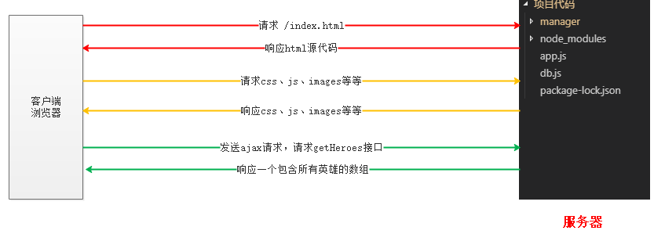


执行 `git add .` 和 `git commit -m '前端请求getHeroes接口，将数据渲染到页面'`

# 四、完成新增

## 4.1 处理表单

- 表单中，有没有缺少的项
    - 缺少昵称，复制一份。  还缺少年龄和性别，可以加，也可以不加
- 各项有没有name属性
- 提交按钮是submit还是button类型


## 4.2 本地图片预览

```js
//////////////////////////   图片预览
    // 当文件域（上传控件）的内容发生改变的时候，实现预览
    $('#heroIcon').change(function () {
      // 1. 找到文件对象
      // console.dir(this);
      var fileObj = this.files[0];
      // 2. 为文件对象生成一个临时的url
      var url = URL.createObjectURL(fileObj);
      // console.log(url);
      // 3. 设置预览的图片的src为临时的url即可
      $('.preview').attr('src', url);
    });
```

执行 `git add .` 和 `git commit -m '处理添加的表单和图片预览效果'`

## 4.3 前端发送请求，将数据提交给接口，完成添加

**分析**：

1. 点击 “新增” 按钮的时候
2. 使用FormData获取表单数据
3. 调用 $.ajax() 将数据发送到接口 addHero (注：接口目前不存在，后面补充)
4. 想象服务器返回的数据结构 ： `{code: 200, message: '添加成功'}`

代码如下：

```js
// 给新增 添加单击事件
    $('.btn-add').click(function () {
      // 使用FormData收集数据
      var fd = new FormData($('form')[0]);
      // 调用$.ajax发送请求
      $.ajax({
        type: 'POST',
        url: '/addHero',
        data: fd,
        dataType: 'json',
        success: function (res) {
          // 约定服务器返回的数据格式为： {code: 200, message: '添加成功'}
          // 无论成功还是失败，都要提示
          alert(res.message);
          if (res.code === 200) {
            // 添加成功，跳转到index.html
            location.href = '/index.html';
          }
        },
        contentType: false,
        processData: false
      });
    });
```

执行 `git add .` 和 `git commit -m '前端完成添加英雄的请求'`

## 4.4 服务器端完成添加接口

应该使用body-parser 还是 multer ？

- 请求体的格式（请求头中的Content-Type）
    - application/x-www-form-urlencoded
        - 使用 serialize() 的时候，会是这种编码格式
        - 使用body-parser
    - multipart/form-data
        - 使用FormData的时候，会是这种编码格式
        - 使用multer

添加英雄的时候，因为有文件上传，所以必须得使用FormData。必须得使用multer。

下载安装multer （npm i multer）。

使用multer方法：

1. 加载multer

    `const multer = require('multer')`

2. 配置multer -- 主要要配置上传文件的保存目录，当然也可以配置文件的名字

    `const upload = multer({ dest: 'uploads/'});`

3. 使用multer

    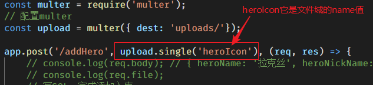


使用multer之后，可以输出：

- req.file  --  是一个包含上传文件信息的对象
- req.body -- 是一个包含文本信息的对象

完成接口：

```js
// 2. 完成添加英雄的接口
// 加载multer
const multer = require('multer');
// 配置multer
const upload = multer({ dest: 'uploads/'});

app.post('/addHero', upload.single('heroIcon'), (req, res) => {
    // console.log(req.body); // { heroName: '拉克丝', heroNickName: '光辉女郎', skillName: '动感光波' }
    // console.log(req.file);
    // 写SQL，完成添加入库
    let sql = 'insert into heroes set ?';
    let values = {
        // 字段： 值
        name: req.body.heroName,
        nickname: req.body.heroNickName,
        skill: req.body.skillName,
        file: req.file.path
    };
    db(sql, values, (err, result) => {
        if (err) {
            // send方法，它会将对象自动转成json格式并响应
            res.send({code: 201, message: '添加失败'});
        } else {
            res.send({code: 200, message: '添加成功'});
        }
    });
});
```

执行 `git add .` 和 `git commit -m '安装了multer，完成后端的添加接口'`

# 五、修改英雄

**分析**：

前端需要两次请求，服务端需要两个接口。

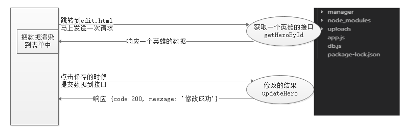

## 5.1 给index.html中的 “编辑”设置跳转链接

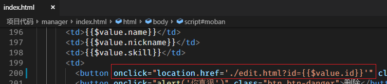


## 5.2 服务端 -- 完成根据id获取一个英雄的接口

```js

// 3. 根据id，获取一个英雄
app.get('/getHeroById', (req, res) => {
    // 获取url上的id参数
    // req.query -- 可以获取到url上所有的参数。这是express提供的一个属性
    let id = req.query.id;
    db('select * from heroes where id=?', id, (err, result) => {
        if (err) throw err;
        res.send(result[0]);
    });
});
```

执行 `git add .` 和 `git commit -m '完成了根据id获取一个英雄的接口'`

## 5.3 前端 -- 发送请求，获取一个英雄

前端edit.html中，向接口 getHeroById 发送请求，获取当前正在修改的英雄的信息，并把数据设置为每个input的value值。

```js
// 页面刷新，发送请求，获取一个英雄
    var id = location.search; // ?id=3
    $.get('/getHeroById' + id, function (res) {
      console.log(res); // {"id":3,"name":"嘉文四世","nickname":"德玛西亚皇子","file":null,"skill":null,"age":22,"sex":"男"}
      // 单独设置每个input 的 value
      $('#heroName').val(res.name);
      $('#heroNickName').val(res.nickname);
      $('#skillName').val(res.skill);
      $('.preview').attr('src', res.file);
    }, 'json');
```

执行 `git add .` 和 `git commit -m '前端向getHeroById接口发请求，并将取得的数据渲染到页面中'`

## 5.4 前端 -- 收集表单数据，提交给修改接口

点击edit.html中的保存的时候，同样是将表单的数据提交给更新的接口。这个代码和添加的代码一样。所以将添加英雄的前端代码复制过来，修改即可。

- 修改了按钮的 类 ，该为了 btn-save
- 接口改成 updateHero

```js
// 给保存 添加单击事件
    $('.btn-save').click(function (e) {
      e.preventDefault(); // 阻止默认行为
      // 使用FormData收集数据
      var fd = new FormData($('form')[0]);
      // 调用$.ajax发送请求
      $.ajax({
        type: 'POST',
        url: '/updateHero',
        data: fd,
        dataType: 'json',
        success: function (res) {
          // 约定服务器返回的数据格式为： {code: 200, message: '修改成功'}
          // 无论成功还是失败，都要提示
          alert(res.message);
          if (res.code === 200) {
            // 修改成功，跳转到index.html
            location.href = '/index.html';
          }
        },
        contentType: false,
        processData: false
      });
    });
```

执行 `git add .` 和 `git commit -m '修改的时候，前端完成提交数据到更新接口'`

## 5.5 服务端-- 完成修改的接口

补充：前面表单中没有id，补充一个：

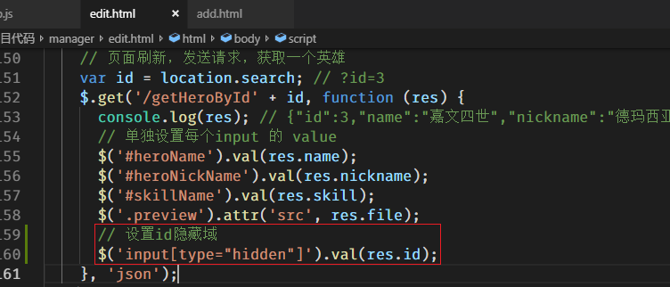

执行 `git add .` 和 `git commit -m '补充一个遗漏，修改的表单中加入id'`

下面继续完成接口，更新的接口和添加的接口差不多，所以也是复制然后修改即可：

```js
// 4. 更新的接口
app.post('/updateHero', upload.single('heroIcon'), (req, res) => {
    // console.log(req.body); // { heroName: '拉克丝', heroNickName: '光辉女郎', skillName: '动感光波' }
    // console.log(req.file);
    // 写SQL，完成添加入库
    let sql = 'update heroes set ? where id = ?';
    let values = {
        // 字段： 值
        name: req.body.heroName,
        nickname: req.body.heroNickName,
        skill: req.body.skillName
    };
    // 单独设置文件
    // console.log(req.file); // 如果没有选择图片，req.file为undefined
    if (req.file !== undefined) {
        // 说明此次更新了头像
        values.file = req.file.path;
    }
    // return;
    db(sql, [values, req.body.id], (err, result) => {
        if (err) {
            // send方法，它会将对象自动转成json格式并响应
            res.send({code: 201, message: '更新失败'});
        } else {
            res.send({code: 200, message: '更新成功'});
        }
    });
});
```

执行 `git add .` 和 `git commit -m '完成更新的接口'`

# 六、删除英雄

**分析**：

点击 index.html 中的删除的时候

首先提示是否要删除

向删除的接口发送请求，参数id必须要有

服务端的接口根据id完成删除即可

## 6.1 前端 -- 发送请求，完成删除

首先给删除标签，添加data-id属性，值就是当前英雄的id

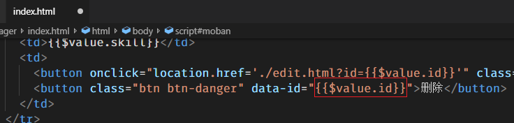

发送ajax请求：

```js
// 找到删除，添加单击事件。单击事件必须使用 事件委托的方式
    $('body').on('click', '.btn-danger', function () {
      if (!confirm('你确定要删除吗')) {
        return;
      }
      var id = $(this).attr('data-id'); // this.dataset.id  也可以

      var that = $(this);

      // 发送请求
      $.get('/deleteHero', {id: id}, function (res) {
        // 服务器返回数据的格式： {code: 200, message: '删除成功'}
        alert(res.message);
        if (res.code === 200) {
          that.parents('tr').remove();
        }
      }, 'json');
    });
```

执行 `git add .` 和 `git commit -m '前端完成删除的请求'`

## 6.2 服务端--完成删除的接口

```js
// 5. 删除英雄的接口
app.get('/deleteHero', (req, res) => {
    // 获取url上的id
    // console.log(req.query);
    let id = req.query.id;
    if (id == '' || isNaN(id)) {
        res.send('参数错误');
        return;
    }
    // 完成删除
    db('delete from heroes where id = ?', id, (err, result) => {
        if (err) {
            res.send({code: 201, message: '删除失败'});
        } else {
            res.send({code: 200, message: '删除成功'});
        }
    });
});
```

执行 `git add .` 和 `git commit -m '服务端完成删除的接口'`

# 七、分页

## 7.1 服务端分页原理

```sql
-- 每页显示多少条，比如5条，用 pageNum 表示
-- 当前是第几页，比如默认是第1页，用page表示
-- 
-- 查询第1页数据
-- select * from heroes limit 0, 5

-- 查询第2页数据
-- select * from heroes limit 5, 5

-- 查询第3页数据
-- select * from heroes limit 10, 5

-- 查询第page页的数据
select * from heroes limit (page-1) * pageNum, pageNum
```

在代码中试验一下，在getHeroes接口中试验一下：

```js
// 1. 完成获取英雄的接口
app.get('/getHeroes', (req, res) => {
    let page = 2; // page表示页码
    let pageNum = 5; // 表示每页显示多少条
    let sql = 'select * from heroes limit ' + (page-1) * pageNum + ',' + pageNum;
    db(sql, null, (err, result) => {
        if (err) throw err;
        res.send(result);
    });
});
```

修改了这个接口，刷新index.html。查看是否获取到了对应页的数据。 试着改变page的值，看数据是否能发生变化。

执行 `git add .` 和 `git commit -m '分页原理，查询数据的getHeroes接口使用通用的SQL'`


## 7.2 前端-使用插件

比对例子，例子中是如何使用插件的，我们index.html中就如何使用。

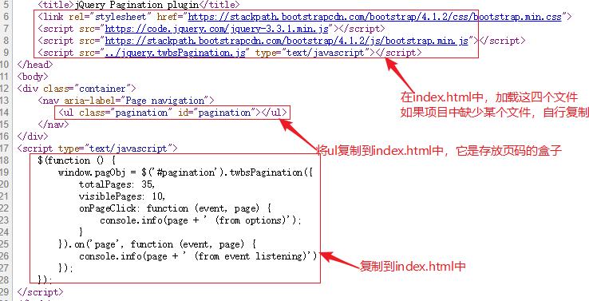

执行 `git add .` 和 `git commit -m '前端引入twbsPagination分页插件'`

## 7.3 基本上实现了分页

index.html 中，前端将发送请求获取数据的代码封装成loadData()。并且先调用一次。另外，发送请求的时候，要传递一个page参数（表示要获取哪一页的数据）

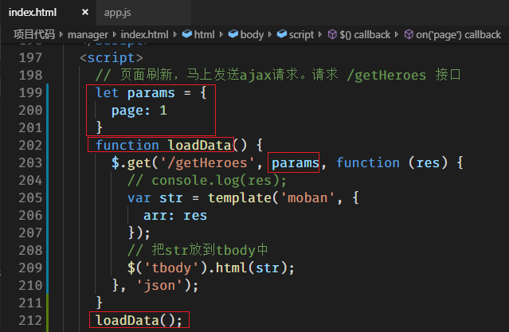

点击页码的时候，修改params.page 的值，并且再次调用loadData函数：

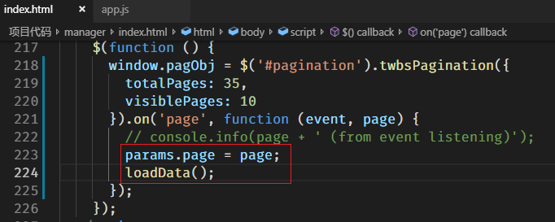

服务端的getHeroes接口，获取url上的page即可：

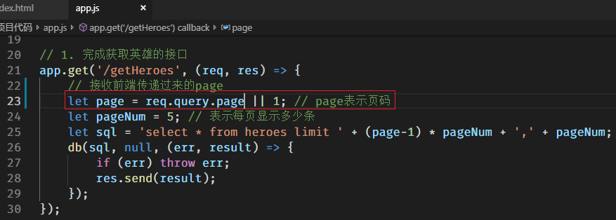

执行 `git add .` 和 `git commit -m '前端封装了loadData函数，基本实现了分页'`

## 7.4 获取总页数

要想获取到总页数，必须获取到总条数；

`总页数 = Math.ceil(总条数 / pageNum)`

获取总条数，必须使用SQL查询：

```sql
select count(*) from 表名 [where 条件]
select count(*) c from heroes
```

在 接口 getHeroes 中，写多条SQL，一条是查询数据的SQL，一条是查询总条数的SQL。

所以查询的结果 result[0] 表示第一条SQL的查询结果；result[1]表示第二条SQL的查询结果。

将两个结果整理，并响应给浏览器：

```js
// 1. 完成获取英雄的接口
app.get('/getHeroes', (req, res) => {
    // 接收前端传递过来的page
    let page = req.query.page || 1; // page表示页码
    let pageNum = 5; // 表示每页显示多少条
    let sql = 'select * from heroes limit ' + (page-1) * pageNum + ',' + pageNum;
    sql += ';select count(*) c from heroes';
    db(sql, null, (err, result) => {
        if (err) throw err;
        console.log(result);
        res.send({
            data: result[0], // 第一条SQL的查询结果
            pageTotal: Math.ceil(result[1][0].c / pageNum)
        });
        // res.send(result);
    });
});
```

前端，封装page函数，当请求完成之后，调用一次page函数（为了不重复调用page，使用flag控制），并且将总页数，传递给page函数

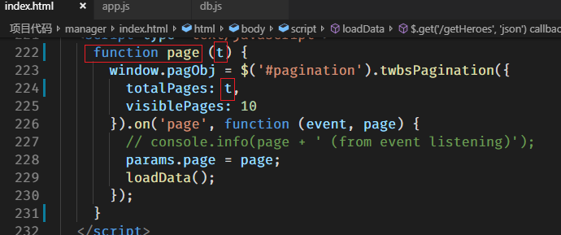

数据加载完毕，调用一次page：

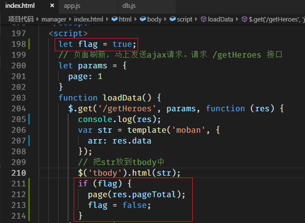


执行 `git add .` 和 `git commit -m '分页，后端获取总页数，前端封装page函数并调用一次'`

## 7.5 模糊搜索

前端：

- 点击 “查找” 的时候，将搜索的关键字发送给接口（直接调用loadData就可以）

    ```js
    // 因为有搜索，所以初始的params要有keywords，默认值为null，表示不搜索任何内容
    let params = {page: 1, keywords: null}
    ```

    ```js
    /////////////////////////////  模糊搜索
        $('.btn-default').click(function (e) {
          e.preventDefault();
          // 获取输入框的值
          var keywords = $('#search').val(); // 搜索框的id自行添加
          params.keywords = keywords;
          params.page = 1; // 搜索的时候，重置一下page
          loadData();
        });
    ```

服务端：

- 根据keywords生成一个where条件即可

    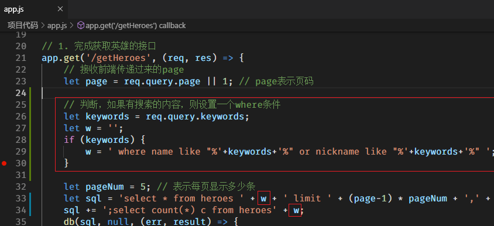

    

执行 `git add .` 和 `git commit -m '模糊搜索，差一个分页页码显示'` 

# 八、登录和注册

## 8.1 创建用户表

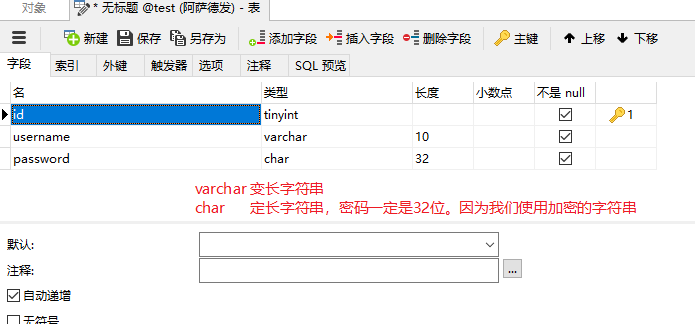

用户名不能重复：所以设置username为unique：

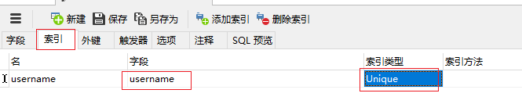


## 8.2 注册

前端：

点击注册，将账号和密码提交给 /reg 接口。密码要使用md5加密

```js
$('.register').click(function () {
      // 收集表单数据
      // var data = $('form').serialize(); // username=zhangsan&password=123
      var data = $('form').serializeArray();
      data[1].value = md5(data[1].value); // 这是密码
      // console.log(data);
      // 将数据发送给注册的接口，约定接口为 /reg
      $.post('/reg', data, function (res) {
        alert(res.message);
        if (res.code == 200) {
          // 注册成功，跳转到登录页
          location.href = '/login.html';
        }
      }, 'json');
    });
```

服务端：

```js
// 6. 注册接口
app.post('/reg', (req, res) => {
    console.log(req.body);
    // 写SQL，将账号和密码添加入库
    let sql = 'insert into user set ?';
    // let values = {
    //     username: '',
    //     password: ''
    // }
    db(sql, req.body, (err, result) => {
        if (err) {
            // throw err;
            res.send({code: 201, message: '注册失败'});
        } else {
            res.send({code: 200, message: '注册成功'});
        }
    });
});
```

执行 `git add .` 和 `git commit -m '完成注册'` 

## 8.3 登录

验证码后续单独说明。所以目前只考虑账号和密码即可：

前端：提交账号、密码、验证码到接口

```html
<!-- 导入md5 -->
<script src="./lib/md5/md5.min.js"></script>

<script>
    // 点击登录按钮的时候，将用户名、密码、验证码提交给接口
    $('.login').click(function (e) {
        e.preventDefault();
        // 收集表单数据
        var data = $('form').serializeArray();
        data[1].value = md5(data[1].value);
        // console.log(data);
        // 将数据提交给登录接口 /login
        $.post('/login', data, function (res) {
            alert(res.message);
            if (res.code === 200) {
                // 登录成功，跳转到index.html
                location.href = '/index.html';
            }
        }, 'json');
    });
</script>
```


后端：接收账号密码验证码，并判断账号和密码是否正确

```js
// 登录接口
app.post('/login', (req, res) => {
    // console.log(req.body);
    // req.body 就是提交过来的数据
    // 首先应该判断验证码是否正确
    // if (req.body.vcode !== '真实的验证码') {
    //     res.send({code: 202, message: '验证码错误'});
    //     return;
    // }

    // 验证码通过了，则判断账号和密码是否正确
    let sql = 'select * from user where username = ? and password = ?';
    db(sql, [req.body.username, req.body.password], (err, result) => {
        if (err) throw err;
        // console.log(result); // 账号密码错误，得到空数组；否则得到非空数组
        if (result.length > 0) {
            res.send({code: 200, message: '登录成功'});
        } else {
            res.send({code: 201, message: '登录失败'});
        }
    });
});
```

执行 `git add .` 和 `git commit -m '完成登录，但是没有验证码'` 

## 8.4 验证码

在 github上搜索一个模块 `svg-captcha` 。复制里面（标志有“在express中使用”）的代码到项目。

```js
// 8. 验证码接口
var svgCaptcha = require('svg-captcha');

app.get('/captcha', function (req, res) {
    var options = {
        background: 'pink',
        noise: 3
    };
	var captcha = svgCaptcha.create(options);
	// var captcha = svgCaptcha.createMathExpr(options);
    // req.session.captcha = captcha.text; // 这行注释，否则报错
    
    console.log(captcha.text); // captcha.text 是验证码上的文字或计算结果
	
	res.type('svg');
	res.status(200).send(captcha.data);
});
```

浏览器访问 127.0.0.1:3000/captcha 即可看到验证码。

在login.html中使用：

只需要将验证码图片的src执行上面的接口即可：‘

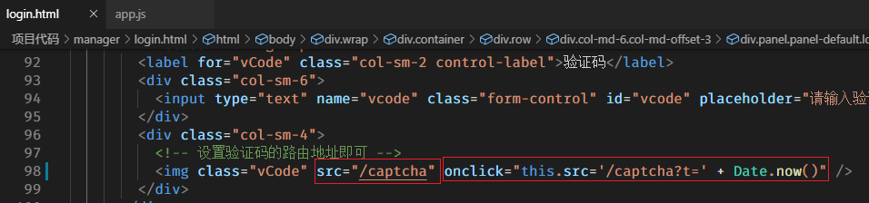

执行 `git add .` 和 `git commit -m '加入验证码，但是登录时没有验证'` 

## 8.5 session和cookie使用

- cookie：

    - 设置cookie

        ```js
        res.set({
            'Set-Cookie': 'name=zs',
            'Set-cookie': ['name=zs', 'age=20'],
            'Set-Cookie': ['name=zs', 'age=20;expires=世界时间']
        });
        ```

    - 获取cookie

        ```js
        req.headers.cookie
        ```

- session：

    - 配置

        ```js
        const session = require('express-session');
        // 使用session中间件
        app.use(session({ 
            secret: 'asre23s2323',  // 加密串，随便写
            cookie: { maxAge: 60000 }, // 过期时间，目前设置为 1分钟
            resave: false, // 重新保存
            saveUninitialized: false, // 即使未初始化也要保存
            // store: 保存位置 （文件、数据库中、memcache中......，保存到其他位置，还需要其他中间件）
        }));
        ```

    - 设置session

        ```js
        req.session.名字 = 值;
        ```

    - 获取session

        ```js
        req.session.名字
        ```

        

## 8.6 判断验证码是否正确

- 首先在项目中，安装express-session.

- 在app.js中，配置session中间件：

    ```js
    const session = require('express-session');
    // 使用session中间件
    app.use(session({ 
        secret: 'asre23s2323',  // 加密串，随便写
        cookie: { maxAge: 60000 }, // 过期时间，目前设置为 1分钟
        resave: false, // 重新保存
        saveUninitialized: false, // 即使未初始化也要保存
        // store: 保存位置 （文件、数据库中、memcache中......，保存到其他位置，还需要其他中间件）
    }));
    ```

- 生成验证码的接口中，将验证码上的字母使用session记录

    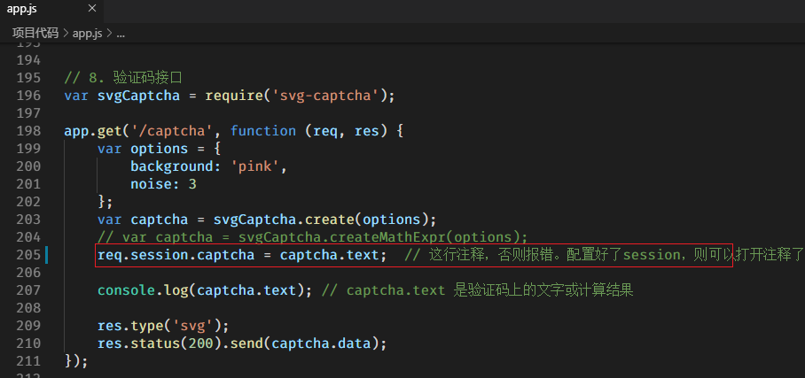

- 登录接口中，使用session中的验证码

    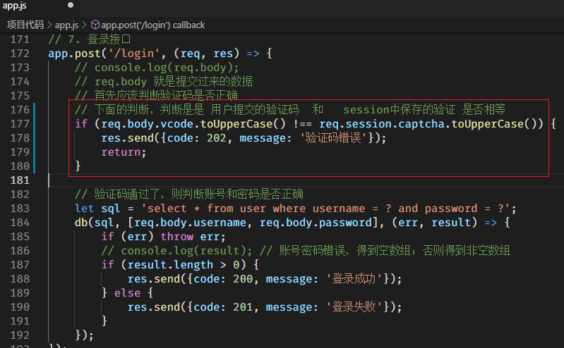

    

执行 `git add .`  和  `git commit -m '登录的时候完成验证码的判断'`

## 8.7 必须登录才能访问页面

- 登录成功，要在session中，记录一个变量，能够表示登录或没有登录即可

    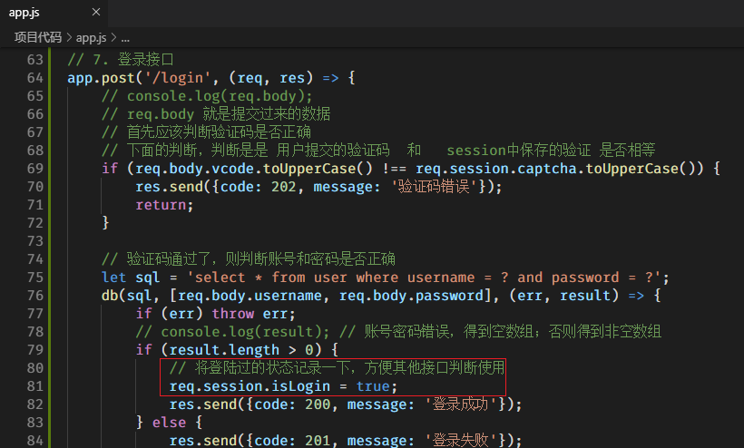

- 将所有的接口全部分成两个部分

    - 一个部分不需要登录，比如登录、注册、验证码等接口和静态资源
    - 一个部分需要登录，比如index、add、edit等页面和相关接口

    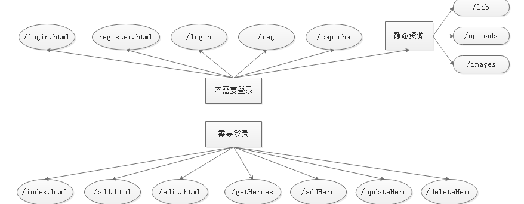

    

- 处理静态资源

    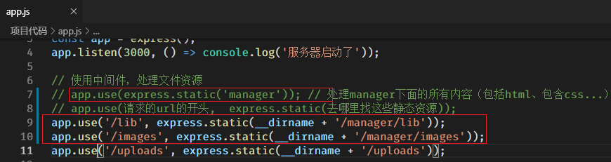

- 编写接口，能够显示html页面即可

    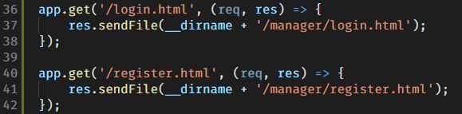

    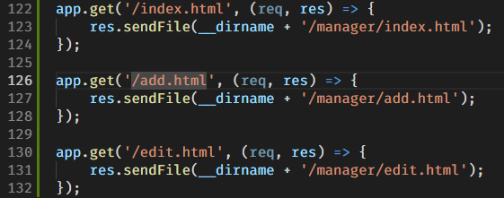

    

    

- 调整接口的位置

    - 不需要登录的接口，放到前面
    - 需要登录才能访问的接口，放到后面
    - 在这两类接口中间，写一个中间件，控制中间件之后的接口必须登录才能访问

    ```js
    app.use((req, res, next) => {
        if (req.session.isLogin === true) {
            // 登录了
            next();
        } else {
            res.send('<script>alert("请先登录"); location.href="login.html";</script>');
            return;
        }
    });
    ```

    执行 `git add .`  和  `git commit -m '控制index等页面必须登录才能访问'`

# 九、模糊搜索页码不正常的问题

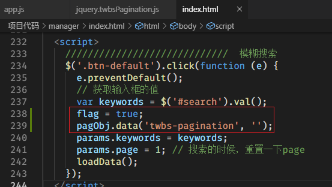

执行 `git add .`  和  `git commit -m '修复了模糊搜索页码不正常的bug'`

# 十、路由

具体查看 “路由.md” 

执行 `git add .`  和  `git commit -m '使用路由分割接口'`