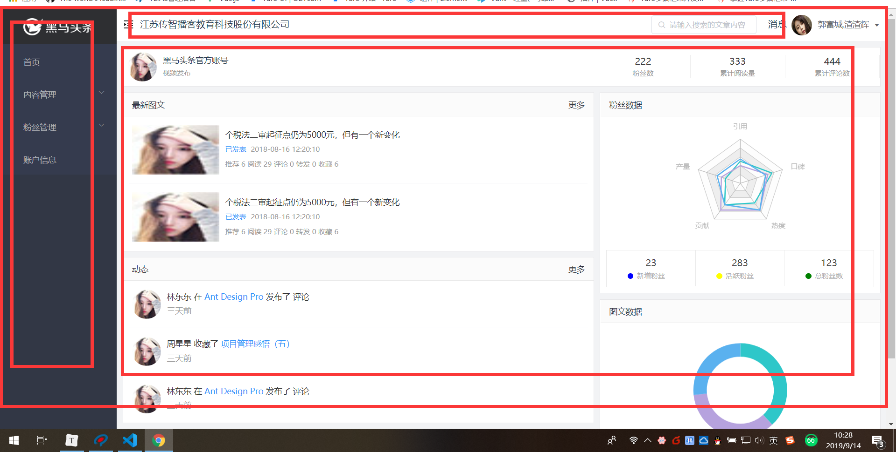
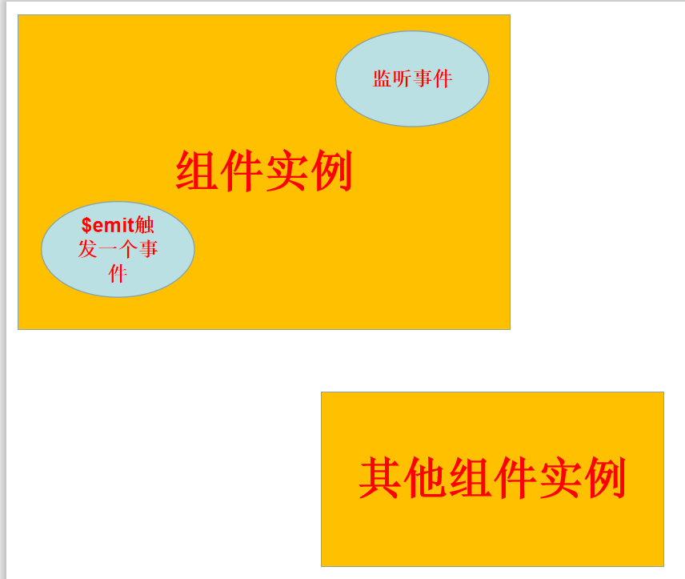

# Vue基础第四天笔记

## 反馈 

| ***  | 老师总结的时候一问今天学了啥，我就一脸懵了。回忆不起来了。需要再过过笔记，写写案例才能回答这些问题。。。可是跟着敲代码，删除商品一直没出来，回头再找找哪里的问题 |
| ---- | ------------------------------------------------------------ |
| ***  | 老师我没服，你要再讲俩小时，我肯定能尊敬你                   |
| ***  | promise老师能再讲讲吗                                        |
| ***  | 计算属性用来做什么，axios发送请求返回Promise对象不理解这块   |
| ***  | 老师，辛苦啦。希望老师讲解一下在计时器中为什么把function普通函数改为箭头函数，this指向改变为vue实例，之前记得老师讲的是箭头函数中的this指向外部作用域window对象。还有就是之前将this.list.reverse()变异方法reverse时，因为直接改变list数组，所以会形成死循环，不可用，但是后面讲this.list.split().reverse().join()时，因为产生了新数组，所以可以直接去使用，是这样吗，可以总结一下，怎样区分是否产生新数组？ |
| ***  | 听着听着就听不懂了，我好难啊！！                             |
| ***  | 老师讲得很好，辛苦了                                         |
| ***  | 憋得有点难受，但是还能忍，多听一句都是血赚，希望老师能多拖几堂课，这个课程价值就上五万了~~~ |
| ***  | 在讲watch的时候，老师您那个return牛bi的写法，我有点没太懂，讲的有点快，慢慢吸收把。 |
| ***  | 越来越难了!                                                  |
| ***  | 内容太多了 吸收不了                                          |
| ***  | 什么场景下用指令，什么场景下用计算属性？                     |
| ***  | 希望老师能再讲一下promise 感谢！ 上午还能听懂，下午全程懵逼=_=+\|\|\| 只能回去敲代码了~ |
| ***  | 建议把前面的知识顺道讲讲 感觉老高讲的有条理                  |
| ***  | 其实视频没必要非得录1080p的，感觉有点太占空间，建议换个清晰度 |
| ***  | 回调地狱真搞不好哎                                           |

## 复习 

* 如果promise 不**`reslove`**,那么这个响应 这个promise就永远也没有then的时候,一直在等待...

* 等待你reslove

* 不resolve , 那你就**`reject`**

* 如果then中没有请求,只是 简单处理数据 可以  直接**`return  数据`**

  ```js
  axios =   new Promise(function(reslove,reject){
      $.ajax({
          url,
          data,
          success:function(data){
               reslove(data)
          }
      })
      
      
  }).then()
  ```

  * 只要promise的函数中reslove,那么就可以从 promise的then方法函数中获取到 前面reslove的数据

  * 将 插值表达式 一些复杂的逻辑抽提出来 做成计算属性  => 计算属性更有效率,使用更简单

  * methods每次运算都会执行,计算属性 有缓存机制,如果计算属性中依赖的数据没有变化 直接从缓存中取

  * 函数中this指向调用该函数的父作用域

  * ```js
    methods:{
        test(){
            // this 指向vue实例
            var _this = this
            this.list.map(function(){
                this // 指向调用该function的对象
                // 不需要知道当前this指向谁 
                // 只能确定调用该函数的一定不是 vue实例
                _this
            })
        },
        test () {
            this.list.map(() => {
              //  this
            })
        }
    }
    ```

  * 指令是操作html元素的   v-for  v-on  v-bind  因为它是作用于标签上 (html)

  * 计算属性  => 复杂逻辑 或者重复逻辑的时候 可以将插值表达式抽提成功计算属性

    组件

    * 重复的页面结构 重复的数据 重复的逻辑 抽提成一个组件 
    * 组件是一个特殊的vue实例 Vue实例都有的它都有 
    * el 没有 但是有template ,有且只有一个根元素
    * data 是一个函数 带返回值的函数 返回值是个对象 =>  因为 每个组件都是独立的作用域  => 
    * methods/computed/watch 
    * 全局组件注册  Vue.component("组件名",组件对象)
    * 组件名 abc 或者abc-d


## 基础-组件-局部组件

> **`目标`**: 掌握 如何实现一个局部组件
>
> 路径: 局部组件的实现
>
> ​        1 定义一个局部组件
>
> ​        2 写入组件选项
>
> ​        3 使用组件
>
> ```js
> new Vue({
> el: "#app",
> data: {},
> methods:{ },
> components:{
>  "content-a": {
>      template: `<div>
>  {{count}}
>  </div>`,
>  data() {
>    return {
>      count: 1
>    };
>  }
> }
> })
> ```
>
> 
>
> **注意**注册组件时,注册名不能为 - 分割的名称
>
> **`任务`** 实现一个局部组件 完成 加减步进器
>
> 

## 基础-组件-组件嵌套

> **`目标`**掌握如何在组件中掌握嵌套
>
> - 我们可以在new Vue()实例中使用自定义组件,
> - 可以在组件中注册组件
> - **`在谁的组件对象中注册,就只能在谁的模板里使用该标签(局部)`**
> - 也可以在注册自定义组件时,嵌套另一个自定义组件,也就是父子组件的关系
> - 组件嵌套 =>  大组件 => 若干个小组件 =>  更多小组件  => 各司其职
> - 
>
> ```js
> var comA = {
> template: `<div>我是子组件</div>`
> };
> var parentA = {
> template: `<div>
> 我是父组件
> <com-a></com-a>
> </div>`,
> components: {'com-a': comA }
> };
> var vm = new Vue({
> el: "#app",
> data: {},
> methods: {},
> components: {
> 'parent-a":parentA
> }
> });
> ```
>
> 
>
> **`任务`** 
>
> 1. 实现一个Vue实例
> 2. 自定义一个组件parentB，内容为我是父组件parentB
> 3. 自定义一个组件childA ,内容是我是子组件childA
> 4. 将在父组件中使用childA, 并在页面上实现显示两个parentB
>
> **`路径`**: 实现组件嵌套
>
> ​        1 定义多个组件 
>
> ​        2 组件对组件进行引用 
>
> ​        3 使用根组件
>
> ​       注意: 组件嵌套和全局 及局部组件没关系
>
> **`关于具体实现参考课程提供的代码`**

## 基础-组件-组件通信的几种情况

> **`目标`**：了解组件通信的几种情况（
>
> - 父组件 =》 子组件   需要将数据传给子组件  **`必须掌握的`**
> - 子组件 =》 父组件  如果父组件需要 子组件也可以传数据给父组件()
> - 兄弟组件1 =》兄弟组件2 **`eventBus`**  **`Vuex`**

## 基础-组件-父组件给子组件传值Props

> **`目标`**:掌握父组件用Props给子组件传值
>
> - props作用: 接收父组件传递的数据
> - props就是父组件给**`子组件标签`**上定义的**`属性`**
>
> ```js
> 1. props是组件的选项  定义接收属性
> 2. props的值可以是字符串数组 props:["list"]  
> 3. props数组里面的元素称之为prop(属性) 属性=?值
> 4. prop的值来源于外部的(组件的外部)
> 5. prop(我们这里是lists)是组件的属性->自定义标签的属性
> 6. prop的赋值位置(在使用组件时,通过标签属性去赋值)
> 7. prop的用法和data中的数据用法一样
> ```
>
> - **`注意`**: 父组件传递给子组件的数据是**`只读`**的,即**`只可以用,不可以改`**
> - 用props完成父组件给子组件传值  传值的属性都是定义在 子组件的标签上,可以采用v-bind的形式传递动态值
> - 定义props属性 在标签上定义属性  v-bind传递动态值
> - 在子组件中声明接收的属性
> - 在子组件中使用 组件 记住 属性只可以用 不可改
>
> **`任务`** 
>
> 1. 定义子组件
> 2. 在父组件中将 ["北京", "上海","天津"] 传递给子组件
> 3. 在子组件中获取该数据 并采用v-for循环显示在页面上
>
> ```html
> components: {
>   a: {
>     template: "<b :name1='123'></b>",
>     components: {
>       b: {
>         props: ["name1"],
>         template: "<c :name2='234'></c>",
>         components: {
>           c: {
>             props: ["name2"],
>             template: "<d :name3='345'></d>",
>             components: {
>               d: {
>                 props: ["name3"]
>               }
>             }
>           }
>         }
>       }
>     }
>   }
> }
> ```
>
> 
>
> **`路径`**: 
>
> ```
>   1. 定义父子组件 
>      2. 定义props接受父组件属性
>      3. 父组件中通过属性给子组件传值
>      4. 注册使用子组件
> ```
>
> ```js
> const comA = {
> template: `<div>
> <span v-for="(item,index) in list" :key="index">{{item}}</span>
> </div>
> `,
> props: ["list"] // props可以是数组  也可以是对象
> };
> ```
>
> **`关于具体实现参考课程提供的代码`**

## 基础-组件-子组件给父组件传值(自定义事件)

> **`目标`**:掌握如何通过子组件给父组件传值
>
> ​    父组件如何监听子组件事件?
>
> - 上个小节中,父组件通过props将值传给了子组件,那么子组件如何将数据传给父组件?
> - 可通过在子组件中触发**`$emit`**事件,然后在当前组件实例中监视此事件 进行追踪
> - **`$emit是在当前组件实例抛出一个事件`**
> - **`监听谁的实例事件,就写在谁的标签上`**
> - $emit触发的事件,只能在当前实例监听,因为是在当前实例触发的
> - 
> - **`任务`**
>
> 1. 上一小节基础上  实现 点击子组件的城市时,将当前点击的城市传递给父组件,
> 2. 父组件 将 当前点击城市 通过props再次传递给子组件 
> 3. 子组件 根据当前选中和循环项目比对 得出 哪个城市 得到 select class 
> 4. 对 select  class进行样式赋值,使其 字体大小为40px  字体颜色为红色
>
> **`注意`**：抛出事件名必须为全小写
>
> **`路径`**:  点击子组件时  调用父组件的方法  改变当前的select
>
> ​        1  定义子组件 
>
> ​        2  定义props接收 父组件 数据 函数
>
> ​        3  父组件给子组件传值  数据 和函数
>
> ​        4  子组件点击事件绑定 父组件传递prop函数
>
> **注意 !!!!!!!!!!!!!**       如果props有驼峰命名的情况 赋值时  需要拆成- 分割的形式 否则无法传递
>
> 例如
>
> ```html
> <p postTitle="hello world"></p> // 错误
> <p post-title="hello world"></p> //正确
> ```
>
> **`关于具体实现参考课程提供的代码`**

## 基础-单页应用-SPA的特点

> **`目标`**  掌握SPA的特点
>
> single page application => 单页应用 =>Vue为单页应用而生
>
> * 传统模式 每个页面及其内容都需要从服务器**`一次次请求`**  如果网络差, 体验则会感觉很慢
> * spa模式, **`第一次加载`** 会将所有的资源都请求到页面 模块之间切换**`不会再请求`**服务器
>
> SPA优点

1. 速度快,**`切换模块不需要经过网络请求`**,**`用户体验好`**,因为前段操作几乎感受不到网络的延迟
2. 完全**`组件化`**开发 ,由于**`只有一个页面`**,所以原来属于一个个页面的工作被归类为一个个**`组件`**.

> 缺点

1. **`首屏加载慢`**->**`按需加载`** 不刷新页面 之请求js模块
2. **`不利于SEO`**->**`服务端渲染`**(node->自己写路由->express-art-template+res.render())
3. 开发难度高(框架) 相对于传统模式,有一些学习成本和应用成本

> vue适合开发SPA->什么是SPA+SPA特点
>
> SPA不利于SEO->搜索引擎排名靠前->搜素引擎机制->搜索引擎不能去找到局部刷新的网站内容

## 基础-单页应用-SPA-实现原理

> **`目标`** 掌握前段SPA的实现原理
>
> * SPA要实现 能够在**`前端自由切换模块`** 
> * SPA要能**`记忆当前切换的模块`**,并且刷新页面模块依然还在当前视图
> * SPA要实现在**`前端切换模块`**时,不能**`引起页面刷新`**,否则页面内容会被重置
>
> **`结论`**
>
> * 可以通过页面地址的**`锚链接`**来实现
> * hash(锚链接)位于链接地址 **`#`**之后
> * hash值的改变**`不会触发`**页面刷新
> * hash值是url地址的一部分,会存储在页面地址上 我们**`可以获取`**到
> * 可以通过**`事件监听`**hash值得改变
> * 拿到了**`hash值`**,就可以根据不同的hash值进行不同的**`模块切换`**
> * **`前端路由`** 

## 基础-路由-js实现前端路由

>**`目标`** 掌握如何用纯js逻辑实现一个前端路由功能
>
>* 通过上一个小节内容可以得出 采用**`hash值改变`**的特性来进行前端路由切换
>
>**`任务`**
>
>1. 在页面上实现4个链接,北京,上海,天津,重庆
>2. 实现点击4个链接时,页面上显示对应的城市名称
>3. 并且刷新页面之后,上次切换的城市还在
>
>**`路径`**: 
>
>​      1.  实现导航结构 
>
>      2.  监听hash改变
>         3.  根据改变切换视图
>
>**`关于具体实现参考课程提供的代码`**

## 基础-路由-vue-router-文档

> **`目标`**  了解vue-router是什么
>
> * Vue-Router 是 [Vue.js](http://cn.vuejs.org/) 官方的**`路由管理器`**。它和 Vue.js 的核心深度集成，让构建单页面应用变得易如反掌 
> * 实现根据不同的**`请求地址`** 而**`显示不同的组件`**
> * 如果要使用 vue开发项目,**`前端路由`**功能**`必须使用`**vue-router来实现
>
> 

## 基础-路由-vue-router-体验及使用步骤

>**`目标`**掌握如何在页面中使用vue-router
>
>1. 导入vue和vue-router
>2. 设置HTML中的内容
>
>```html
><!-- router-link 最终会被渲染成a标签，to指定路由的跳转地址 -->
><router-link to="/users">用户管理</router-link>
>
><!-- 路由匹配到的组件将渲染在这里 -->
><router-view></router-view>
>```
>
>3. 创建组件
>
>   ```js
>   // 创建组件
>   // 组件也可以放到单独的js文件中
>   var Home = {
>       template: '<div>这是Home内容</div>'
>   };
>   var Users = {
>       template: '<div>这是用户管理内容</div>'
>   };
>   ```
>
>4. 实例化路由对象,配置路由规则
>
>  ```js
>// 配置路由规则
>var router = new VueRouter({
>    routes: [
>        { name: 'home', path: '/', component: Home },
>        { name: 'users', path: '/users', component: Users }
>    ]
>});
>  ```
>
>5. vue实例挂载router实例
>
>```js
>var vm = new Vue({
>    el: '#app',
>    router
>});
>```
>
>**`任务`**: 
>
>1. 使用vue-router实现一个前端路由
>2. 导航为 勇士 湖人 快船 火箭
>3. 勇士 =>库里-汤普森  湖人 =>詹姆斯-浓眉  快船 => 泡椒-卡哇伊  火箭 => 灯泡

**`关于具体实现参考课程提供的代码`**

## 基础-路由-vue-router-动态路由

> **`目标`**掌握Vue-router的动态路由如何使用
>
> - 点击**`列表页`** 跳转到**`详情页`**时,跳转的链接需要**`携带参数`**,会导致**`页面path`**不同
> - 当**`页面path不同`**却需要对应**`同一个组件`**时,需要用到**`动态路由`**这一概念
>
> 此时可以通过路由传参来实现，具体步骤如下：
>
> id是可以随意命名的,
>
> 1. 路由规则中增加参数，在path最后增加 **:`id`**
>
> **`注意`**这里的id相当于我们给路由加了参数 叫做**`id`**
>
> ```js
> { name: 'users', path: '/users/:id', component: Users },
> ```
>
> 2. 通过 <router-link> 传参，在路径上传入具体的值(**`实参`**)
>
> ```html
> <router-link to="/users/120">用户管理</router-link>
> ```
>
> 3. 在组件内部可以使用，**`this.$route`** 获取当前路由对象  并通过**`params`**获取定义的参数**`id`**
>
> ```js
> var Users = {
> template: '<div>这是用户管理内容 {{ $route.params.id }}</div>',
> mounted() {
> console.log(this.$route.params.id);
> }
> };
> ```
>
> | 路由规则                      | 匹配路径            | $route.params                          |
> | ----------------------------- | ------------------- | -------------------------------------- |
> | /user/:username               | /user/evan          | `{ username: 'evan' }`                 |
> | /user/:username/post/:post_id | /user/evan/post/123 | `{ username: 'evan', post_id: '123' }` |
>
> **`任务`**
>
> 1. 在上一小节任务中,将多个球队指向的组件改为同一个组件
> 2. 在导航中传入参数 (当前点击的名称)
> 3. 在组件中显示的内容: 我是 "传入的球队"队的粉丝
>
> **注意** 动态路由的参数 可以通过 vue实例.$route.params获取
>
> **`关于具体实现参考课程提供的代码`**

## 基础-路由-vue-router-to属性赋值

>**`目标`**掌握 vue-router中的to的多种赋值方式
>
>* to 有多种赋值方式  

```html
<!-- 常规跳转 -->
      <!-- <router-link to="/sport">体育</router-link> -->
      <!-- 变量 -->
      <!-- <router-link :to="path">体育</router-link> -->
      <!-- 根据对象name跳转 -->
      <!-- <router-link :to="{name:'abcdefg'}">体育</router-link> -->
      <!-- 根据对象path跳转 -->
      <!-- <router-link :to="{path:'/sport'}">体育</router-link> -->
      <!-- 带参数的跳转 -->
      <router-link :to="{name:'abcdefg',params:{a:1}}">体育</router-link>
```

**`任务`**

1. 用vue-router实例化路由 
2. 导航为 北京 上海 
3. 分别采用四种赋值方式 将上海跳转到对应的组件
4. 在北京跳转时 实现 带参数的跳转

**`关于具体实现参考课程提供的代码`**

## 基础-路由-vue-router-重定向

>**`目标`**掌握路由-vue-router-重定向
>
>**`重定向 拦截谁就在谁的路由中写`** **`redirect`** 
>
>**`你希望它去哪就写谁的`** 地址 **`path`**
>
>场景: 当希望某个页面被强制中转时  可采用redirect 进行路由重定向设置
>
>```json
>{
>  path: "/sport",
>  redirect: "/news", // 强制跳转新闻页
>  component: {
>    template: `<div>体育</div>`
>  }
>},
>```
>
>**`任务`**
>
>1. 实例化一个vue路由
>2. 导航为 bj => 北京  sh => 上海 tj => 天津
>3. 实现当跳转到天津时 直接重定向到北京
>
>**`关于具体实现参考课程提供的代码`**

## 基础-路由-vue-router-编程式导航

>**`目标`**掌握路由-vue-router-编程式导航
>
>* 跳转不同的组件 不仅仅可以用router-link 还可以采用**`代码行为`**
>* (Vue实例)**`this.$router`** 可以拿到当前路由对象的实例
>* 路由对象的实例方法 有 push  replace, go()  
>* push 方法 相当于往历史记录里推了一条记录 如果点击返回 会回到上一次的地址  相当于 to属性
>* replace方法 想相当于替换了当前的记录  历史记录并没有多 但是地址会变
>* go(数字) 代表希望是前进还是回退,当数字大于0 时 就是前进 n(数字)次,小于0时,就是后退n(数字)次
>
>  
>
>可以通过vue实例 获取当前的路由实例 $router 
>
>```js
>goPage() {
>        // 跳转到新闻页面
>        this.$router.push({
>          path: "/news"
>        });
>  等价于  to="{path:'/news'}"
>      }
>```
>
>**`任务`**
>
>1. 实例化一个导航路由
>2. 导航为 A, B, C ,D 
>3. 实现A => B , B => C, 然后从C返回时,直接回到A
>4. 实现A => B ,B => C , C =>D 从D返回时 不能返回
>5. 实现A => B ,B => C , C =>D 从D返回直接返回到A 在A中直接前进到D

## 基础-路由-vue-router-routerlink-tag-激活样式

> **`目标`**: 掌握如何设置当前激活路由的样式
>
> * 当前路由在导航中是拥有激活class样式的
>
> 
>
> 审查导航元素,可以发现 激活样式
>
> **`class名称是可以设置的`**
>
> ```html
> 	<a href="#/news" class="router-link-exact-active router-link-active">新闻</a>
> ```
>
> 设置激活class样式即可
>
> **`任务`**
>
> 1. 实例化一个vue-router导航
> 2. 北京- 上海- 天津
> 3. 让当前路由的导航 字体48px  加粗 颜色红色

## 在 CSS 过渡和动画 中自动应用 class

> **`目标`**掌握如何在Vue过渡动画中自动应用class
>
> * Vue中的动画 只能在组件的显示或者隐藏中操作 => v-if/v-show
> * transition标签是一个组件,Vue提供的 我们必须用它来包裹我们的组件 =>我们的组件必须有显示隐藏这个动作
>
> - 基本用法就是给我们需要动画的标签外面嵌套**`transition`**标签 ,并且设置name属性
> - Vue 提供了 `transition` 的封装组件，在下列元素更新,移除，新增 情形中，可以给任何元素和组件添加进入/离开过渡
> - 
>
> ```html
> <transition name="slide">
>  <div v-if="show" >动态显示内容</div>
> </transition>
> ```
>
> 6中class状态 
>
> 1. v-enter：定义进入过渡的开始状态。
> 2. v-enter-active：定义进入过渡生效时的状态。
> 3. v-enter-to: 2.1.8版及以上 定义进入过渡的结束状态。
> 4. v-leave: 定义离开过渡的开始状态。
> 5. v-leave-active：定义离开过渡生效时的状态。
> 6. v-leave-to: 2.1.8版及以上 定义离开过渡的结束状态。

**`注意`**   v要替换成transition组件的name属性值

**`注意`**先要编写元素的最终展示样式

**`任务`**

1. 实现一个div 显示时 从小到大过渡
2. 实现该div隐藏时 从大到小

## 基础-路由-vue-router-嵌套路由

> **`目标`** 掌握如何实现一个嵌套路由
>
> - 如果存在**`组件嵌套`**,就需要提供多个视图容器<router-view></router-view>
> - 同时,router-link和router-view 都可以添加类名、设定样式
>
> **`任务`** 
>
> 1. 实现一个嵌套路由   
> 2. 第一级路由为 热点 教育 社会 音乐
> 3. 音乐下 二级路由为 流行.古典.爵士
>
> **要注意，以 / 开头的嵌套路径会被当作根路径。 这让你充分的使用嵌套组件而无须设置嵌套的路径。**
>
> 即
>
> ```js
> {
>    path:'/music',
>    children:{
>        path:'/pop'  //此时该条路由 就是 /pop
>    }
> }
> // 如果想使用 /music/pop 可以这样
> {
>    path:'/music',
>    children:{
>        path:'/music/pop'  //此时该条路由 就是 /music/pop
>    }
> }
> // 或者
> {
>    path:'/music',
>    children:{
>        path:'pop'  //此时该条路由 就是 /music/pop
>    }
> }
> ```
>
> **`注意`**如果一个需要给子路由一个默认的显示 可以配置一个默认的选项
>
> ```js
> {
>      path: '/user/:id', component: User,
>      children: [
>        // 当 /user/:id 匹配成功，
>        // UserHome 会被渲染在 User 的 <router-view> 中
>        { path: '', component: UserHome },
> 
>        // ...其他子路由
>      ]
>    }
> ```
>
> 
>
> 路径: 实现一个嵌套路由
>
> ​        1  引入vue-router
>
> ​        2  页面导航 
>
> ​        3  页面视图 => 子视图
>
> ​        4  实例化router 
>
> ​        5  router选项
>
> ​        6  挂载router
>
> ```js
> // 实例化 router
> var router = new VueRouter({
>   routes: [
>     {
>       path: "/hot",
>       component: {
>         template: `
>         <div>热点</div>
>         `
>       }
>     },
>     {
>       path: "/tech",
>       component: {
>         template: `
>         <div>教育</div>
>         `
>       }
>     },
>     {
>       path: "/soc",
>       component: {
>         template: `
>         <div>社会</div>
>         `
>       }
>     },
>     {
>       path: "/music",
>       component: {
>         template: `
>         <div>
>          <router-link to="/music/pop">流行</router-link>
>          <router-link to="/music/tra">古典</router-link>
>          <router-link to="/music/jazz">爵士</router-link>
>          <router-view></router-view>
>         </div>
>         ` // 组件中放入 嵌套的导航 和视图容器
>       },
>       // children承载嵌套路由对象
>       children: [
>         {
>           path: "/music/pop",
>           component: {
>             template: `<div>
>             流行音乐
>             </div>
>             `
>           }
>         },
>         {
>           path: "/music/tra",
>           component: {
>             template: `<div>
>             古典音乐
>             </div>
>             `
>           }
>         },
>         {
>           path: "/music/jazz",
>           component: {
>             template: `<div>
>             爵士音乐
>             </div>
>             `
>           }
>         }
>       ]
>     },
>     {
>       path: "/sport",
>       component: {
>         template: `
>         <div>体育</div>
>         `
>       }
>     }
>   ]
> });
> var vm = new Vue({
>   el: "#app",
>   data: {},
>   methods: {},
>   router
> });
> </script>
> ```

2. 

## 基础-vue-cli工具介绍

> ,**`目标`**了解vue-cli是什么东西  脚手架
>
> - 介绍: vue-cli是一个**`辅助开发工具`**=> **`代码编译`** + **`样式`** + **`语法校验`** + **`输出设置`** + 其他 ...
> - 作用: 可以为开发者提供一个**`标准`**的**`项目开发结构`** 和配置  **开发者**不需要再关注
> - vue-cli 一个**`命令行`**工具,最新版本也支持图形化操作,可快速搭建大型网页应用

## 基础-vue-cli安装和2-3版本解释

> **`目标`**掌握vue-cli的版本安装
>
> 说明:vue-cli本质上是一个npm包,也需要通过npm去安装下载
>
> ```bash 
> npm i -g @vue/cli  // 全局安装脚手架  默认安装的最新版本 3.0+
> ```
>
> 安装完成后  可通过 **`vue命令`**来进行检查 脚手架是否安装成功
>
> **`npm`**是服务器搭建与外网 (国外),
>
> 淘宝提供一种**`国内`**的镜像 就是淘宝镜像
>
> ```bash
> # 注册淘宝镜像
> $ npm install -g cnpm --registry=https://registry.npm.taobao.org
> # 执行完毕之后 
> cnpm 完全可替代npm 
> ```
>
> 
>
> **注意** vue-cli的命令行 关键字 是**vue**
>
> 查看版本
>
> ```bash
> vue -V  // 查看脚手架版本号
> or 
> vue --version // 和上面等价 
> ```
>
> `注意`: 默认安装的3.0+ 版本,但是企业很多还在用2.0+版本 怎么破?
>
> 执行以下命令就可以 2.0 和 3.0 兼得
>
> 2.0 和 3.0 **`创建项目`**的命令不同的 
>
> ```bash
> npm install -g @vue/cli-init  // 安装桥接工具 将2.0的功能补齐到目前的脚手架上
> 
> ```
>
> **注意**  vue生成的模板的有难有易 
>
> - 简单业务 => 简易模板 
> - 复杂业务 => 内容丰富模板
>
> **`任务`**
>
> 1. 安装vue-cli脚手架 并 将2.0版本的补丁打到当前版本

## 基础-vue-cli创建项目

> **`目标`** 学会使用vue-cli 2.0特性创建项目
>
> 创建项目: 采用 cli 2.0的特性 (生成简易模板)
>
> [vue/cli2.0文档](https://github.com/vuejs/vue-cli/tree/v2#vue-cli--)
>
> ```bash
> #  heroes 创建的项目名称
> $ vue  init webpack-simple heroes //  webpack-simple 为模板名称 固定写法
> # 切换到当前目录
> $ cd  heroes 
> # 在开发模式下 启动运行项目
> $ npm run dev
> 
> ```
>
> 创建项目: 采用 cli 3.0 特性 (两种 默认 /选填)
>
> ```bash 
> # 3.0下创建项目
> $ vue create heroes // create(创建) 为关键字
> # 切换到当前目录
> $ cd  heroes 
> # 在开发模式下 启动运行项目
> $ npm run serve
> ```
>
> **注意** 3.0 +创建项目时  有两种模式, 一种默认模式, 一种选择模式,
>
> 默认模式:一种标准的模板
>
> 选择模式 可以根据自己的需求选择需要的工具和模式
>
> **`任务`**
>
> 1. 分别使用vue-cli 2.0 和 3.0特性创建一个叫做heroes的项目 
> 2. 分别启动运行

## 基础-vue-cli项目目解释

> **`目标`**对2.0项目目录生成的模板文件进行识别认识
>
> .bablelr=>存放 babel编译的配置信息
>
> .editorconfig => 存放编辑器的配置信息
>
> .gitignore => git忽略文件
>
> index.html => 单页应用的html
>
> package.json => 用于存放依赖信息 及 其他项目信息
>
> README.md => 项目介绍信息 github上的页面信息
>
> webpack.config.js => wepack工具的配置文件 => webpack是一个前端工程化的工具

## 基础-回顾-ES6模块的导入和导出

**`目标`**回顾ES6的导入导出

> **ES6**提供**import**   别名   **from**  路径   语法 来引入 组件 
>
> 提供 **export**  **default**  { } 语法来导出组件
>
> 上面的代码 换成import 
>
> ```js
> export default vue //导出对象 vue
> ```
>
> ```js
> import vue from 'vue'
> ```
>
> 扩展--- 
>
> ```js
> export const function  fn1() {} // 方法1
> export const function  fn2() {} // 方法2
> export const function  fn3() {} // 方法3
> ```
>
> ```js 
> import { fn1,fn2, fn3 } from '文件'
> ```

## 基础-Vue-单文件组件及入口解析

> **`目标`**  掌握认识 Vue的单文件组件
>
> **`注意`**Vue 选项中的 **`render`** 函数若存在，则 Vue 构造函数不会从 **`template`** 选项或通过 `el` 选项指定的挂载元素中提取出的 HTML 模板编译渲染函数。
>
> 介绍: 在cli开发模式下, 一个*.vue文件就是**`一个组件`**
>
> - template 组件的页面结构 代表它的 html 结构 
>
> - - 必须在里面放置一个 html 标签来包裹所有的代码 
>
> - 我们在其他地方写好了一个组件，然后就可以在当前template中引入
>
> - script  组件的逻辑结构及数据对象
>
> - ```js
>   export default {
>   // 这里写你的代码,如
>   data:,
>   props:
>   // 省略
>   };
>   ```
> ```
> 
> ```
> * style 组件的样式
>
> *  就是针对我们的 template 里内容出现的 html 元素写一些样式 
>
> **`注意`**: vue-cli的作用就是让我们把精力放在业务编码上,一切准备的工作交给vue-cli去做
> **`任务`** 
>
> 1. 新建一个名为 Menu的组件 
> 2. 内容为 一个横向菜单   商城   团购   拼团   省钱帮 
> 3. 菜单高60px  水平居中  字体大小为20px  颜色为 red  背景色 为 #CCCCCC
> 4. 实现组件在页面上展示
>
>
> ```
> 
> ```

## 基础-示例项目效果演示

> **`目标`**演示示例项目的最终效果 分拆功能  

## 回顾

* Promise =>  axios 返回的new Promise(function(resolve,reject){})
* 组件 => 局部组件 =>当前实例上注册 => 组件嵌套组件 => 父子组件关系 
* 父=> 子 props =>  1 定义props属性(给谁传值就在谁的标签上 ) 2 接收属性  props:["属性名 "] 3 props/data/methods/computed 都代理给了Vue实例  this.
* 子 => 父 => $emit =>  在当前实例上抛出一个自定义事件 ,若干参数=> 当前实例监听 =>  绑定了父组件的方法,若干参数=> eventBus
* spa => 速度快,体验好,
* 首屏加载慢 => 按需加载
* spa => 前端切换模块,不刷新页面 hash(锚链接)
* js实现纯路由 => 导航/容器 /监听路由改变事件 => 根据当前hash值 切换对应模块
* vue-router =>1 引入vuejs 2 导航(可不写,编程式导航)  3  容器(必不可少)  4 实例化路由对象 5  配置路由表 => path/component  6 挂载路由
* Vue-router 动态路由 =>  多个不同路由 对应同一个组件 =>传参的形式 解决=> 动态路由传参
* 1 定义路由参数 /:路由参数名(形参) 2 传入实参  3 获取参数 this.route.params
* to属性赋值 => 字符串/变量/对象 { path:'' }  { name:'' }  {name:"",params:{   }}
* 重定向 => redirect => 拦截某个路由 跳转到 特定的地址
* 编程式导航 push  /replace /go(数字)
* 激活样式 => 找到当前哪个导航被选中 => 被选中的导航有class =>class名称可以定制
* 动画 => 如果有元素可以增删=>  transition包裹元素 => 写样式  v-enter/v-leave-to,在v-enter-active/v-leave-active中写动作 transition