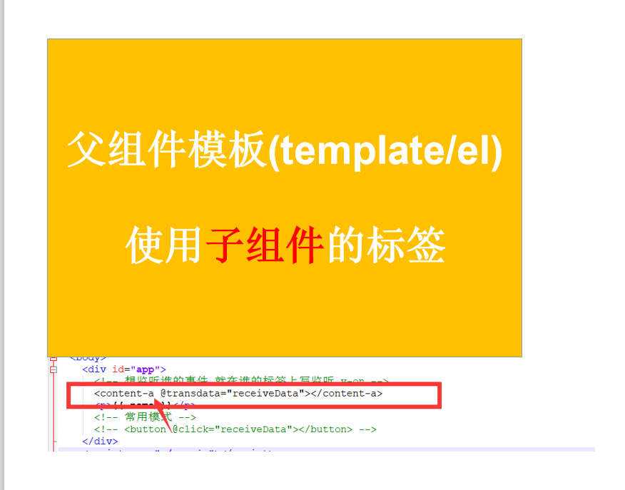
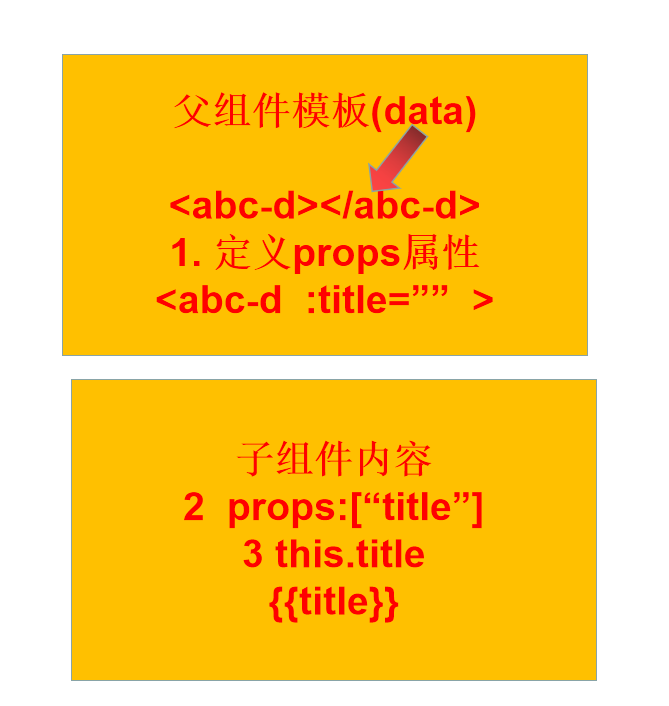
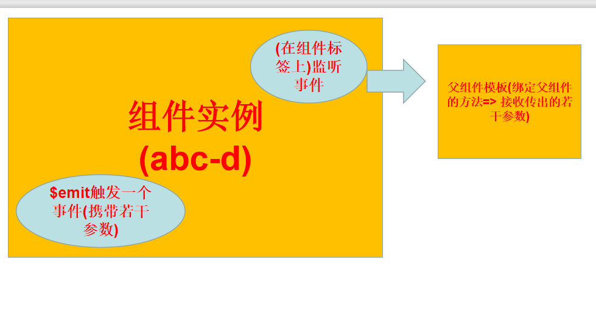
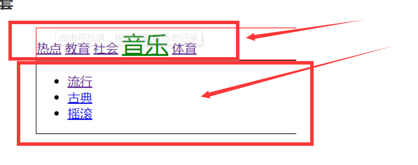
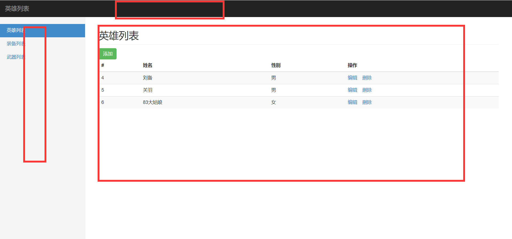
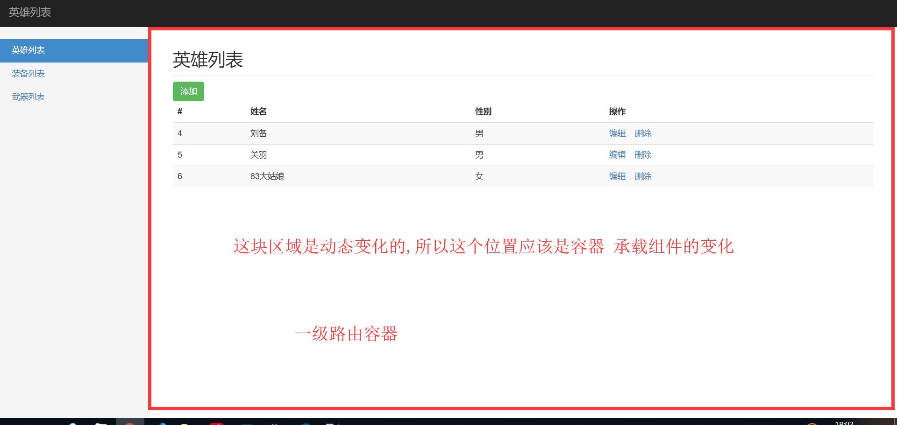
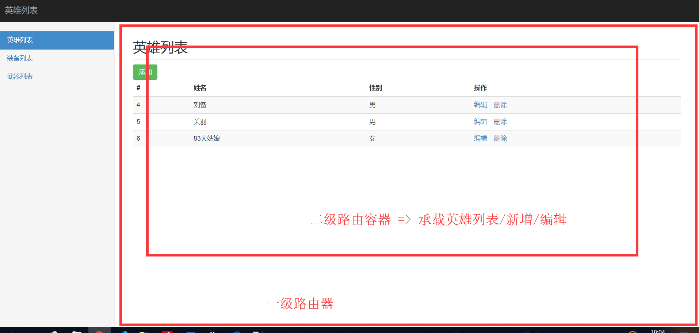

# Vue基础第五天笔记

## 反馈 

| ***  | 懵死了，太难了，神情恍惚                                     |
| ---- | ------------------------------------------------------------ |
| ***  | 越来越越来越懵了。代码敲不完理解不到位。give up！            |
| ***  | 接触vue之后，我想说 能退学费嘛                               |
| ***  | 老师讲的很好，人也很好，是我无能。。。。真是条咸鱼。。。。   |
| ***  | 老师 别总叹气 会变老的                                       |
| ***  | 老师 现阶段命名是哪些是需要小写的？ 感觉有点混乱了 能不能给说下 今天讲义中的局部组件有个注意 “**注意**注册组件时,注册名不能为 - 分割的名称”是不是打错了？ |
| ***  | 老师，能画一个图说明一下组件的子传父，父传子，其中的数据是怎么个传递法么，有点理不清，谢谢~~~ |
| ***  | 每日对新的知识都有无限的期待，话说今天没有发预习资料啊       |
| ***  | 比如:父亲往子传值的时候，<content-a :content="content"></content-a> 第一个:content，这个是自己随便取得变量，第二个content代表得是data里面得数据，能不能暂时不将这两个写一样呢，如果这两个长得不一样，即使暂时不明白，照葫芦画瓢，硬扒也能扒下来（但是这是不可取得），现在写的一样，课堂上再加上快节奏，一呲流的就过去了，就是一直在画魂，/(ㄒoㄒ)/~~,哎呀，心好乱。 |
| ***  | 老师的态度真的让人敬佩!                                      |
| ***  | 子传父那个案例不是特别清楚，传来传去，搞不清                 |
| ***  | 今天听的一脸懵逼 基本都不懂。。。没办法只能多练了            |
| ***  | 晚上没敲完，看着代码却没有思路，希望有难点的地方多加一些过程备注，代码跳跃有点大。 |
| ***  | 感觉连啥是父组件啥是子组件都分不清了，一开始觉得component中嵌套的就是它的子组件，可后来的案例连component父组件都没有，一上来就说他有个天然的爹，不太懂这个天然的爹是个什么爹，就是讲案例7的时候 |
| ***  | 是不是使用了props属性，就会强行建立父子关系？                |

## 复习  

* 组件名推荐 小写 abc / abc-d  不容易出问题
* 子组件传父组件的时候  $emit => 自定义事件 => 事件名 在现阶段 强制小写
* 父子组件 =>  父模板中使用了子组件标签 => 子组件 的父亲就是父模板所在的实例
* 

* 父传子  => Props
* 
* 子传父
* 

* props => 父组件中的数据 =>v-for => item => props选项
* 点击子组件选项时  => props选项 => $emit传出去 =>父组件 =>设置给了一个其他的变量 currentcity
* props=>currentCity => 子组件 => 循环项/点击项
* 计算属性 =>判断 其是否相等 
* v-bind:class="{class名称:变量/表达式}"
* spa => 单页应用 => 一个html页面  => 速度快,组件化开发
* spa => 前端切换模块 => 前端路由  => hash值改变 =>不会请求服务器 => 根据hash值决定哪个模块渲染
* vue-router => 1 引入 2 导航 3 视图(必备) 4 实例化  5 配置路由表 6 挂载路由
* 动态路由=> 多个路由 =>同一个组件  =>动态路由传参 1 定义参数 (形参) 路由表 /abc/:name  2  传递形参 /abc/123 => this.$route.params
* to属性赋值 => 字符串/变量/对象 {path:''} {name:''}
* 重定向  redirect 
* 编程式导航 => this.$router.push/replace /go 
* 激活样式 =>class 
* 动画过渡=> transition包裹 => v-enter/v-enter-active

## 基础-路由-vue-router-嵌套路由

> **`目标`** 掌握如何实现一个嵌套路由
>
> 
>
> - 如果存在**`路由嵌套`**,就需要提供多个视图容器<router-view></router-view>
> - 同时,router-link和router-view 都可以添加类名、设定样式
>
> **`任务`** 
>
> 1. 实现一个嵌套路由   
> 2. 第一级路由为 热点 教育 社会 音乐
> 3. 音乐下 二级路由为 流行.古典.爵士
>
> **要注意，以 / 开头的嵌套路径会被当作根路径。 这让你充分的使用嵌套组件而无须设置嵌套的路径。**
>
> 即
>
> ```js
> {
> path:'/music',
> children:{
> path:'/pop'  //此时该条路由 就是 /pop
> }
> }
> // 如果想使用 /music/pop 可以这样
> {
> path:'/music',
> children:{
> path:'/music/pop'  //此时该条路由 就是 /music/pop
>  path:'pop'
> }
> }
> // 或者
> {
> path:'/music',
> children:{
> path:'pop'  //此时该条路由 就是 /music/pop
> }
> }
> ```
>
> **`注意`**如果一个需要给子路由一个默认的显示 可以配置一个默认的选项
>
> ```js
> {
> path: '/user/:id', component: User,
> children: [
> // 当 /user/:id 匹配成功，
> // UserHome 会被渲染在 User 的 <router-view> 中
> { path: '', component: UserHome },
> 
> // ...其他子路由
> ]
> }
> ```
>
> * **`二级路由的path为"",代表一级路由的默认二级路由`**
>
> * ```js
> {
>                path: "", // 什么都不写 就认为是默认的二级路由
>                component: {
>                  template: `<div>北京欢迎你</div>`
>                }
>              },
>   ```
> ```
> 
> * 
> 
> 路径: 实现一个嵌套路由
> 
> ​        1  引入vue-router
> 
> ​        2  页面导航 
> 
> ​        3  页面视图 => 子视图
> 
> ​        4  实例化router 
> 
> ​        5  router选项
> 
> ​        6  挂载router
> 
> ​```js
> // 实例化 router
> var router = new VueRouter({
> routes: [
> {
> path: "/hot",
> component: {
> template: `
> <div>热点</div>
> `
> }
> },
> {
> path: "/tech",
> component: {
> template: `
> <div>教育</div>
> `
> }
> },
> {
> path: "/soc",
> component: {
> template: `
> <div>社会</div>
> `
> }
> },
> {
> path: "/music",
> component: {
> template: `
> <div>
> <router-link to="/music/pop">流行</router-link>
> <router-link to="/music/tra">古典</router-link>
> <router-link to="/music/jazz">爵士</router-link>
> <router-view></router-view>
> </div>
> ` // 组件中放入 嵌套的导航 和视图容器
> },
> // children承载嵌套路由对象
> children: [
> {
>  path: "/music/pop",
>  component: {
>    template: `<div>
>    流行音乐
>    </div>
>    `
>  }
> },
> {
>  path: "/music/tra",
>  component: {
>    template: `<div>
>    古典音乐
>    </div>
>    `
>  }
> },
> {
>  path: "/music/jazz",
>  component: {
>    template: `<div>
>    爵士音乐
>    </div>
>    `
>  }
> }
> ]
> },
> {
> path: "/sport",
> component: {
> template: `
> <div>体育</div>
> `
> }
> }
> ]
> });
> var vm = new Vue({
> el: "#app",
> data: {},
> methods: {},
> router
> });
> </script>
> ```

## 基础-vue-cli工具介绍

> ,**`目标`**了解vue-cli是什么东西  脚手架
>
> - 介绍: vue-cli是一个**`辅助开发工具`**=> **`代码编译`** + **`样式`** + **`语法校验`** + **`输出设置`** + 其他 ...
> - 中间过程 => 转化过程(Vuejs/脚手架) => 浏览器可识别,支持
> - 作用: 可以为开发者提供一个**`标准`**的**`项目开发结构`** 和配置  **开发者**不需要再关注
> - vue-cli 一个**`命令行`**工具,最新版本也支持图形化操作,可快速搭建大型网页应用
> - 使用vue-cli =>  综合性服务 => nodejs开发的=> 五花八门=> 开发期间 暂时先不关注

## 基础-vue-cli安装和2-3版本解释

> **`目标`**掌握vue-cli的版本安装
>
> 说明:vue-cli本质上是一个npm包,也需要通过npm去安装下载
>
> ```bash 
> npm i -g @vue/cli  // 全局安装脚手架  默认安装的最新版本 3.0+
> ```
>
> 安装完成后  可通过 **`vue命令`**来进行检查 脚手架是否安装成功
>
> **`npm`**是服务器搭建与外网 (国外),
>
> 淘宝提供一种**`国内`**的镜像 就是淘宝镜像
>
> ```bash
> # 注册淘宝镜像
> $ npm install -g cnpm --registry=https://registry.npm.taobao.org
> # 执行完毕之后 
> cnpm 完全可替代npm 
> ```
>
> 
>
> **注意** vue-cli的命令行 关键字 是**vue**
>
> 查看版本
>
> ```bash
> vue -V  // 查看脚手架版本号
> or 
> vue --version // 和上面等价 
> ```
>
> `注意`: 默认安装的3.0+ 版本,但是企业很多还在用2.0+版本 怎么破?
>
> 执行以下命令就可以 2.0 和 3.0 兼得
>
> 2.0 和 3.0 **`创建项目`**的命令不同的 
>
> ```bash
> npm install -g @vue/cli-init  // 安装桥接工具 将2.0的功能补齐到目前的脚手架上
> 
> ```
>
> **注意**  vue生成的模板的有难有易 
>
> - 简单业务 => 简易模板 
> - 复杂业务 => 内容丰富模板
>
> **`任务`**
>
> 1. 安装vue-cli脚手架 并 将2.0版本的补丁打到当前版本
>
> 2. 先执行安装3.0 =>  默认安装的就是3.0
>
> 3. ```bash
>   npm i -g @vue/cli
>   ```
> ```
> 
> 4. 在执行安装2.0补丁
> 
> ​```bash
> npm install -g @vue/cli-init
> ```
>
> 

## 基础-vue-cli创建项目

> **`目标`** 学会使用vue-cli 2.0特性创建项目
>
> 创建项目: 采用 cli 2.0的特性 (生成简易模板)
>
> [vue/cli2.0文档](https://github.com/vuejs/vue-cli/tree/v2#vue-cli--)
>
> ```bash
> #  heroes 创建的项目名称
> $ vue  init webpack-simple heroes //  webpack-simple 为模板名称 固定写法
> # 切换到当前目录
> $ cd  heroes 
> # 在开发模式下 启动运行项目
> $ npm run dev
> 
> ```
>
> 创建项目: 采用 cli 3.0 特性 (两种 默认 /选填)
>
> ```bash 
> # 3.0下创建项目
> $ vue create heroes // create(创建) 为关键字
> # 切换到当前目录
> $ cd  heroes 
> # 在开发模式下 启动运行项目
> $ npm run serve
> ```
>
> **注意** 3.0 +创建项目时  有两种模式, 一种默认模式, 一种选择模式,
>
> 默认模式:一种标准的模板
>
> 选择模式 可以根据自己的需求选择需要的工具和模式
>
> **`任务`**
>
> 1. 分别使用vue-cli 2.0 和 3.0特性创建一个叫做heroes的项目 
> 2. 分别启动运行

## 基础-vue-cli项目目录解释

> **`目标`**对2.0项目目录生成的模板文件进行识别认识
>
> node_modules => 存放包依赖文件 (不能提交)
>
> .bablelrc=>存放 babel编译的配置信息 => ES7/ES6 => ES5 => ES3
>
> .editorconfig => 存放编辑器的配置信息
>
> .gitignore => git忽略文件  => 忽略**`不需要提交`**的文件
>
> index.html => 单页应用的html
>
> package.json => 用于存放依赖信息 及 其他项目信息 => dependencies/devDependencies
>
> * dependencies  运行时依赖  => 项目上线之后依然再用 => axios /vuejs
> * devDependencies 开发时依赖  =>开发时 需要用的=> vue-cli =>  上线时不再需要 =>脚手架
>
> README.md => 项目介绍信息 github上的页面信息
>
> webpack.config.js => wepack工具的配置文件 => webpack是一个前端工程化的工具

## 基础-回顾-ES6模块的导入和导出

**`目标`**回顾ES6的导入导出

* require =>nodeJs 语法 
* import/from => es6语法 => react/angular/vue

* 正常开发过程中  一个文件就是一个组件 => **`拆解任务`**
* 组件嵌套 => 父组件 => 子组件  =>引入子组件 =>import  别名 from 路径(第三方 可以直接写 名称 package.json中的名称) => import 导入的前提是 ?=> 必须导出  export default 导出对象 { }
* var obj = { }    =>  export default  {}  import 别名  from  路径

> **ES6**提供**import**   别名   **from**  路径(包名)   语法 来引入 组件   引入
>
> 提供 **export**  **default**  {     } 语法来导出组件  导出
>
> 上面的代码 换成import 

如果想引入组件,该组件必须导出 =>  *.vue 文件默认做了导出 

要有导入,必须要有导出

> ```js
>export default vue //导出对象 vue
> ```
>
> ```js
>import vue from 'vue'
> ```
> 
> 扩展--- 
>
> ```js
> export const function  fn1() {} // 方法1
> export const function  fn2() {} // 方法2
>export const function  fn3() {} // 方法3
> ```
>
> ```js 
> import { fn1,fn2, fn3 } from '文件'
> ```

## 基础-Vue-单文件组件及入口解析

> **`目标`**  掌握认识 Vue的单文件组件
>
> * .vue文件就是一个组件
>
> * ```js
>   var obj = {
>    template:``,
>    data(){
>        
>    }
>   }
>   ```
> ```
> 
> * template/script/style=> html+js+css => 将原来的template提成了一个节点 => 写代码有提示.结构更清晰 => 开发更有效率
> 
> * script =>  导出一个组件对象 =>  export default  {   data () { return {} }   }
> 
> * style =>  样式 => 编写该组件的样式
> 
> **`注意`**Vue 选项中的 **`render`** 函数若存在，则 Vue 构造函数不会从 **`template`** 选项或通过 `el` 选项指定的挂载元素中提取出的 HTML 模板编译渲染函数。
> 
> 介绍: 在cli开发模式下, 一个*.vue文件就是**`一个组件`**
> 
> - **`template`** 组件的页面结构 代表它的 html 结构 
> 
> - - 必须在里面放置一个 html 标签来包裹所有的代码 
> 
> - 我们在其他地方写好了一个组件，然后就可以在当前template中引入
> 
> - **`script`**  组件的逻辑结构及数据对象
> 
> ​```js
> export default {
> // 这里写你的代码,如
> data:,
> props:
> // 省略
> };
> ```
> * **`style`** 组件的样式
>
> *  就是针对我们的 template 里内容出现的 html 元素写一些样式 
>
> **`注意`**: vue-cli的作用就是让我们把精力放在业务编码上,一切准备的工作交给vue-cli去做
> **`任务`** 
>
> 1. 新建一个名为 Menu的组件 
> 2. 内容为 一个横向菜单   商城   团购   拼团   省钱帮 
> 3. 菜单高60px  水平居中  字体大小为20px  颜色为 red  背景色 为 #CCCCCC
> 4. 实现组件在页面上展示

## 基础-示例项目效果演示

> **`目标`**演示示例项目的最终效果 分拆功能 
>
> * npm run start(dev) => **`nodejs服务`** =>  会将 **`main.js`**(入口)=> 打包 编译成 **`build.js`**
> * npm run dev(开发期) =>  **`build.js 不是物理文件`**  => **`二进制流 (虚拟)`** => 纯内存
> * npm run build (开发完成)=> 生成物理文件**`build.js`** => 上线 => 提交上线代码 => 生成上线文件
> * main.js =>  实例化Vue => App.vue(单文件组件) =>Vue实例视图 => **`App.vue`** => 整个项目的根组件
> * App.vue => 嵌套其他组件 => 子组件 =>子组件  
> * 引用组件 import from   export default
> * main.js  => build.js =>  **`会将main.js中所有import的东西 都打包到一起`**
> * **`main.js =>入口`**
> * **`App.vue => 根组件`**

## 基础-示例项目-导入素材处理样式

>**`目标-任务`**:将项目所需样式导入到项目中 
>
>* 安装 bootstrap固定版本
>* --save  -S（装到dependencies） 和 --save--dev   -D(装到devDependencies)
>
>```bash 
>npm i  bootstrap@3.3.7
>```
>
>安装完成之后 ,在入口处引入css文件
>
>import 路径  => 引入css文件/less文件/sass文件
>
>```js
>import "./../node_modules/bootstrap/dist/css/bootstrap.css"; // 引入 bootstarp的样式文件
>import "./assets/index.css"; // 引入index.css
>
>```
>
>重启运行,发现bootstrap.css文件 运行报错 
>
>根据错误 需要在webpack.config.js增加对不识别文件的处理
>
>```js	
>{
>test: /.(ttf|woff2|woff|eot)$/,
>loader: "file-loader",
>options: {
>name: "[name].[ext]?[hash]"
>}
>}
>```
>
>

## 基础-示例项目-提取公共组件-头部-侧边栏-列表,并预览效果

>**`目标-任务`**:将静态内容的 头部 侧边栏 , 列表分别封装成Vue组件 ,并在视图中显示
>
>**`路径`** 提取组件
>
>1. 新建vue文件
>
>2.  拷贝html静态内容到 template中
>3.  在app.vue中引入注册组件
>4. 注册在app.vue的组件中 
>5. 在app.vue的模板中使用注册组件 

## 基础-示例项目-提取路由模块

**`目标-任务`** 在示例项目中 提取路由模块,并应用视图

> **`路径`**  提取路由模块
>
> 1  安装路由 
>
> ```bash 
> npm i vue-router // 安装路由模块
> ```
>
> 2   在**main.js**中引入 路由模块
>
> ```js
> import VueRouter from 'vue-router ' // 引用router
> ```
>
> 3  使用router 
>
> ```js 
> Vue.use(VueRouter) // 使用router
> ```
>
> 4   实例化 router 
>
> ```js 
> const router = new VueRouter({
> routes:[] //实例化routes
> })
> ```
>
> 5  配置理由表
>
> ```js
> const router = new VueRouter({
> routes: [
> { path: "/heroes", component: AppList },
> { path: "/foo", component: Foo },
> { path: "/bar", component: Bar }
> ] // 路由表
> }); // 实例化router
> ```
>
> * 挂载到路由上的组件 => 路由级组件 => 原来的一个个页面
>
> **注意** 一般来说 路由表 需要单独一个文件   可以将router提取成一个js文件 
>
> 6   提取 三个组件 appList(主要 )  Foo(组件) Bar(组件) 完善路由表
>
> ```html
> <template>
> <div>Bar组件</div>
> </template>
> 
> <script>
> export default {};
> </script>
> 
> <style>
> </style>
> 
> ```
>
> 
>
> 7   在App.vue中假如路由承载视图
>
> ```html
> <div>
> <AppHeader></AppHeader>
> <div class="row">
> <AppSilder></AppSilder>
> <div class="col-sm-9 col-sm-offset-3 col-md-10 col-md-offset-2 main">
>  <router-view></router-view> // 加入承载视图
> </div>
> </div>
> </div>
> ```

## 基础-示例项目-json-server-启动接口服务器

> **`目标-任务`**准备json-server服务器.启动实现 数据接口 增删改查的联通
>
> **`路径`**: 启动json-server服务器
>
> 1  安装json-server  
>
> **注意** json-server 是一个命令行工具,和vue以及vue-cli没有任何关系 所以安装在任何位置都可以
>
> ```bash 
> npm i -g json-server // 安装json-server 
> ```
>
> 2  新建json文件 
>
> ```json
> {
> "heroes": [
> { "name": "张三", "id": 1, "gender": "男" },
> { "name": "李白", "id": 2, "gender": "女" },
> { "name": "吕布", "id": 3, "gender": "男" }
> ],
> "heroes1": [
> { "name": "张三", "id": 1, "gender": "男" },
> { "name": "李白", "id": 2, "gender": "女" },
> { "name": "吕布", "id": 3, "gender": "男" }
> ]
> }
> 
> 
> ```
>
> 3  启动json-server
>
> ```bash
> json-server --watch db.json 
> 
> ```
>
> 

## 基础-示例项目-列表渲染

> **`目标-任务`**完成英雄列表的数据加载及渲染
>
> **`路径`**:
>
> 1 安装axios 插件 
>
> ```bash
> npm i axios // 安装axios插件
> 
> ```
>
> 2  英雄列表组件中引入 axios , 
>
> ```js 
> import axiod from 'axios' // 引入axios
> 
> ```
>
> 3  定义数据list
>
> ```js
> data() {
> return {
> list: []
> };
> }
> 
> ```
>
> 4  请求英雄列表的方法封装 
>
> ```js
> loadData() {
> //restful规则
> axois.get("http:localhost:3000/heros").then(result => {
> this.list = result.data;
> });
> }
> 
> ```
>
> 5  在事件中加入 请求方法
>
> ```js
> // 实例完成事件
> created() {
> //可以加
> this.loadData();
> },
> 
> ```
>
> 6  渲染列表list

## 基础-示例项目-删除功能

> **`目标`**实现英雄列表的删除功能
>
> 路径: 删除功能
>
> 1  注册删除事件 
>
> ```html
> <a href="javascript:void(0)" @click="delItem(item.id)">删除</a>
> 
> ```
>
> 2 定义删除方法  实现删除逻辑
>
> ```js
> // 定义删除方法
> // id为要删除id的方法
> delItem(id) {
> // restful规则
> if (confirm("确认删除此条数据")) {
> axios.delete("http://localhost:3000/heroes" + id).then(result => {
> if (result.status === 200) {
>   // 判断删除状态 是否成功
>   this.loadData(); // 刷新数据
> }
> });
> }
> }
> 
> ```
>
> 3  根据状态 进行刷新页面
>
> ```js
> this.loadData(); // 刷新数据
> 
> ```
>
> 

## 基础-示例项目-添加-渲染添加组件

> **`目标-任务`**添加组件功能的静态实现
>
> 路径: 添加视图的实现
>
> 1 新建add.vue组件 并写入静态内容(拷贝)
>
> ```html
> <!-- 添加静态内容到template模板下 -->
> <div>
> <h2 class="sub-header">添加英雄</h2>
> <form>
> <div class="form-group">
> <label for="exampleInputEmail1">用户名</label>
> <!-- 使用v-model的方式来绑定表单 -->
> <input
> v-model="formData.name"
> type="text"
> class="form-control"
> id="exampleInputEmail1"
> placeholder="请输入姓名"
> />
> </div>
> <div class="form-group">
> <label for="exampleInputPassword1">性别</label>
> <input
> v-model="formData.gender"
> type="text"
> class="form-control"
> id="exampleInputPassword1"
> placeholder="请输入性别"
> />
> </div>
> <!-- 给添加英雄按钮注册一个事件 -->
> <button type="submit" class="btn btn-success" @click="addHero">添加英雄</button>
> </form>
> </div>
> 
> 
> ```
>
> 2  在路由表中配置添加功能的路由
>
> ```js
> { path: "/add", component: Add }  // 引入组件 配置路由
> 
> 
> ```
>
> 3  给列表组件中的添加按钮 添加l导航 到添加功能路由的导航
>
> ```html
> <!-- 给添加功能添加路由导航 -->
> <a class="btn btn-success" href="#/add">添加</a>
> 
> ```
>
> 4  根据业务场景调整页面模板
>
> ```html
> <div>
> <h2 class="sub-header">添加英雄</h2>
> <form>
> <div class="form-group">
> <label for="exampleInputEmail1">用户名</label>
> <input type="email" class="form-control" id="exampleInputEmail1" placeholder="请输入姓名" />
> </div>
> <div class="form-group">
> <label for="exampleInputPassword1">性别</label>
> <input type="password" class="form-control" id="exampleInputPassword1" placeholder="请输入性别" />
> </div>
> <button type="submit" class="btn btn-success">添加英雄</button>
> </form>
> </div>
> 
> ```
>
> ```
> 
> ```

## 基础-示例项目-添加-功能实现

> **`目标-任务`** 实现添加英雄的功能
>
> **`路径`**:  添加功能的实现
>
> 1  定义表单数据  和  表单进行绑定 
>
> ```js
> data() {
> return {
> // 定义一个数据对象 存储 姓名和性别
> formData: {
> name: "", // 姓名
> gender: "" // 性别
> }
> };
> }  //定义一个数据对象
> 
> ```
>
> 2 	注册添加按钮的点击事件 
>
> ```html
> <!-- 给添加英雄按钮注册一个事件 -->
> <button type="submit" class="btn btn-success" @click="addHero">添加英雄</button>
> 
> ```
>
> 3   实现 添加的前后逻辑
>
> ```js
> // 添加英雄方法
> addHero() {
> // 判断填报信息是否为空
> if (this.formData.name && this.formData.gender) {
> // 该判断条件是判断 当前的姓名和 性别都不为空
> // restful规则
> axios
> .post("http://localhost:3000/heroes", this.formData)
> .then(result => {
>   // 注意这里添加成功的状态码 是 201
>   if (result.status === 201) {
>     // 添加成功之后 要跳转回列表页
>     // 编程式导航
>     this.$router.push({ path: "/heroes" });
>   } else {
>     alert("添加失败");
>   }
> });
> } else {
> alert("提交信息不能为空");
> }
> }
> 
> ```
>
> 

## 基础-示例项目-编辑-添加编辑组件	

> **`目标-任务`**实现英雄列表的编辑功能组件渲染
>
> 路径: 编辑功能渲染
>
> 新建编辑组件
>
> **注意** 由于 编辑组件和添加组件页面结构基本一致  可以 直接拷贝添加组件的内容
>
> ```html
> <!-- 添加静态内容到template模板下 -->
> <div>
> <h2 class="sub-header">添加英雄</h2>
> <form>
> <div class="form-group">
> <label for="exampleInputEmail1">用户名</label>
> <!-- 使用v-model的方式来绑定表单 -->
> <input
> v-model="formData.name"
> type="text"
> class="form-control"
> id="exampleInputEmail1"
> placeholder="请输入姓名"
> />
> </div>
> <div class="form-group">
> <label for="exampleInputPassword1">性别</label>
> <input
> v-model="formData.gender"
> type="text"
> class="form-control"
> id="exampleInputPassword1"
> placeholder="请输入性别"
> />
> </div>
> <!-- 给添加英雄按钮注册一个事件 -->
> <button type="submit" class="btn btn-success" @click="editHero">编辑英雄</button>
> </form>
> </div>
> 
> ```
>
> 

## 基础-示例项目-编辑-显示编辑数据

> **`目标-任务`**实现英雄列表的编辑功能
>
> **`路径`**:  实现编辑的显示数据 
>
> 1. 添加编辑路由  **注意** 由于需要拿到编辑数据的标识 所以需要动态路由
>
> ```js
> { path: "/edit/:id", component: Edit } // 编辑组件 动态路由
> 
> ```
>
> 2. 编辑按钮添加跳转路由的属性
>
> ```html
> <a class="btn btn-success" href="#/edit">添加</a>
> 
> ```
>
> 3. 定义加载英雄方法 **注意** 通过 $router.params来获取参数
>
> ```js
> // 加载英雄
> loadHero() {
> const { id } = this.$route.params; // 通过参数获取id
> if (id) {
> //判断id
> axios.get("http://localhost:3000/heroes/" + id).then(result => {
> this.formData = result.data; // 获取数据并赋值给表单对象
> });
> }
> }
> 
> ```
>
> 3. 在初始化事件中 调用loadHero 方法
>
> ```js
> // 实例完成事件
> created() {
> this.loadHero(); // 加载英雄
> }
> 
> ```

## 基础-示例项目-编辑-表单处理

> **`目标-任务`**实现英雄列表编辑数据的提交
>
> **`路径`**:实现编辑方法
>
> 定义实现编辑提交方法
>
> ```js
> // 编辑英雄
> editHero() {
> if (this.formData.name && this.formData.gender) {
> const { id } = this.$route.params;
> //restful规则
> axios
> .put("http://localhost:3000/heroes/" + id, this.formData)
> .then(result => {
>   if (result.status === 200) {
>     this.$router.push({ path: "/heroes" });
>   } else {
>     alert("编辑失败");
>   }
> });
> } else {
> alert("提交内容不能为空");
> }
> }
> 
> ```
>
> 

## 基础-示例项目-优化-axios统一导入

> **`目标-任务`**实现axios的统一导入
>
> **`路径`**: axios的统一导入 和使用
>
> 1 在入口main.js文件中引入axios,并给全局Vue对象的原型链赋值 
>
> ```js
> Vue.prototype.$http = Axios; //所有的实例都直接共享拥有了 这个方法
> 
> 
> ```
>
> 2  调用接口时  采用 实例.属性的方式即可调用 
>
> ```js
> addHero() {
> // 判断填报信息是否为空
> if (this.formData.name && this.formData.gender) {
> // 该判断条件是判断 当前的姓名和 性别都不为空
> // restful规则
> this.$http
> .post("http://localhost:3000/heroes", this.formData)
> .then(result => {
>   // 注意这里添加成功的状态码 是 201
>   if (result.status === 201) {
>     // 添加成功之后 要跳转回列表页
>     // 编程式导航
>     this.$router.push({ path: "/heroes" });
>   } else {
>     alert("添加失败");
>   }
> });
> } else {
> alert("提交信息不能为空");
> }
> }
> 
> ```
>
> 

## 基础-示例项目-优化-设置baseUrl

> **`目标-任务`**通过配置**`baseUrl`**将所有的请求地址进行优化 
>
> **`路径`**: axios中配置统一的**`请求路径头`**
>
> 1. 给axios中的baseUrl设置常态值
>
> ```js
> Axios.defaults.baseURL = "http://localhost:3000"; // 设置共享的方法
> 
> 
> ```
>
> 2. 改造所有的的请求
>
> ```js
> this.$http.put("heroes/" + id, this.formData).then(result => {
> if (result.status === 200) {
>   this.$router.push({ path: "/heroes" });
> } else {
>   alert("编辑失败");
> }
> });
> 
> ```
>
> 

## 基础--示例项目-优化-目录划分-统一设置激活样式

> **`目标-任务`**将组件的目录进行整理划分,并统一当前路由的激活样式
>
> 路径:   左侧导航激活样式  目录划分
>
> 1  统一激活样式
>
> ```js
> linkActiveClass: "active", // active为bootstrap中的 一个class样式
> 
> 
> ```
>
> 2  整理目录   分门别类
>
> **注意**同一类 组件放入同一个文件夹下  修改引用地址

## 给切换路由增加过渡效果 (扩展)

> **`目标-任务`**实现项目中的路由切换过渡
>
> **`路径`**:  给路由切换加入 过渡效果 
>
> 1  用过渡组件包裹路由视图
>
> ```html
> <transition name="slide">
> <router-view></router-view>
> </transition>
> 
> ```
>
> 2  编写 过渡效果
>
> ```css
> .slide-enter,
> .slide-leave-to {
> opacity: 0;
> }
> .slide-enter-to,
> .slide-leave {
> opacity: 1;
> }
> .slide-enter-active {
> transition: all 1s;
> }
> 
> ```
>
> 

## 钩子函数

> **`目标`**掌握Vue的生命周期及其**`钩子函数`**
>
> - 生命周期是指Vue实例或者组件从诞生到消亡经历的每一个阶段，在这些阶段的前后可以设置一些函数当做事件来调用。
>-  
> 

- beforeCreate (实例被创建前)
- created(实例被创建后)
- beforeMount(文档被挂载前)
-  mounted(文档被挂载后)
- beforeUpdate(数据变化 页面更新前)
- updated(数据变化 页面更新后)
- beforeDestory(视图销毁前)
- destoryed(视图销毁后)

**`任务`**

1. 分别在以上不同的生命周期中 输出不同内容 查看不同变化

## 回顾

* 嵌套路由 => 一级路由 下二级路由 
* 二级路由的容器=>一级路由的组件中 router-view
* 二级路由路由表 => 一级路由路由表下 =>children =>数组=> {path:component}
* vue-cli=> 脚手架 => 辅助开发工具 => 2.0 /3.0 =>3.0版本 =>2.0补丁
* 网络原因 => npm外网 => cnpm(淘宝镜像) =>  cnpm i -g @vue/cli
* vue init  webpack-simple  heroes   => 自动生成项目模板
* 首先需要安装依赖 => node_modules(依赖) => 没有依赖 启动不了项目 => npm run dev => package.json 脚本
* 单文件组件 => vue-cli => 入口 main.js =>  new Vue() =>App.vue =>渲染到页面上 =>App.vue整个项目的根组件
* 单文件组件 =>  一个文件就是一个组件 => template/script/style => html+js+css
* var obj = { template:'' } => 友好的提示,插件检查 
* import  别名 from   路径(导入) /   export default  对象(导出)
* require / module.exports
* 英雄列表 => 导入了素材 => 按照步骤操作即可
* 拆分封装组件
* 

* 安装路由
* 

* 英雄列表/装备列表/武器列表 => 一级路由组件
* 

* 英雄列表 =>列表渲染 =>axios =>json-server => restful =>created=>v-for
* 新增 =>调用axios接口 =>成功 => 回到列表页
* 编辑 => 动态路由传参 => id => 编辑组件=>$route.params => axios加载当前英雄数据 =>提交 => 成功 => 回到列表页
* 激活样式 => class 默认的 => linkActiveClass => 默认class => active(bootStarp的样式)