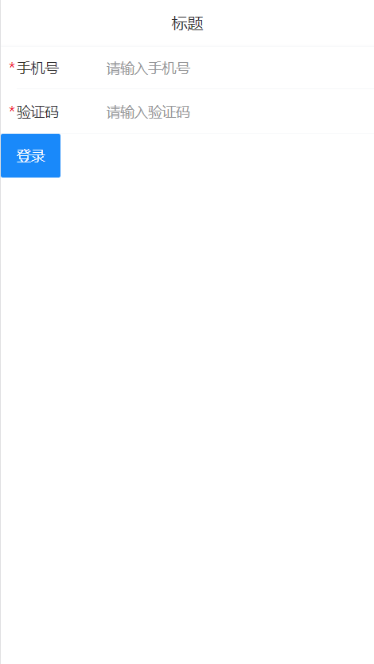

# 二、从登陆开始


流程：

- 创建登录组件并配置路由
- 布局
- 完成登录功能


## 准备

### 创建登录组件并配置路由


1、创建 `views/login/index.vue` 并写入以下内容：

```html
<template>
  <div class="login">登录页面</div>
</template>

<script>
export default {
  name: 'LoginIndex'
}
</script>

<style lang="less" scoped>
</style>

```

2、然后在 `router/index.js` 中配置路由表：

```js
import Vue from 'vue'
import Router from 'vue-router'
+ import Login from '@/views/login'

Vue.use(Router)

export default new Router({
  routes: [
+    {
+      name: 'login',
+      path: '/login',
+      component: Login
+    }
  ]
})

```

最后，访问 `/login` 查看是否能访问到登录页面组件。

### 基本结构



这里主要使用到三个 Vant 组件：

- [NavBar 导航栏](https://youzan.github.io/vant/#/zh-CN/nav-bar)
- [Field 输入框](https://youzan.github.io/vant/#/zh-CN/field)
- [Button 按钮](https://youzan.github.io/vant/#/zh-CN/button)

1、将登录页修改为：

```html
<template>
  <div class="login">
    <!-- 导航栏 -->
    <van-nav-bar
      title="标题"
    />
    <!-- /导航栏 -->

    <!-- 登录表单 -->
    <van-cell-group>
      <van-field
        required
        clearable
        label="手机号"
        placeholder="请输入手机号"
      />

      <van-field
        type="password"
        label="验证码"
        placeholder="请输入验证码"
        required
      />
    </van-cell-group>
    <!-- /登录表单 -->

    <!-- 登录按钮 -->
    <div>
      <van-button type="info">登录</van-button>
    </div>
    <!-- /登录按钮 -->
  </div>
</template>

<script>
export default {
  name: 'LoginIndex'
}
</script>

<style>

</style>

```

### 样式调整


我们把设置登录页头部的样式写到全局（全局生效），因为其它页面也要使用。把非公共样式写到页面组件内部，避免和其它组件样式冲突。

下面是具体实现步骤。

一、添加全局样式

1、创建 `styles/index.less` 并写入以下内容：

```less
.van-nav-bar {
  background-color: #3196fa;
  .van-nav-bar__title {
    color: #fff;
  }
}

```

2、然后在 `main.js` 中加载使其生效：

```js
...
import './styles/index.less'
```

完了测试查看效果。

二、添加局部样式

将 `views/login.vue` 组件中的 style 修改为：

```css
<style lang="less" scoped>
.login {
  .btn-wrap {
    padding: 20px;
    .btn {
      width: 100%;
      background-color: #6db4fb;
      color: #fff;
    }
  }
}
</style>
```


## 实现基本登录功能


实现流程：

- 获取表单数据（绑定）
- 注册点击登录的事件
- 表单验证
- 发请求提交
- 根据请求结果做下一步处理


下面是具体的实现过程：

一、数据绑定

1、根据接口要求绑定表单数据

在登录页面组件的实例选项 data 中添加 `user` 数据字段：

```js
...
data () {
  return {
    user: {
      mobile: '',
      code: ''
    }
  }
}
```

2、在表单中使用 `v-model` 绑定对应数据：

```html
<!-- van-cell-group 仅仅是提供了一个上下外边框，能看到包裹的区域 -->
<van-cell-group>
  <van-field
+    v-model="user.mobile"
    required
    clearable
    label="手机号"
    placeholder="请输入手机号"
  />

  <van-field
+    v-model="user.code"
    type="password"
    label="验证码"
    placeholder="请输入验证码"
    required
  />
</van-cell-group>
```

最后在浏览器使用 VueDevtools 调试工具查看是否绑定成功。

二、请求提交

1、给登录按钮注册点击事件处理函数

```html
...
<van-button type="info" @click="onLogin">登录</van-button>
```


2、登录处理函数

```js
import request from '@/utils/request'

async onLogin () {
  try {
    // 请求提交表单数据
    const { data } = await request({
      method: 'POST',
      url: '/app/v1_0/authorizations',
      data: this.user
    })
    this.$toast.success('登录成功')
  } catch (err) { // 所有大于等于 400 的状态码都会进入 catch
    if (err.response && err.response.status === 400) {
      this.$toast.fail('登录失败，手机号或验证码错误')
    }
  }
}

```


## 封装 api 请求模块

我们建议将所有请求都封装为函数的方式来进行使用，这样做的主要目的是为了便于开发和维护。

下面是具体的实现方式：

创建 `api/user.js` 并写入：

```js
/**
 * 用户相关接口封装模块
 * 最佳实践：建议将所有请求都封装成一个一个的小函数，在需要的时候直接调用
 *   好处：1. 好维护，统一管理 2. 可重用
 * 遵循一个原则：不要直接在组件中发请求，都封装成函数进行调用
 */
import request from '@/utils/request'

export const login = ({ mobile, code }) => {
  // 其它逻辑。。。
  return request({
    method: 'POST',
    url: '/app/v1_0/authorizations',
    data: {
      mobile,
      code
    }
  })
}

```

> 这里涉及到一个知识点就是 ECMAScript 6 中的[函数参数解构]([http://es6.ruanyifeng.com/#docs/destructuring#%E5%87%BD%E6%95%B0%E5%8F%82%E6%95%B0%E7%9A%84%E8%A7%A3%E6%9E%84%E8%B5%8B%E5%80%BC](http://es6.ruanyifeng.com/#docs/destructuring#函数参数的解构赋值))。

然后在登录页面中加载调用：

```js
import { login } from '@/api/user'

async onLogin () {
  try {
    const { data } = await login(this.user)
    this.$toast.success('登录成功')
  } catch (err) {
    if (err.response && err.response.status === 400) {
      this.$toast.fail('手机号或验证码错误')
    }
  }
}

```

之后项目中所有的请求就都不要直接在组件中去直接发了，而是都采用上面的方式封装之后进行使用，这是一个建议的做法。

## 表单验证

方式一：自定义校验，建议参考 Vue 官方 Cookbook 写的[表单校验](https://cn.vuejs.org/v2/cookbook/form-validation.html)

方式二：使用组件库内置的验证

- 例如 element 内置的验证功能

- vant 没有提供

方式三：使用专门的验证插件

- [vuelidate](https://github.com/monterail/vuelidate)
- [VeeValidate](https://github.com/baianat/vee-validate)
- ...


这里我们以使用 VeeValidate 为例。

> 所有第三方资源的使用方式。都是：照着文档 try-try-see

### 安装和配置

安装：

```bash
npm install vee-validate
```


在 `main.js` 中：

```js
..
import { ValidationProvider, ValidationObserver, extend } from 'vee-validate'
import zhCN from 'vee-validate/dist/locale/zh_CN' // 加载验证插件的语言包
import * as rules from 'vee-validate/dist/rules'

// 配置使用中文语言
for (let rule in rules) {
  extend(rule, {
    ...rules[rule], // add the rule
    message: zhCN.messages[rule] // add its message
  })
}

// 注册为全局组件
Vue.component('ValidationProvider', ValidationProvider)
Vue.component('ValidationObserver', ValidationObserver)

```

### 基本使用

在模板中为需要验证的表单字段配置验证规则：

```html
...
<!--
	表单验证需要使用 ValidationObserver 组件将被验证的多个 ValidationProvider 包裹起来，这是使用规则。
	我们一般会把多个表单元素使用 form 来包裹。
	ValidationObserver 默认渲染的元素的 span
	所以 ValidationObserver 支持定义渲染的元素标签
	我们按照常规方式希望它渲染成一个 form 元素，所以配置 tag="form"
-->
<ValidationObserver tag="form" ref="loginForm">
  <van-cell-group>
    <ValidationProvider tag="div" name="手机号" rules="required" v-slot="{ errors }">
      <van-field
        v-model="user.mobile"
        clearable
        label="手机号"
        placeholder="请输入手机号"
        :error-message="errors[0]"
      />
    </ValidationProvider>
    <ValidationProvider tag="div" name="验证码" rules="required" v-slot="{ errors }">
      <van-field
        v-model="user.code"
        type="password"
        label="验证码"
        placeholder="请输入验证码"
        :error-message="errors[0]"
      />
    </ValidationProvider>
  </van-cell-group>
</ValidationObserver>
```

当表单提交的时候，调用 js 进行验证

```js {3-6}
async onLogin () {
  try {
    const isValid = await this.$refs.loginForm.validate()
    if (!isValid) {
      return
    }

    const { data } = await login(this.user)

    console.log(data)

    // 跳转到首页
    // this.$router.push({ name: 'home' })

+    // 登陆成功，关闭 loading
    this.isLoginLoading = false
+  } catch (err) {
    if (err.response && err.response.status === 400) {
+      this.$toast.fail('手机号或验证码错误')
    }
  }
}
```

测试效果。

## loading 提示

> 注意：所有和网络请求相关的用户交互一定要在请求期间禁用这个交互入口！！！

1、在 data 中初始化一个字段用来控制按钮的 loading 效果

```js
data: {
  ...
  isLoginLoading: false
}
```

2、给登录按钮绑定 loading 属性

```html
...
<van-button type="info" :loading="isLoginLoading" @click="onLogin">登录</van-button>
```

3、当提交登录的时候，设置 loading

```js
async onLogin () {
  try {
    const isValid = await this.$validator.validate()
    
    if (!isValid) {
      return
    }

    // 提交表单，让登陆按钮 loading
    this.isLoginLoading = true

    const { data } = await login(this.user)

    console.log(data)

    // 跳转到首页
    // this.$router.push({ name: 'home' })

    // 登陆成功，关闭 loading
    this.isLoginLoading = false
  } catch (err) {
    if (err.response && err.response.status === 400) {
      this.$toast.fail('手机号或验证码错误')
    }
  }

  // 无论登陆成功还是失败，都要把 loading 停止
  this.isLoginLoading = false
}
```

最后，在浏览器控制台选择慢速网络进行测试。
