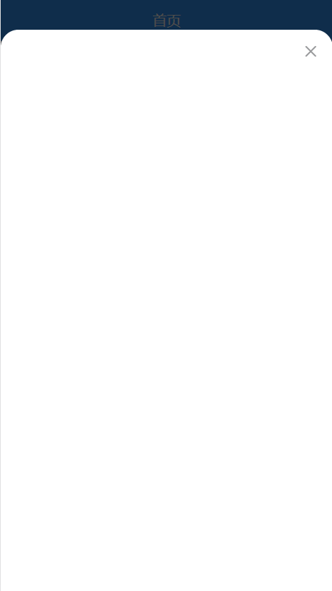
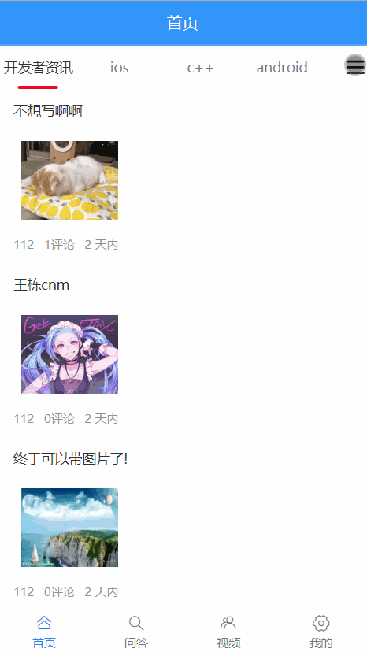
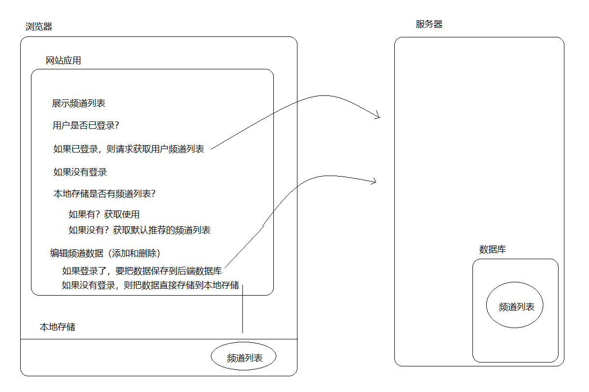
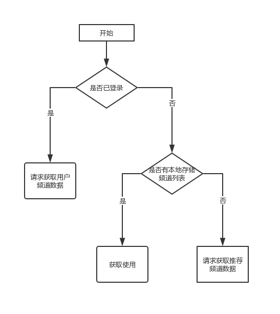

# 五、首页（下）


## 频道弹窗

### 弹窗组件

在 `home/index.vue` 文件中：

```html
<!-- 编辑频道 -->
<van-popup
  v-model="isChannelEditShow"
  position="bottom"
  :style="{ height: '95%' }"
  closeable
  close-icon-position="top-left"
  round
/>
<!-- /编辑频道 -->
```

然后在 `data `中添加一个数据用来控制弹窗的显示和隐藏：

```js
data () {
  return {
    ...
    isChannelEditShow: true // 这里我们先设置为 true 就能看到弹窗的页面了
  }
}
```

测试查看结果。



### 点击面包按钮展示频道弹窗

在 `views/home/index.vue` 中添加按钮模板：

```html
<!-- 频道列表 -->
<van-tabs v-model="active">
  ...
  <!-- 面包按钮 -->
  <div slot="nav-right" class="wap-nav" @click="isChannelEditShow = true">
    <van-icon name="wap-nav" size="24" />
  </div>
  <!-- /面包按钮 -->
</van-tabs>
<!-- /频道列表 -->
```

> 注意：我们这里是把面包按钮通过 van-tabs 组件的 nav-right 插槽插入进去的。

别忘了给它设置一下样式，定位到右侧不动：

```css
.wap-nav {
  position: sticky;
  right: 0;
  display: flex;
  align-items: center;
  background-color: #fff;
  opacity: 0.8;
}
```

测试查看结果。



## 组件布局

在频道管理的弹层组件中添加：

```html
<!-- 频道管理 -->
<van-popup
  v-model="isChannelEditShow"
  position="bottom"
  :style="{ height: '95%' }"
  round
>
  <!-- 我的频道 -->
  <div>
    <van-cell title="我的频道">
      <van-button type="danger" size="mini">编辑</van-button>
    </van-cell>
    <van-grid :gutter="10">
      <van-grid-item
        v-for="value in 8"
        :key="value"
        text="文字"
      />
    </van-grid>
  </div>
  <!-- /我的频道 -->

  <!-- 频道推荐 -->
  <div>
    <van-cell title="频道推荐">
    </van-cell>
    <van-grid :gutter="10">
      <van-grid-item
        v-for="value in 8"
        :key="value"
        text="文字"
      />
    </van-grid>
  </div>
  <!-- /频道推荐 -->
</van-popup>
<!-- /频道管理 -->
```


## 展示我的频道

无论登录与否都支持频道管理。

- 登录状态下进行的频道管理会把数据保存到后端，具有跨设备同步功能
- 非登录状态下进行的频道管理，仅限于当前设备本身，没有备份和同步功能
  - 有些用户始终不登录，这个功能也可以正常使用





首先在 `api/channel.js` 中添加用于获取用户频道或默认推荐频道的数据接口：

```js
/**
 * 获取用户频道列表或者默认推荐的频道列表
 * 如果有 token，则返回用户频道列表
 * 如果没有 token，则返回默认推荐的频道列表
 */
export const getUserOrDefaultChannels = () => {
  return request({
    method: 'GET',
    url: '/app/v1_0/user/channels'
  })
}
```

然后将首页中原来获取频道列表的业务修改为：

```js
+ import { getUserOrDefaultChannels } from '@/api/channel'
import { mapState } from 'vuex'
import { getItem } from '@/utils/storage'

export default {

  computed: {
+    ...mapState(['user']),
    currentChannel () {
      // active 是动态的
      return this.channels[this.active]
    }
  },

  methods: {
    async loadAllChannels () {
      // 开始的时候还没有考虑频道管理这件事儿，所以为了简单，这里直接获取了所有频道列表
-      // const { data } = await getAllChannels()

+      // 有了频道管理这个业务
+      let channels = []
+      // 1. 如果用户已登录，则请求获取后端存储的用户频道列表
+      if (this.user) {
+        const { data } = await getUserOrDefaultChannels()
+        channels = data.data.channels
+      } else {
+        // 2. 如果用户没有登录，则查看本地存储是否有频道列表
+        const localChannels = getItem('channels')
+        // 2.1 如果本地存储有，则获取使用
+        if (localChannels) {
+          channels = localChannels
+        } else {
+          // 2.2 如果本地存储没有，则请求获取默认推荐的频道列表
+          const { data } = await getUserOrDefaultChannels()
+          channels = data.data.channels
+        }
+      }

      // 为每一个频道初始化一个成员 articles 用来存储该频道的文章列表
+      channels.forEach(channel => {
        channel.articles = [] // 频道的文章列表
        channel.loading = false // 频道的上拉加载更多的 loading 状态
        channel.finished = false // 频道的加载结束的状态
        channel.timestamp = null // 用于获取下一页数据的时间戳（页码）
        channel.pullDownLoading = false // 频道的下拉刷新 loading 状态
      })

+      this.channels = channels
    }
  }
}
```

然后将频道列表渲染到频道管理的我的频道中：

```html
<!-- 我的频道 -->
      <div>
        <van-cell title="我的频道" :border="false">
          <van-button type="danger" size="mini">编辑</van-button>
        </van-cell>
        <van-grid :gutter="10">
          <van-grid-item
            v-for="channel in channels"
            :key="channel.id"
            :text="channel.name"
          />
        </van-grid>
      </div>
      <!-- /我的频道 -->
```


最后测试结果。

## 展示剩余频道列表

思路：`所有频道列表 - 我的频道 = 剩余的频道`。

实现过程所以一共分为两大步：

- 获取所有频道
- 获取剩余频道


一、获取所有频道

1、在 `api/channel.js` 中新增（如果已经写了就不用写了）：

```js
/**
 * 获取所有频道列表
 */
export const getAllChannels = () => {
  return request({
    method: 'GET',
    url: '/app/v1_0/channels'
  })
}
```

2、然后在首页组件中：

```js
...
import { getUserOrDefaultChannels, getAllChannels } from '@/api/channel'

export default {
  name: 'HomeIndex',
  data () {
    return {
      ...
+      allChannels: [] // 存储所有频道列表
    }
  },

  created () {
    this.loadUserOrDefaultChannels()
+    this.loadAllChannels()
  },

  methods: {
    // 原来的 loadAllChannels 改名为 loadUserOrDefaultChannels
    async loadUserOrDefaultChannels () {
      。。。
    },

    /**
     * 获取所有频道
     */
+    async loadAllChannels () {
+      const { data } = await getAllChannels()
+      this.allChannels = data.data.channels
+    }
  }
}
```

最后回到浏览器中测试结果。


二、处理获取展示剩余频道

1、封装一个计算属性用来获取剩余频道

```js
export default {

  computed: {
    ...

    /**
     * 获取剩余的频道
     */
    remainingChannels () {
      // 剩余频道 = 所有频道 - 我的频道
      const channels = []
      this.allChannels.forEach(channel => {
        // 如果我的频道不包含当前遍历频道，那它就是剩余的频道
        // find 方法：遍历数组，查找满足 item.id === channel.id 的元素，找到就返回该元素
        // 如果直到遍历结束都没有，则返回 undefined
  			// findIndex 获取满足条件的元素，如果有，则返回该元素对应的索引
  			// 如果没有满足的元素，则返回 -1
        const index = this.channels.findIndex(item => item.id === channel.id)
        if (index === -1) {
          channels.push(channel)
        }
      })
      return channels
    }
  }
}
```

2、模板绑定进行展示：

```html
<!-- 频道推荐 -->
<div>
  <van-cell title="频道推荐">
  </van-cell>
  <van-grid :gutter="10">
    <van-grid-item
                   v-for="channel in remainingChannels"
                   :key="channel.id"
                   :text="channel.name"
                   />
  </van-grid>
</div>
<!-- /频道推荐 -->
```


## 添加频道

实现步骤：

- 封装请求函数
- 绑定事件处理函数
- 如果未登录，将数据保存到本地存储
- 如果已登录，将数据请求添加到后端数据库


首先封装请求接口，在 `api/channel.js` 中新增：

```js

/**
 * 重置用户频道列表
 */
export const resetUserChannels = channels => {
  return request({
    method: 'PUT',
    url: '/app/v1_0/user/channels',
    data: {
      channels
    }
  })
}
```

> 提示：
>
> - 正常应该使用新增频道的数据接口，但是该接口暂时有问题，实际工作中要和后端沟通解决
> - 对于无法通过文档一眼看懂的接口使用文档，建议先使用 postman 把接口搞明白，然后再进行编码

然后在模板中添加点击事件：

```html
...
<!-- 频道推荐 -->
      <div>
        <van-cell title="频道推荐" :border="false">
        </van-cell>
        <van-grid :gutter="10">
          <van-grid-item
            v-for="channel in remainingChannels"
            :key="channel.id"
            :text="channel.name"
+            @click="onAddChannel(channel)"
          />
        </van-grid>
      </div>
      <!-- /频道推荐 -->

...
```

对应的处理函数如下：

```js
...
import {
  getUserOrDefaultChannels,
  getAllChannels,
+  resetUserChannels
} from '@/api/channel'

export default {
  ...
  methods: {
    ...
    async onAddChannel (channel) {
      // 添加到我的频道
      this.channels.push(channel)

      // 持久化
      if (this.user) {
        // 已登录：请求保存到后端
        // [ { id: 频道id, seq: 序号 }, { id: 频道id, seq: 序号 }, ]
        const channels = []

        // 处理提取要重置的频道列表
        // this.channels.slice(1) 不包括第1个频道（推荐）
        this.channels.slice(1).forEach((item, index) => {
          channels.push({
            id: item.id,
            seq: index + 2
          })
        })

        // 请求重置
        await resetUserChannels(channels)
      } else {
        // 未登录：本地存储
        setItem('channels', this.channels)
      }
    }
  }
}
```

最后测试。

## 处理编辑频道按钮的切换显示

首先在 data 中初始化一个数据成员用来控制删除按钮的显示和隐藏：

```js
data () {
  return {
    ...
    isEdit: false
  }
}
```

然后在我的频道模板中：

```html
<!-- 我的频道 -->
<div>
  <van-cell title="我的频道" :border="false">
    <van-button
      type="danger"
      size="mini"
+      @click="isEdit = !isEdit"
+    >{{ isEdit ? '完成' : '编辑' }}</van-button>
  </van-cell>
  <van-grid :gutter="10">
    <van-grid-item
      v-for="channel in channels"
      :key="channel.id"
      :text="channel.name"
    >
+      <van-icon
+        v-show="isEdit"
+        class="close-icon"
+        slot="icon"
+        name="close"
+      />
    </van-grid-item>
  </van-grid>
</div>
<!-- /我的频道 -->
```

关闭按钮通过样式处理将其定位到频道项的右上角：

```css
.close-icon {
  position: absolute;
  top: -5px;
  right: -5px;
}
```


## 点击切换频道展示

步骤：

- 注册点击事件处理函数
- 在处理函数中
  - 判断如果是编辑状态，则执行删除操作
  - 如果是非编辑器状态，则执行切换频道

首先，为我的频道中的每一个频道项绑定一个处理函数：

```html
<!-- 我的频道 -->
<div>
  <van-cell title="我的频道" :border="false">
    <van-button
      type="danger"
      size="mini"
      @click="isEdit = !isEdit"
    >{{ isEdit ? '完成' : '编辑' }}</van-button>
  </van-cell>
  <van-grid :gutter="10">
    <van-grid-item
+      v-for="(channel, index) in channels"
      :key="channel.id"
      :text="channel.name"
+      @click="onUserChannelClick(channel, index)"
    >
      <van-icon
        v-show="isEdit"
        class="close-icon"
        slot="icon"
        name="close"
      />
    </van-grid-item>
  </van-grid>
</div>
<!-- /我的频道 -->
```

然后添加 `onUserChannelClick` 处理函数：

```js
/**
 * 我的频道中的点击处理函数
 */
async onUserChannelClick (channel, index) {
  // 如果是编辑状态，删除频道
  if (this.isEdit) {
    // 待会儿处理
  } else {
    // 如果是非编辑状态，则切换频道
    
    // 让频道列表切换到点击的这个频道
    this.active = index
    
    // 关闭弹层
    this.isChannelEditShow = false
  }
}
```

最后，测试结果。

## 删除频道

步骤：

- 封装请求函数
- 如果未登录，则将数据保存到本地存储
- 如果已登录，则将数据请求保存到后端


首先封装请求接口，在 `api/channel.js` 中新增：

```js
/**
 * 删除用户频道
 */
export const deleteUserChannel = channelId => {
  return request({
    method: 'DELETE',
    url: `/app/v1_0/user/channels/${channelId}`
  })
}
```

然后将 `onUserChannelClick` 函数修改为：

```js
/**
 * 我的频道中的点击处理函数
 */
async onUserChannelClick (channel, index) {
  // 如果是编辑状态，删除频道
  if (this.isEdit) {
+    // 删除频道
+    this.channels.splice(index, 1) // 将数据从视图中移除

+    // 持久化
+    if (this.user) {
+      // 已登录，请求删除
+      await deleteUserChannel(channel.id)
+    } else {
+      // 未登录，删除本地存储
+      // 注意：本地存储中的数据无法像操作 js 数据成员一样来修改
+      //      如果想要修改，则重新存储实现修改
+      setItem('channels', this.channels)
+    }
  } else {
    // 如果是非编辑状态，则切换频道
    // 让频道列表切换到点击的这个频道
    this.active = index
    // 关闭弹层
    this.isChannelEditShow = false
  }
}
```

> 注意：
>
> - 本地存储中的数据无法像 JavaScript 数据一样进行修改，如果想要修改，必须重新存储才可以

最后测试。

## 补充：关于 axios 传参

Headers 参数：

```js
axios({
  method: 'xxx',
  headers: {
    名字: 值
  }
})
```

Query 参数：

```js
axios({
  method: 'xxx',
  params: {
    名字: 值
  }
})
```

Body 参数：

```js
axios({
  method: 'xxx',
  data: {
    名字: 值
  }
})
```

路径参数：

> 文档中一般是在 url 中通过 :xxx 表示的

```js
axios({
  method: 'xxx',
  // 例如 /app/imtest/:event
  // url: '/app/imtest/数据'

  // 例如 /app/v1_0/user/channels/:target
  // url: '/app/v1_0/user/channels/数据'
})
```

## 补充：关于第三方组件的插槽使用

```html
<!--
  我想在指定的位置渲染一些自定义 HTML 标签
  组件
  如果想要在使用组件的时候自定义里面的元素标签，那么一定是使用插槽的方式
  -->

<!-- 如果不需要定义，直接使用这种方式 -->
<!-- <van-cell title="单元格" value="内容" label="描述信息" /> -->

<!-- 如果需要定义，则参照文档使用自定义插槽的方式 -->
<van-cell title="单元格" value="内容" label="描述信息">
  <!-- default 是默认插槽，可以省略不写 slot="defaut" -->
  <!-- <div style="color: red" slot="default">default 内容</div> -->
  <div style="color: red">default 内容</div>

  <!-- 任何元素都可以作为插槽内容，只需要在其上面标记 slot="xx" 即可 -->
  <!-- <div style="color: green" slot="title">title 内容</div> -->
  <span style="color: green" slot="title">title 内容</span>


  <!-- <div style="color: blue" slot="label">label 内容</div> -->
  <!-- 插槽内容也可以是一个组件 -->
  <van-button
    type="primary"
    size="mini"
    slot="label"
  >迷你按钮</van-button>
  <div style="color: black" slot="icon">icon 内容</div>
  <div style="color: pink" slot="right-icon">right-icon 内容</div>
</van-cell>
```

