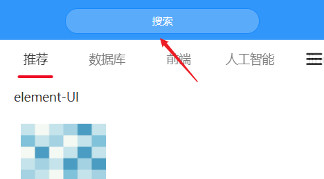
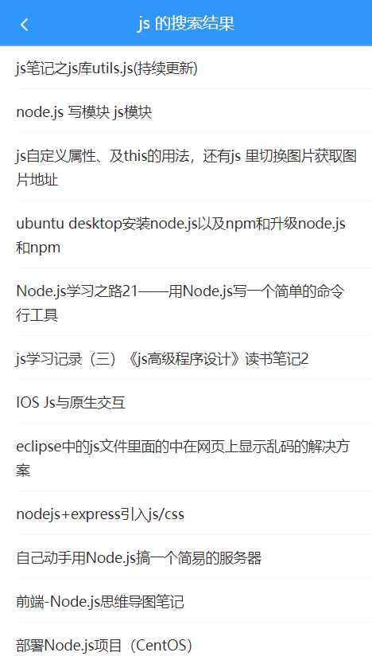

# 六、搜索


## 自定义首页中导航栏的搜索按钮



导航栏的标题默认只能渲染文字，如果想要渲染一些别的元素则可以使用组件的插槽的方式来自定义，查阅 Vant 的导航栏文档我们知道该组件支持自定义 title 插槽，所以这里我们可以通过自定义插槽的方式来渲染一个按钮到导航栏标题的位置：

```html
<!-- 原来的 -->
<!-- <van-nav-bar fixed title="首页"> -->

<!-- 在标题的位置使用插槽自定义一个按钮 -->
<van-nav-bar fixed>
  <!-- 自定义标题内容 -->
  <van-button
    class="search-btn"
    slot="title"
    round
    type="info"
    size="small"
    @click="$router.push('/search')"
  >搜索</van-button>
</van-nav-bar>
```

按钮的自定义样式如下：

```css
.search-btn {
  width: 100%;
  background: #5babfb;
}
```

## 创建组件并配置路由

创建 `views/search/index.vue` 并写入以下内容：

```html
<template>
  <div class="search">搜索页面</div>
</template>

<script>
export default {
  name: 'SearchIndex'
}
</script>

```

然后在路由配置中新增：

```js
...
import Search from '@/views/search'

const router = new VueRouter({
  	...
    {
      name: 'search',
      path: '/search',
      component: Search
    }
  ]
})
```

测试：点击首页中的搜索按钮导航到搜索页面。

## 页面布局


```html
<template>
  <div>
    <!-- 搜索框 -->
    <form action="/">
      <van-search
        v-model="searchText"
        placeholder="请输入搜索关键词"
        show-action
        @search="onSearch"
        @cancel="onCancel"
      />
    </form>
    <!-- /搜索框 -->

    <!-- 联想建议 -->
    <van-cell-group>
      <van-cell
        icon="search"
        v-for="item in 5"
        :key="item"
      >
        <div slot="title">{{ item }}</div>
      </van-cell>
    </van-cell-group>
    <!-- /联想建议 -->

    <!-- 历史记录 -->
    <van-cell-group>
      <van-cell title="历史记录">
        <span style="margin-right: 10px;">全部删除</span>
        <span>完成</span>
        <van-icon
          slot="right-icon"
          name="delete"
          style="line-height: inherit;"
        />
      </van-cell>
      <van-cell title="hello" v-for="value in 5" :key="value">
        <van-icon
          slot="right-icon"
          name="close"
          style="line-height: inherit;"
        />
      </van-cell>
    </van-cell-group>
    <!-- /历史记录 -->
  </div>
</template>

<script>
export default {
  name: 'SearchIndex',
  data () {
    return {
      searchText: ''
    }
  },
  
  methods: {
    onSearch () {},
    onCancel () {}
  }
}
</script>

```


## 搜索联想建议

步骤：

- 封装请求函数
- 当搜索输入变化的时候，请求加载联想建议的数据
- 将请求得到的结果绑定到模板中

创建 `api/serach.js` 并写入：

```js
/**
 * 搜索相关接口
 */
import request from '@/utils/request'

export const getSuggestions = q => {
  return request({
    method: 'GET',
    url: '/app/v1_0/suggestion',
    params: {
      q
    }
  })
}

```


然后在 `search/index.vue` 中：

```html
<template>
  ...
  <!-- 联想建议 -->
    <van-cell-group>
      <van-cell
        icon="search"
+        v-for="item in suggestions"
        :key="item"
        @click="onSearch(item)"
      >
        <div slot="title" v-html="item"></div>
      </van-cell>
    </van-cell-group>
    <!-- /联想建议 -->
</template>

<script>
import { getSuggestions } from '@/api/search'

export default {
  name: 'SearchIndex',
  data () {
    return {
      searchText: '',
+      suggestions: []
    }
  },

+  watch: {
+    // 封装接口，监视搜索文本的变化 -> 发送请求 -> 获取结果 -> 将结果绑定到数据 -> 模板绑定
+    async searchText (newValue) {
+      if (!newValue.trim().length) {
+        return
+      }
+      const { data } = await getSuggestions(newValue)
+      this.suggestions = data.data.options
+    }
+  },

  methods: {
    onSearch () {},

    onCancel () {}
  }
}
</script>
```

## 搜索关键字高亮

为了增强用户体验，我们这里可以把搜索联想建议处理关键字高亮效果。

如何将一个字符串中指定的内容进行高亮？

```
hello world
```

例如我想让上面的  `hello` 高亮，说白了如何单独对 `helllo` 单独设置颜色。

那就是给你需要高亮的字符串包装一个标签，然后单独对这个标签设置样式。

```js
const str = 'hello world hello world'

// 只能替换一个
'hello world'.replace('hello', 'abc') // abc world hello world

// 使用正则可以替换全部
'hello world'.replace(/hello/g, 'abc') // abc world abc world

// /xxx/ 这样写的正则表达式都是会当做字符串来处理
// 而我们希望这个正则表达式动态生成，则手动 new RegExp
// 注意：不用前后的 /
const reg = new RegExp('hello', 'gi') // /hello/gi
```

下面是具体的实现：

1、添加一个处理高亮的函数：

```js
highLight (str) {
  const searchText = this.searchText
  // 根据用户输入的内容创建一个动态的正则表达式
  const reg = new RegExp(searchText, 'gi')
  return str.replace(reg, `<span style="color: red;">${searchText}</span>`)
}
```

2、然后修改模板绑定：

```html
<div slot="title" v-html="highLight(item)"></div>
```

## 搜索结果

步骤：

- 注册搜索表单的提交事件处理函数
- 跳转到搜索结果页
  - 根据搜索关键字获取搜索结果
  - 展示到列表中




### 创建组件并配置路由

创建 `views/search-result/index.vue` 并写入以下内容：

```html
<template>
  <div class="serach-result">搜索结果页面</div>
</template>

<script>
export default {
  name: 'SearchResult'
}
</script>

<style>

</style>

```

然后在 `router/index.js` 中：

```js
...
import SearchResult from '@/views/search-result'

export default new Router({
  routes: [
    ...
    {
      name: 'search-result',
      path: '/search/:q',
      component: SearchResult
    }
  ]
})
```


### 传递搜索参数

在 `views/search/index.vue` 中：

```html
<template>
  <div>
    <!-- 搜索框 -->
    <form action="/">
      <van-search
        v-model="searchText"
        placeholder="请输入搜索关键词"
        show-action
+        @search="onSearch(searchText)"
        @cancel="onCancel"
      />
    </form>
    <!-- /搜索框 -->

    <!-- 联想建议 -->
    <van-cell-group>
      <van-cell
        icon="search"
        v-for="item in suggestions"
        :key="item"
+        @click="onSearch(item)"
      >
        <div slot="title" v-html="highLight(item)"></div>
      </van-cell>
    </van-cell-group>
    <!-- /联想建议 -->
    
    ...
  </div>
</template>

<script>
export default {
	...
  methods: {
    ...
    onSearch (q) {
    	if (!q.trim().length) {
        return
      }

      this.$router.push({
        name: 'search-result',
        params: {
          q
        }
      })
    },
  }
}
</script>
```

### 布局

```html
<template>
  <div class="serach-result">
    <!-- 导航栏 -->
    <van-nav-bar
      title="xxx 的搜索结果"
      left-arrow
      fixed
      @click-left="$router.back()"
    />
    <!-- /导航栏 -->

    <!-- 文章列表 -->
    <van-list
      class="article-list"
      v-model="loading"
      :finished="finished"
      finished-text="没有更多了"
      @load="onLoad"
    >
      <van-cell
        v-for="item in list"
        :key="item"
        :title="item"
      />
    </van-list>
    <!-- /文章列表 -->
  </div>
</template>

<script>
export default {
  name: 'SearchResult',
  data () {
    return {
      list: [],
      loading: false,
      finished: false
    }
  },

  methods: {
    onLoad () {
      // 异步更新数据
      setTimeout(() => {
        for (let i = 0; i < 10; i++) {
          this.list.push(this.list.length + 1)
        }
        // 加载状态结束
        this.loading = false

        // 数据全部加载完成
        if (this.list.length >= 40) {
          this.finished = true
        }
      }, 500)
    }
  }
}
</script>

<style lang="less" scoped>
.serach-result {
  .article-list {
    margin-top: 46px;
  }
}
</style>

```


### 展示搜索结果

步骤：

- 封装接口
- 发请求，获取结果
- 模板绑定

在 `api/serach.js` 中新增：

```js
/**
 * 获取搜索结果
 */
export const getSearch = ({
  page,
  perPage,
  q
}) => {
  return request({
    method: 'GET',
    url: '/app/v1_0/search',
    params: {
      page, // 页数，不传默认为1
      per_page: perPage, // 每页数量，不传每页数量由后端决定
      q // 搜索关键词
    }
  })
}
```

然后在 `views/search-result/index.vue` 中：

```js
...
import { getSearch } from '@/api/search'

async onLoad () {
  // 1. 请求获取数据
  const { data } = await getSearch({
    page: this.page, // 页码
    perPage: 20, // 每页大小
    q: this.$route.params.q
  })

  // 2. 将请求结果保存到当前组件的 list 中
  const { results } = data.data
  this.list.push(...results)

  // 3. 关闭 loading
  this.loading = false

  // 4. 判断是否已全部加载结束
  if (results.length) {
    // 4.1 如果有，更新页码
    this.page++
  } else {
    // 4.2 如果没有数据了，则将 finished 设置为 true，不再 onLoad
    this.finished = true
  }
}
```

最后，模板绑定：

```html
<!-- 文章列表 -->
    <van-list
      class="article-list"
      v-model="loading"
      :finished="finished"
      finished-text="没有更多了"
      @load="onLoad"
    >
      <van-cell
+        v-for="article in list"
+        :key="article.art_id.toString()"
+        :title="article.title"
      />
    </van-list>
    <!-- /文章列表 -->
```


## 搜索历史记录

### 保存搜索历史记录

步骤：

- 当你跳转搜索的时候，将搜索的关键字记录到搜索历史记录中

- 展示搜索历史记录列表

- 添加历史记录
- 保存历史记录
- 删除历史记录

回到搜索页面中，首先在 data 中初始化一个数组用来存储历史记录：

```js
data () {
  ...
  searchHistories: [] // 存储历史记录
}
```

然后当触发搜索页面跳转之前记录历史记录：

```js
onSearch (q) {
  if (!q.trim().length) {
    return
  }

+  // 记录历史记录
+  const searchHistories = this.searchHistories

+  const index = searchHistories.findIndex(item => {
+    // 忽略空格、大小写
+    return item.trim().toLowerCase() === q.trim().toLowerCase()
+  })

+  // 如果已存在，则将其移除
+  if (index !== -1) {
+    searchHistories.splice(index, 1)
+  }

+  // 将最新搜索记录保存到最前面
+  searchHistories.unshift(q)

  // 跳转到搜索结果页面
  this.$router.push({
    name: 'search-result',
    params: {
      q
    }
  })
},
```

### 展示历史记录

```html
<!-- 历史记录 -->
<van-cell-group>
  <van-cell title="历史记录">
    <span style="margin-right: 10px;">全部删除</span>
    <span>完成</span>
    <van-icon
      slot="right-icon"
      name="delete"
      style="line-height: inherit;"
    />
  </van-cell>
+  <van-cell :title="item" v-for="item in searchHistories" :key="item">
    <van-icon
      slot="right-icon"
      name="close"
      style="line-height: inherit;"
    />
  </van-cell>
</van-cell-group>
<!-- /历史记录 -->
```

### 处理删除操作相关元素的显示状态

首先在 data 中初始化一个数据成员用来控制删除相关操作的元素的显示状态：

```js
data () {
  return {
    ...
    isDeleteShow: false
  }
}
```

然后在模板中绑定处理：

```html
<!-- 历史记录 -->
<van-cell-group>
  <van-cell title="历史记录">
+    <template v-if="isDeleteShow">
      <span style="margin-right: 10px;">全部删除</span>
+      <span @click="isDeleteShow = false">完成</span>
    </template>
    <van-icon
+      v-else
      slot="right-icon"
      name="delete"
      style="line-height: inherit;"
+      @click="isDeleteShow = true"
    />
  </van-cell>
  <van-cell :title="item" v-for="item in searchHistories" :key="item">
    <van-icon
      slot="right-icon"
      name="close"
      style="line-height: inherit;"
+      v-show="isDeleteShow"
    />
  </van-cell>
</van-cell-group>
<!-- /历史记录 -->
```

### 删除历史记录

两个功能：

- 删除单个
- 删除所有


```html
<!-- 历史记录 -->
<van-cell-group>
  <van-cell title="历史记录">
    <template v-if="isDeleteShow">
+      <span style="margin-right: 10px;" @click="searchHistories = []">全部删除</span>
      <span @click="isDeleteShow = false">完成</span>
    </template>
    <van-icon
      v-else
      slot="right-icon"
      name="delete"
      style="line-height: inherit;"
      @click="isDeleteShow = true"
    />
  </van-cell>
+  <van-cell :title="item" v-for="(item, index) in searchHistories" :key="item">
    <van-icon
      slot="right-icon"
      name="close"
      style="line-height: inherit;"
      v-show="isDeleteShow"
+      @click.stop="searchHistories.splice(index, 1)"
    />
  </van-cell>
</van-cell-group>
<!-- /历史记录 -->
```

### 历史记录持久化

无论是往数组中添加元素还是删除，我们都需要将其重新写入到本地存储进行持久化。这里我们可以通过监视的方式来统一处理：

```js
watch: {
  ...
  searchHistories (newValue) {
    // 当数据发生改变，重新保存到本地存储
    setItem('search-histories', newValue)
  }
}
```

但是我们在添加数据的时候还要手动的持久化，因为添加之后要跳转页面，没来得及触发监视就页面跳转了：

```js
onSearch (q) {
  if (!q.trim().length) {
    return
  }

  // 记录历史记录
  const searchHistories = this.searchHistories

  const index = searchHistories.findIndex(item => {
    // 忽略空格、大小写
    return item.trim().toLowerCase() === q.trim().toLowerCase()
  })

  // 如果已存在，则将其移除
  if (index !== -1) {
    searchHistories.splice(index, 1)
  }

  // 将最新搜索记录保存到最前面
  searchHistories.unshift(q)

  // 监视不是立即发生的，起码等着当前函数执行完它才会去判定数据到底有没有改变

  // 虽然我们通过监视数据改变的方式处理数据的持久化
  // 但是这里还要手动的来存储这个数据，因为后面的代码会发生页面跳转
  // 页面跳转的时候回先销毁当前页面（事件、watch、生命周期。。。。都被干掉了），然后再加载新的页面
+  setItem('search-histories', searchHistories)

  this.$router.push({
    name: 'search-result',
    params: {
      q
    }
  })
},
```

### 点击记录项跳转到搜索结果页

```html
<!-- 历史记录 -->
<van-cell-group>
  ...
  <van-cell
    :title="item"
    v-for="(item, index) in searchHistories"
    :key="item"
+    @click="onSearch(item)"
  >
    ...
  </van-cell>
</van-cell-group>
<!-- /历史记录 -->
```


### 处理联想建议和历史记录的切换显示

```html
<!-- 联想建议 -->
+ <van-cell-group v-if="searchText">
  ...
</van-cell-group>
<!-- /联想建议 -->

<!-- 历史记录 -->
+ <van-cell-group v-else>
  ...
</van-cell-group>
<!-- /历史记录 -->
```


## 函数防抖和函数节流

> 推荐资料：
>
> - https://zhuanlan.zhihu.com/p/38313717

干嘛的？限制函数调用的频率。

为什么要限制？例如搜索的时候请求联想建议，没必要每次内容改变就发请求，当用户输入的很快的时候，中间的请求都是无意义的，浪费资源，没必要。

### 函数防抖（Debounce）

**概念：** `在事件被触发n秒后再执行回调，如果在这n秒内又被触发，则重新计时。`

**生活中的实例：** `如果有人进电梯（触发事件），那电梯将在10秒钟后出发（执行事件监听器），这时如果又有人进电梯了（在10秒内再次触发该事件），我们又得等10秒再出发（重新计时）。`

我们先使用第三方包 [lodash]() 来体验什么是函数防抖：

```html
<!DOCTYPE html>
<html lang="en">
<head>
  <meta charset="UTF-8">
  <meta name="viewport" content="width=device-width, initial-scale=1.0">
  <meta http-equiv="X-UA-Compatible" content="ie=edge">
  <title>Document</title>
</head>
<body>
  <script src="./node_modules/lodash/lodash.js"></script>
  <script>
    // lodash 会在全局提供一个成员：_

    // _ 对象中有很多方法，其中有一个方法专门用于处理函数防抖
    // 方法名：debounce
    // 作用：函数防抖
    // 使用方式：

    function fn (foo) {
      console.log('hello', foo)
    }

    // 正常的函数调用：立即调用，而且是一定会调用
    // fn()
    // fn()
    // fn()

    // 我们可以使用函数防抖把一个正常的函数变得不正常
    // 两个参数：
    //   参数1：函数
    //   参数2：时间，单位是毫秒
    // 返回值：函数
    //   返回值函数的功能和 fn 和的功能是一样
    //   唯一的区别就是经过了防抖处理
    const newFn = _.debounce(fn, 1000)

    // 计时 1s
    newFn('a')

    // 当你不到 1s 的时候，再次调用
    // 先把之前的废掉，重新计时 1s
    newFn('b')

    newFn('b')
    newFn('b')
    // newFn()

    // he
  </script>
</body>
</html>

```

然后在我们的应用中将原来的搜索联想建议进行函数防抖优化：

```js
import { debounce } from 'lodash'

// 监视只有运行的是当前页面才工作
watch: {
  // 当文本框数据变化要执行的函数
  // 默认的方式：立即执行，而且一定会执行
  // async searchText (newValue) {

  // 对象的属性函数简写方式
  // 函数名 () {}

  // 完整写法
  // 函数名: function () {}

  // 所以：
  searchText: debounce(async function (newValue) {
    ...
  }, 1000),
},
```

函数防抖的实现原理：

```js
function fn (foo) {
  console.log('hello', foo)
}

const newFn = debounce(fn, 1000)

// 计时 1s
newFn(123)

// 如果在 1s 之内重新调用
//   先把之前的废除
//   重新计时
newFn('world')
// newFn()


function debounce (callback, time) {
  let timer = null
  // 函数参数中的 ... 表示接收剩余参数
  // 它会把所有的参数收集到一个数组中
  return function (...args) {
    console.log(args)
    window.clearTimeout(timer)
    timer = setTimeout(() => {
      // 这里的 ... 表示数组展示操作符
      // args[0], args[1], args[2] .........
      callback(...args)
    }, time)
  }
}
```

### 函数节流（Throttle）

**概念：** `规定一个单位时间，在这个单位时间内，只能有一次触发事件的回调函数执行，如果在同一个单位时间内某事件被触发多次，只有一次能生效。`

生活中的例子：`函数节流就是开枪游戏的射速，就算一直按着鼠标射击，也只会在规定射速内射出子弹。`


我们先用 lodash 来体验节流的使用方式：

```js
function fn () {
  console.log('------ fire ------')
}


// 参数1：函数
// 参数2：间隔时间
// 返回值：函数（它的功能和保证的 fn 的功能是一样的，但是被进行了节流处理）
// 第1次直接调用，之后的按照一定频率进行调用
const newFn = _.throttle(fn, 2000)

// newFn()
// newFn()

setInterval(() => {
  console.log('鼠标点击')
  newFn()
}, 200)

// 一上来就调用一次
// newFn()

// // 之后的调用，开始计时 1s
// newFn()

// // 1s 之内所有的调用只有1次
// newFn()
// newFn()
// newFn()
// newFn()
// newFn()
```


完了，我们再来研究它的原理实现。

```js
function throttle(callback, interval) {
  // 最后一次的调用时间
  let lastTime = 0
  
  // 定时器
  let timer = null
  
  // 返回一个函数
  return function () {
    // 清除定时器
    clearTimeout(timer)

    // 当前最新时间
    let nowTime = Date.now()

    // 如果当前最新时间 - 上一次时间 >= 时间间隔
    // 或者没有上一次时间，那就立即调用
    if (nowTime - lastTime >= interval) {
      callback()

      // 记录最后一次的调用时间
      // 1
      lastTime = nowTime
    } else {
      timer = setTimeout(() => {
        callback()
      }, interval)
    }
  }
}

const fn = throttle(函数, 1000)

// 
fn()

fn()

fn()

```

### 总结

- 函数防抖和函数节流都是防止某一时间频繁触发，但是这两兄弟之间的原理却不一样。
  - search搜索联想，用户在不断输入值时，用防抖来节约请求资源。
  - window触发resize的时候，不断的调整浏览器窗口大小会不断的触发这个事件，用防抖来让其只触发一次
- 函数防抖是某一段时间内只执行一次，而函数节流是间隔时间执行。
  - 鼠标不断点击触发，mousedown(单位时间内只触发一次)
  - 监听滚动事件，比如是否滑到底部自动加载更多，用throttle来判断


