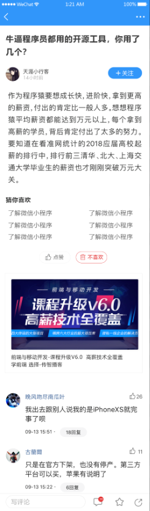

# 七、文章详情（上）



## 创建组件并配置路由

- 创建组件文件
- 配置路由
- 页面布局
- 功能编写


创建 `views/article/index.vue` 并写入以下内容：

```html
<template>
  <div class="article-container">
    <van-nav-bar
      fixed
      left-arrow
      @click-left="$router.back()"
      title="文章详情"
    ></van-nav-bar></van-nav-bar>
    <van-loading class="article-loading" />
    <div class="detail">
      <h3 class="title">{{article.title}}</h3>
      <div class="author">
        <van-image round width="2rem" height="2rem" fit="fill" :src="article.aut_photo" />
        <div class="text">
          <p class="name">{{article.aut_name}}</p>
          <p class="time">{{article.pubdate}}</p>
        </div>
        <van-button
          round
          size="small"
          type="info"
        >+ 关注</van-button>
      </div>
      <div class="content" v-html="article.content"></div>
      <div class="zan">
        <van-button round size="small" hairline type="primary" plain icon="good-job-o">点赞</van-button>
        &nbsp;&nbsp;&nbsp;&nbsp;
        <van-button round size="small" hairline type="danger" plain icon="delete">不喜欢</van-button>
      </div>
    </div>
    <div class="error">
      <p>网络超时，点击 <a href="#" @click.prevent="loadArticle">刷新</a> 试一试。</p>
    </div>
  </div>
</template>

<script>
export default {
  name: 'ArticleIndex',
  data () {
    return {
      loading: true,
      article: {
        title: 'hello world',
        content: '<p>hello hello</p>',
        aut_name: 'LPZ',
        pubdate: '4天前',
        aut_photo: 'http://toutiao.meiduo.site/FsyeQUotMscq-vji-2ZDiXrc44k5'
      }
    }
  }
}
</script>

<style scoped lang='less'>
.article-container{
  position: absolute;
  left: 0;
  top: 0;
  overflow-y: scroll;
  width: 100%;
  height: 100%;
}
.article-loading {
  padding-top: 100px;
  text-align: center;
}
.error{
  padding-top: 100px;
  text-align: center;
}
.detail {
  padding: 50px 10px;
  .title {
    font-size: 16px;
  }
  .zan{
    text-align: center;
  }
  .author {
    padding: 10px 0;
    display: flex;
    .text {
      flex: 1;
      padding-left: 10px;
      line-height: 1.3;
      .name {
        font-size: 14px;
        margin: 0;
      }
      .time {
        margin: 0;
        font-size: 12px;
        color: #999;
      }
    }
  }
  .content {
    overflow: hidden;
    white-space: pre-wrap;
    word-break: break-all;
    /deep/ img{
      max-width:100%;
      background: #f9f9f9;
    }
  }
}
</style>

```

然后在 `router/index.js` 中新增路由配置项：

```js
{
  name: 'article',
  path: '/article/:articleId',
  component: Article
},
```

然后在点击文章列表项的时候，传递文章id跳转到文章详情页：

```html
<van-cell
  v-for="article in channel.articles"
  :key="article.art_id.toString()"
  :title="article.title"
+ @click="$router.push({
+   name: 'article',
+   params: {
+     articleId: article.art_id.toString()
+   }
+ })"
>
</van-cell>
```


## 展示基本信息

这里我们主要实现两个主要功能：

- 获取展示文章详情
- 处理加载中 loading


**一、获取展示文章详情**

步骤：

- 封装接口
- 发送请求获取数据
- 模板绑定

下面是具体实现：

1、封装获取文章详情的数据接口

```js

/**
 * 获取文章详情
 */
export const getArticle = articleId => {
  return request({
    method: 'GET',
    url: `/app/v1_0/articles/${articleId}`
  })
}

```

2、在组件中调用获取文章详情

```js
import { getArticle } from '@/api/article'

data () {
  return {
  	article: {}  
  }
},
  
created () {
  this.loadArticle()
},

methods: {
  async loadArticle () {
    const { data } = await getArticle(this.$route.params.articleId)
    this.article = data.data
  }
}
```

3、模板绑定

```html
<!-- 文章详情 -->
<div class="detail" v-else-if="article.title">
+  <h3 class="title">{{ article.title }}</h3>
  <div class="author">
+    <van-image round width="2rem" height="2rem" fit="fill" :src="article.aut_photo" />
    <div class="text">
+      <p class="name">{{ article.aut_name }}</p>
+      <p class="time">{{ article.pubdate | relativeTime }}</p>
    </div>
    <van-button
      round
      size="small"
      type="info"
    >+ 关注</van-button>
  </div>
+  <div class="content" v-html="article.content"></div>
  <div class="zan">
    <van-button round size="small" hairline type="primary" plain icon="good-job-o">点赞</van-button>
    &nbsp;&nbsp;&nbsp;&nbsp;
    <van-button round size="small" hairline type="danger" plain icon="delete">不喜欢</van-button>
  </div>
</div>
<!-- /文章详情 -->
```


**二、处理加载中 loading**

需求：

- 加载中，显示 loading
- 加载成功，显示文章详情
- 加载失败，显示错误提示


步骤：

- 添加 loading 数据用来控制 loading 展示
- 在请求获取数据处理函数中处理 loading
  - 请求开始，loading = true
  - 请求结束，loading = false
- 在模板中绑定处理


下面是具体实现过程：

1、在 data 数据中添加一个属性用来控制 loading 状态

```js
data () {
  return {
    ...
    loading: true // 控制加载中 loading
  }
}
```

2、在请求获取文章详情的方法中控制处理 loading

```js
methods: {
  async loadArticle () {
+    this.loading = true
+    try {
      const { data } = await getArticle(this.$route.params.articleId)
      this.article = data.data
+    } catch (err) {
+      console.log(err)
+    }
+    this.loading = false
  }
}
```

> 注意：请求失败就会报错，报错就导致请求之后的代码不会执行了，所以这里把请求使用 try-catch 包起来

3、模板绑定

```html
<div class="article-container">
  ...

  <!-- 加载中 loading -->
+  <van-loading class="article-loading" v-if="loading" />
  <!-- /加载中 loading -->

  <!-- 文章详情 -->
+ <div class="detail" v-else-if="article.title">
    ...
  </div>
  <!-- /文章详情 -->

  <!-- 加载失败提示 -->
+  <div class="error" v-else>
    ...
  </div>
  <!-- /加载失败提示 -->
</div>
```

> 上面的判断关系是：if -> else-if -> else
>
> 如果 loading 为 true，则展示 loading
>
> 当请求结束的时候我们把 loading 设置为了 false
>
> - 成功：article 就有了 title、content 等数据
> - 失败：article 中没有任何数据
>
> 所以如果 article有title、content等成员数据就表示数据获取成功了，没有就表示请求失败了。


## 关注|取消关注

步骤：

- 封装接口
- 请求调用
- 模板处理

下面是具体实现过程：

1、封装关注用户/取消关注用户数据接口：

```js
/**
 * 关注用户
 */
export const followUser = userId => {
  return request({
    method: 'POST',
    url: '/app/v1_0/user/followings',
    data: {
      target: userId
    }
  })
}

/**
 * 取消关注用户
 */
export const unFollowUser = userId => {
  return request({
    method: 'DELETE',
    url: `/app/v1_0/user/followings/${userId}`
  })
}
```


2、给 "关注" 按钮注册点击事件，以及处理按钮的展示

```html
<!-- 关注按钮 -->
<van-button
  round
  size="small"
+  :type="article.is_followed ? 'default' : 'info'"
+  @click="onFollow"
+ >{{ article.is_followed ? '已关注' : '+ 关注' }}</van-button>
<!-- /关注按钮 -->
```


3、在关注的处理函数中

```js
onFollow () {
  const { is_followed: isFollowed, aut_id: autId } = this.article

  if (isFollowed) {
    // 已关注，取消关注
    unFollowUser(autId)
    // this.article.is_followed = false
  } else {
    // 没有关注，去关注
    followUser(autId)
    // this.article.is_followed = true
  }

  // 修改视图数据
  this.article.is_followed = !isFollowed
}
```


## 点赞|取消点赞

步骤：

- 封装接口
- 请求调用
- 模板处理


1、封装点赞/取消点赞的数据接口：

```js
/**
 * 对文章点赞
 */
export const likeArticle = articleId => {
  return request({
    method: 'POST',
    url: '/app/v1_0/article/likings',
    data: {
      target: articleId
    }
  })
}

/**
 * 取消文章点赞
 */
export const unLikeArticle = articleId => {
  return request({
    method: 'DELETE',
    url: `/app/v1_0/article/likings/${articleId}`
  })
}
```

2、注册“点赞”按钮的点击事件以及处理模板展示

```html
<van-button
  round
  size="small"
  hairline
+  :type="article.attitude === 1 ? 'default' : 'primary'"
  plain
  icon="good-job-o"
+  @click="onLike"
+ >{{ article.attitude === 1 ? '取消点赞' : '+ 点赞' }}</van-button>
```

3、处理流程如下：

```js
...

import {
  getArticle,
+  likeArticle,
+  unLikeArticle
} from '@/api/article'

methods: {
  ...
  onLike () {
    const { attitude } = this.article
    const articleId = this.article.art_id.toString()

    if (attitude === 1) {
      // 已点赞，取消点赞
      unLikeArticle(articleId)
      this.article.attitude = -1
    } else {
      // 没有点赞，去点赞
      likeArticle(articleId)
      this.article.attitude = 1
    }
  },
}

```

> 这里唯一的难点对接口属性的使用
>
> article中的 attitude：`用户对文章的态度, -1: 无态度，0-不喜欢，1-点赞`

## 不喜欢|取消不喜欢

步骤

- 封装接口
- 请求调用
- 模板处理

下面是具体实现流程：

1、封装接口

```js
/**
 * 对文章不喜欢
 */
export const addDislike = articleId => {
  return request({
    method: 'POST',
    url: '/app/v1_0/article/dislikes',
    data: {
      target: articleId
    }
  })
}

/**
 * 取消对文章不喜欢
 */
export const deleteDislike = articleId => {
  return request({
    method: 'DELETE',
    url: `/app/v1_0/article/dislikes/${articleId}`
  })
}
```

2、模板处理

```html
<!-- 不喜欢按钮 -->
<van-button
  round
  size="small"
  hairline
+  :type="article.attitude === 0 ? 'default' : 'danger'"
  plain
  icon="delete"
+  @click="onDislike"
+ >{{ article.attitude === 0 ? '取消不喜欢' : '不喜欢' }}</van-button>
<!-- /不喜欢按钮 -->
```

3、具体的请求处理函数如下：

```js
...
import {
  getArticle,
  likeArticle,
  unLikeArticle,
  addDislike,
  deleteDislike
} from '@/api/article'

methods: {
  ...
  /**
   * 对文章不喜欢/取消不喜欢
   */
  onDislike () {
    const { attitude } = this.article
    const articleId = this.article.art_id.toString()

    if (attitude === 0) {
      // 已不喜欢，取消不喜欢
      deleteDislike(articleId)
      this.article.attitude = -1
    } else {
      // 没有不喜欢，去不喜欢
      addDislike(articleId)
      this.article.attitude = 0
    }
  }
}
```

4、测试。


