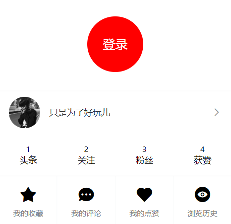

# 九、我的


## 准备

1、创建组件

```html
<template>
  <div class="my">我的页面</div>
</template>

<script>
export default {

}
</script>

<style>

</style>

```


2、配置路由

```js
...
import My from '@/views/my'

const router = new VueRouter({
  // 配置路由表
  routes: [
    ...
    {
      // 嵌套路由如果有默认子路由，则不需要 name
      // name: 'tabbar',
      path: '/',
      component: Tabbar,
      children: [
        ...
        {
          name: 'my',
          path: '/my', // 默认子路由
          component: My
        }
      ]
    }
  ]
})

export default router

```


3、处理 tabbar 组件中的导航

```html
<template>
  <div>
    <!-- 路由出口 -->
    <router-view />
    <!-- /路由出口 -->

    <!-- 底部导航栏 -->
+    <van-tabbar route>
+      <van-tabbar-item icon="home-o" to="/">首页</van-tabbar-item>
      <van-tabbar-item icon="search">问答</van-tabbar-item>
      <van-tabbar-item icon="friends-o">视频</van-tabbar-item>
+      <van-tabbar-item icon="setting-o" to="/my">我的</van-tabbar-item>
    </van-tabbar>
    <!-- /底部导航栏 -->
  </div>
</template>

<script>
export default {
  name: 'TabbarIndex'
}
</script>

<style>

</style>

```

## 布局

```html
<template>
  <div>
    <van-nav-bar
      title="个人信息"
      left-arrow
      right-text="保存"
    />
    <van-cell-group>
      <van-cell title="头像" is-link>
        <van-image
          round
          width="30"
          height="30"
          src="http://toutiao.meiduo.site/FgSTA3msGyxp5-Oufnm5c0kjVgW7"
        />
      </van-cell>
      <van-cell title="昵称" value="abc" is-link />
      <van-cell title="性别" value="男" is-link />
      <van-cell title="生日" value="2019-9-27" is-link />
    </van-cell-group>
  </div>
</template>

<script>
export default {
  name: 'UserIndex'
}
</script>

```


## 处理已登录和未登录的显示状态

一、tabbar 中的文字显示


- 已登录，显示“我的“
- 没有登录，显示“未登录”

```html
<template>
  <div>
    <!-- 路由出口 -->
    <router-view />
    <!-- /路由出口 -->

    <!-- 底部导航栏 -->
    <van-tabbar route>
      <van-tabbar-item icon="home-o" to="/">首页</van-tabbar-item>
      <van-tabbar-item icon="search">问答</van-tabbar-item>
      <van-tabbar-item icon="friends-o">视频</van-tabbar-item>
      <van-tabbar-item
        icon="setting-o"
        to="/my"
      >
+        {{ $store.state.user ? '我的' : '未登录' }}
      </van-tabbar-item>
    </van-tabbar>
    <!-- /底部导航栏 -->
  </div>
</template>

<script>
export default {
  name: 'TabbarIndex'
}
</script>

<style>

</style>

```

二、处理我的页面中几个元素的显示状态



- 未登录，显示上面的圆圈儿
- 已登录，显示下面的用户信息

```html
<!-- 未登录 -->
+ <div class="not-login" v-if="!$store.state.user">
  ...
</div>
<!-- /未登录 -->

<!-- 用户信息 -->
+ <van-cell-group class="user-info" v-else>
  ...
</van-cell-group>
<!-- /用户信息 -->
```


## 展示用户信息

步骤：

- 封装接口
- 请求获取数据
- 处理模板

下面是具体实现流程：

1、封装接口

```js
/**
 * 获取用户自己信息
 */
export const getSelf = () => {
  return request({
    method: 'GET',
    url: '/app/v1_0/user'
  })
}
```

2、请求获取数据

```js
+ import { getSelf } from '@/api/user'

export default {
  name: 'UserIndex',
  data () {
    return {
+      user: {} // 用户信息对象
    }
  },

+  created () {
+    this.loadUser()
+  },

  methods: {
+    async loadUser () {
+      const { data } = await getSelf()
+      this.user = data.data
+    }
  }
}
```

3、模板绑定

```html
<!-- 用户信息 -->
<van-cell-group class="user-info" v-else>
  <van-cell class="base-info" is-link :border="false">
    <div slot="title">
      
+      <span class="title">{{ user.name }}</span>
    </div>
  </van-cell>
  <van-grid class="data-info" :border="false">
    <van-grid-item>
+      <span class="count">{{ user.art_count }}</span>
      <span class="text">头条</span>
    </van-grid-item>
    <van-grid-item>
+      <span class="count">{{ user.follow_count }}</span>
      <span class="text">关注</span>
    </van-grid-item>
    <van-grid-item>
+      <span class="count">{{ user.fans_count }}</span>
      <span class="text">粉丝</span>
    </van-grid-item>
    <van-grid-item>
+      <span class="count">{{ user.like_count }}</span>
      <span class="text">获赞</span>
    </van-grid-item>
  </van-grid>
</van-cell-group>
<!-- /用户信息 -->
```

最后测试。

