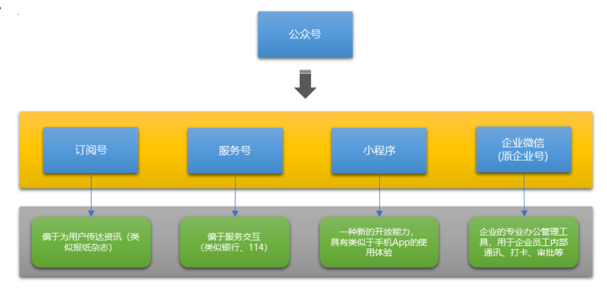
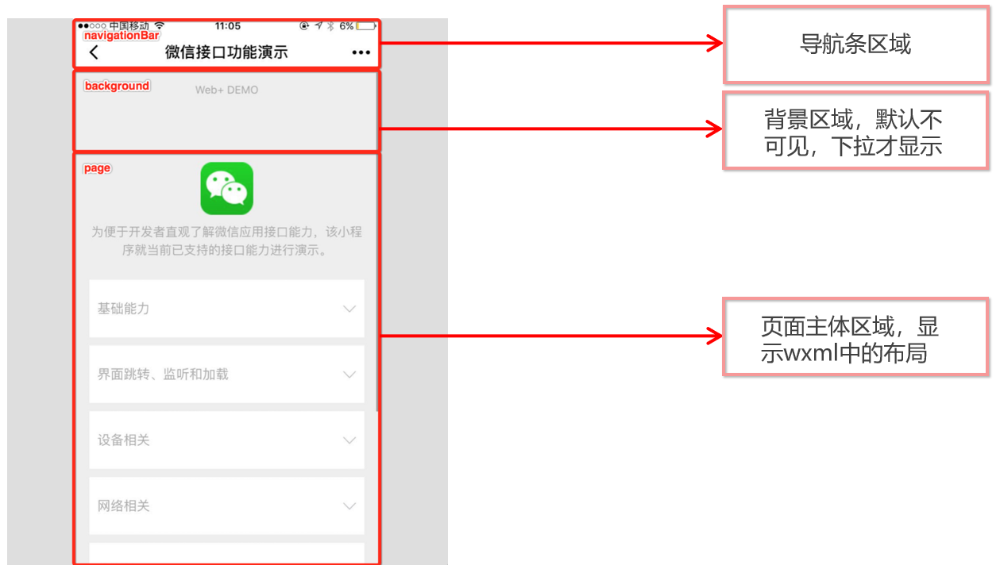

#### 小程序基础 第一天

---

小程序阶段前三天主要是小程序基础知识和wepy框架的基本使用、后面五天通过项目来实现小程序开发

#### 今日目标

+ 了解什么是微信开放平台和微信公众平台
+ 能够知道App和小程序的区别
+ 能够注册小程序账号并使用小程序开发者工具
+ 能够知道小程序项目的基本结构
+ 能够使用小程序常用的组件
+ 能够使用wxss美化页面
+ 能够配置小程序外观
+ 能够配置小程序的tabbar
+ 能够知道小程序的生命周期

####  01--小程序基本概念介绍

##### 微信开发的概述(能够描述出来)

###### 001 - 什么是微信开发

> 微信软件除了提供聊天还提供了例如：支付、分享、收藏、人工智能等功能，同时微信还对外开放了很多的接口与能力，程序员基于这些功能和接口进行的开发，叫做微信开发
>

###### 002 - 为什么要学习微信开发

- 企业开发的需要
- 个人的发展以及技能的提升

---

##### 了解微信开放平台(了解即可)

> 微信开放平台是微信对外提供**微信开放接口**的一个平台，这些开发出来的微信接口，供**第三方的网站**或**App**使用

###### 001  - 微信开放平台

平台登录地址：[微信开放平台](https://open.weixin.qq.com/)

###### 002 - 微信开放平台提供的能力

- 微信分享

- 微信支付

- 微信登录

- 微信收藏

- ……等等

    

  ​

###### 003 - 谁会使用微信开放平台

- 网站应用开发(第三方网站)
- 移动应用开发(例如第三方`App`)
- 后台人员

###### 004 - 资质认证相关知识

-  只有通过 开发者资质认证后，才能使用开发平台提供的能力
-  个人名义无法申请资质认证，必须是公司或者一个团体才可以申请
-  只有企业类型的主体，才能申请资质认证

---

##### 微信公众平台(了解即可)

###### 001、微信公众平台

1.  微信公众平台

    是运营者通过公众号这个媒介，为微信用户提供咨询和服务的平台 

2.  微信公众平台开发

    指基于微信公众号进行的业务开发

3.  [平台登录地址](https://mp.weixin.qq.com/)

###### 002、微信公众平台的账号分类

> 微信公众平台的账号统称为公众号



###### 003、如何选择自己的公众号类型

-  订阅号 -- 简单的发送消息，达到宣传效果，建议选择订阅号
-  服务号 -- 想用公众号获得更多的功能、提供更多的服务，例如开通微信支付，建议选择服务号
-  小程序 -- 想提供类似于手机 `App` 的服务体验，建议选择小程序
-  企业微信(原企业号) -- 想用来管理内部企业员工、团队，对内使用，进行以选择企业微信(原企业号)

---

##### 开放平台和公众平台的区别(理解记忆)

###### 001、开放平台

-  是微信对外开放 `API` 接口的平台
-  开放的 `API` 接口，供第三方网站和 `App` 调用
-  后端程序员是开放平台开发的主力军

###### 002、公众平台

-  是基于微信公众号，为微信用户提供服务的平台
-  所用公众号，都属于微信内开发
-  前端程序员是公众平台开发的主力军

---

##### 认识小程序

###### 001、什么是小程序

> 微信小程序是一种全新的连接用户和服务的媒介，它可以在微信内被便捷地获取和传播，同时具有出色的使用体验

- 小程序的特点： 体积小、方便获取与传播
- 小程序的理念： 用完即走

###### 002、 小程序出现的目的

-  拦截微信用户流量入口，用户的大多数应用需求，都可以才能够微信小程序中得到满足

###### 003、 小程序和订阅号、服务号的区别

-  发布时间不同
  - 2012-07 公众平台发布
  - 2017-01  小程序发布
-  入口方式不同
  -  订阅号、服务号是作为微信联系人存在的 

     

  -  小程序有自己的独立入口

     
-  体验效果不同
  -  订阅号、服务号体验差、无法提供类似于 `App` 的体验
  -  小程序模拟了手机 `App` 的体验，更人性化

###### 004、小程序适合的业务场景

- 适合做用完即走的应用
  -  例如： 点外卖、打车、代驾、共享单车等
- 不适合做重度依赖的应用
  -  例如：大型手机游戏类、音乐播放器等

###### 005、小程序和传统手机 `App` 的区别

-  开发原理不同
  - `App` ： 基于手机操作系统提供的 `API` 进行开发
  - 小程序：基于微信提供的 `API` 进行开发 
-  运行方式不同
  -  `App`：  直接安装并运行在手机操作系统之上
  -  小程序：必须基于手机微信才能安装和运行

 


---

##### 注册小程序账号

+ [微信公众平台](https://mp.weixin.qq.com/) 

+ 点击右上角立即注册

+ 选择账号类型：选择小程序

+ 填写账号基本信息（邮箱不能注册过公众号）

+ 进入邮箱激活

+ 最后一步信息登记，主体类型选择个人，然后登记信息

  

  ​

+ 登陆该账号进入自己的公众平台

---

##### 小程序基本信息设置

1.  登录小程序账号 --> 设置 --> 基本设置

---

##### 小程序账号的开发设置

1.  登录小程序账号 --> 开发 --> 开发设置
2.  既可以查看到在实际开发中需要获取以及设置的开发者ID

---

##### 小程序账号的成员管理

###### 001 - 成员管理的概念

1.  一个团队进行小程序开发，那么团队成员的身份管理是很有必要的
2.  管理员可在小程序管理后台统一管理项目成员、设置项目成员的权限

###### 002 - 权限说明

1.  运营者权限
   - 管理、推广、设置等模块权限，可使用体验版小程序
2.  开发者权限
   -  开发模块权限，可使用体验版小程序、开发者工具（`IDE`）
3.  数据分析者(基础分析)
   - 统计模块权限，可使用体验版小程序

###### 003 - 添加方式

1.  登录小程序账号 --> 管理 --> 成员管理 -- 项目成员 -- 点击向下的箭头

#### 02 - 创建小程序

##### 创建基本的小程序

+ 下载开发者工具并安装[开发者工具下载地址](https://developers.weixin.qq.com/miniprogram/dev/devtools/download.html)
+ 利用开发者工具创建小程序
  + 打开小程序开发者工具，用微信扫码登录开发者工具
  + 点击左侧菜单中的小程序选项
  + 点击+号新建小程序项目
  + 填写项目名称
  + 选择项目存放路径（必须选择空目录）
  + 填写 `AppID`
  + 点击新建按钮


+ 预览小程序

##### 介绍开发者工具界面和项目结构 

+ 开发者工具主界面，从上到下，从左到右，分别为五大部分：
  + 菜单栏
  + 工具栏
  + 模拟器
  + 编辑器
  + 调试器


+ 小程序项目的结构

```javascript
├── pages ······································ 【目录】存放所有的小程序页面
│   │── index ···································· 【目录】index 页面
│   │   ├── index.wxml ······························· 【文件】 index 页面的结构
│   │   ├── index.js ································· 【文件】 index 页面的逻辑
│   │   ├── index.json ······························· 【文件】 index 页面的配置
│   │   └── index.wxss ······························· 【文件】 index 页面的样式
│   └── logs ····································· 【目录】 logs 页面
│       ├── logs.wxml ································ 【文件】 logs 页面的结构
│       └── logs.js ·································· 【文件】 logs 页面的逻辑
└── utils ······································ 【目录】 存放小程序中用到的工具函数
├── app.js ····································· 【文件】 小程序逻辑
├── app.json ··································· 【文件】 小程序的公共配置
├── app.wxss ··································· 【文件】小程序公共样式表
├── project.config.json ························ 【文件】 开发工具配置文件
```

+ 小程序页面和 `Vue` 组件的对比
  + 每个 `.vue` 文件，是由 `template` 模板结构、`script` 行为逻辑、`style` 样式三部分组成的
  + 每个小程序页面，是由 `.wxml` 结构、`.js` 逻辑文件、`.json` 配置、`.wxss` 样式表这四部分组成的


+ 小程序页面中每个文件的作用
  + `.wxml` : 用来描述当前这个页面的标签结构，同时提供了类似于 `Vue` 中指令的语法
  + `.js` : 用来定义当前页面中用到的数据、交互逻辑和响应用户的操作
  + `.json` : 用来定义当前页面的个性化配置，例如，为每个页面单独配置顶部颜色、是否允许下拉刷新等
  + `.wxss` : 用来定义样式来美化当前的页面

##### 创建小程序页面作为首页

- 在 `pages` 目录上右键，选择 “新建目录”，输入目录名称
- 在新建的目录上，再次右键，选择 “新建 `page`” ，输入 页面 名称

注意：

- 输入 页面名称以后，会自动创建四个文件
- 修改小程序项目的默认首页
  + 打开 `app.json` 全局配置文件，找到 `pages` 节点。这个 pages 节点是一个数组，存储了项目中所有页面的访问路径。其中，`pages` 数组中第一个页面路径，就是小程序项目的默认首页。
  + 所以只需要修改 pages 数组中路径的顺序，就可以可修改小程序的默认首页。

#### 03 - 常用组件的基本使用

小程序提供了丰富的基础组件给开发者，开发者可以像搭积木一样，组合各种组件拼接称自己的小程序 <br />

小程序中的组件，就像 `HTML` 中的 `div` 、`p`、`span` 等标签的作用一样，用于搭建页面的基础结构

##### text文本组件的用法

###### 001 - text 组件的属性

|     属性     |   类型    |  默认值  |  必填  |                说明                |
| :--------: | :-----: | :---: | :--: | :------------------------------: |
| selectable | boolean | false |  否   |              文本是否可选              |
|   space    | string  |   .   |  否   | 显示连续空格，可选参数：`ensp`、`emsp`、`nbsp` |
|   decode   | boolean | false |  否   |               是否解码               |

**注： [text 组件详细文档](https://developers.weixin.qq.com/miniprogram/dev/component/text.html)**

- `text` 组件相当于行内标签、在同一行显示
- 除了文本节点以外的其他节点都无法长按选中

###### 002 - 代码案例

```html
<view>
  <!-- 长按文本是否可选 -->
  <text selectable='true'>来了老弟</text>
</view>

<view>
  <!-- 显示连续空格的方式 -->
  <view>
    <text space='ensp'>来了  老弟</text>
  </view>
  <view>
    <text space='emsp'>来了  老弟</text>
  </view>
  <view>
    <text space='nbsp'>来了  老弟</text>
  </view>
</view>

<view>
  <text>skyblue</text>
</view>

<view>
  <!-- 是否解码 -->
  <text decode='true'>&nbsp; &lt; &gt; &amp; &apos; &ensp; &emsp;</text>
</view>
```

------

##### view视图容器组件的用法

> View 视图容器， 类似于 HTML 中的 div

###### 001 - 组件的属性


**注：[View 的详细文档](https://developers.weixin.qq.com/miniprogram/dev/component/view.html)**

###### 002 - 代码案例

```html
<!-- hover-class设置点击之后的样式类名 -->
<!-- hover-start-time="2000" 设置点击之后延迟2000毫秒出现效果 -->
<!-- hover-stay-time='2000' 设置松开手指保持的时间 -->

<view class="box2" hover-class="box2_active">
  <view class='box1' hover-class='active' hover-stop-propagation hover-start-time="2000" hover-stay-time='2000'>

  </view>
</view>
```

------

##### button按钮组件的用法

###### 001 - 组件的属性

|   属性名    |   类型    |   默认值   |        说明         |
| :------: | :-----: | :-----: | :---------------: |
|   size   | String  | default |       按钮的大小       |
|   type   | String  | default |      按钮的样式类型      |
|  plain   | Boolean |  false  |   按钮是否镂空，背景色透明    |
| disabled | Boolean |  false  |       是否按钮        |
| loading  | Boolean |  false  | 名称是否带 loading t图标 |

**注：[Button 组件的详细文档](https://developers.weixin.qq.com/miniprogram/dev/component/button.html)**

- `button` 组件默认独占一行，设置 `size` 为 `mini` 时可以在一行显示多个

###### 002 - 案例代码

```html
<button size='mini' type='primary'>前端</button>

<button size='mini' type='default' disabled='true'>前端</button>

<button size='mini' type='warn' loading='true'>前端</button>
```

------

#### 04 - 其他组件的使用及wxss和rpx的使用

##### input文本输入框组件的用法

###### 001 - input 组件属性

|     属性名     |   类型    |  默认值   |          说明           |
| :---------: | :-----: | :----: | :-------------------: |
|    value    | String  |   .    |       输入框的初始内容        |
|    type     | String  | 'text' |       input 的类型       |
|  password   | Boolean | false  |        是否是密码类型        |
| placeholder |  Sting  |   .    |       输入框为空时占位符       |
|  disabled   | Boolean | false  |         是否禁用          |
|  maxlength  | Number  |  140   | 最大输入长度，设置 -1 时不限制最大长度 |

**注：[input 组件的详细文档](https://developers.weixin.qq.com/miniprogram/dev/component/input.html)**

###### 002 - 案例代码

```html
<input placeholder='111' type='idcard' />
```

------

##### image图片组件的用法

###### 001 - image 组件常用的属性

- `src` --  支持本地和网络上的图片
- `mode` -- 指定图片的裁剪、缩放的模式 
  + aspectFit：会保持比例缩放，长边能够完全的显示出来
  + aspectFill：会保持比例缩放，短边能够完全的显示出来，长边会被裁剪

**注意：[image 图片组件详细文档](https://developers.weixin.qq.com/miniprogram/dev/component/image.html)** 

- image 组件默认的宽度是 `300px` 、`高度是225px`

###### 002 - 案例代码

```html
<!-- image组件 -->
<image mode="aspectFit" src="http://destiny001.gitee.io/image/cxk.gif"></image>
<image mode="aspectFill" src="/assets/cxk.gif"></image>
```

------

##### wxss的基本使用

+ 初识wxss
  + `WXSS` 是一套样式语言，用来决定 `WXML` 的组件应该怎么显示
  + `wxss` 具有 `css` 大部分特性
  + `wxss` 对 `css` 进行了扩充以及修改，以适应微信小程序的开发
+ 002 - `wxss` 和 `css` 的区别
  + 尺寸单位
  + 样式导入


​	**注：[wxss 详细文档](https://developers.weixin.qq.com/miniprogram/dev/framework/view/wxss.html)**

+ 001 - `wxss` 目前支持的选择器

  + 标签选择器
  + id选择器
  + class选择器
  + 伪类选择器
  + data-*属性选择器(与之前我们学过的属性选择器有区别)
  + :nth-of-type() 等常用的 css3 选择器
  + 其他…

  **注： [wxss详细文档](https://developers.weixin.qq.com/miniprogram/dev/framework/view/wxss.html)**


+ 案例代码

```css
view{
  color: #8B3A3A;
}

#myText{
  color: green;
}

.myText {
  color: blue;
}

.myText::before{
  content: '我是左边的小翅膀'
}

.myText::after{
  content: '我是右边的小翅膀'
}

[data-color="pink"] {
  color: pink;
}


view:nth-of-type(5) {
  background: red;
}
```

##### import 样式导入

###### 001 - 语法解释

- 使用 `@import` 语句可以导入外联样式表
- 语法格式：`@import "wxss 样式表文件的相对路径"`

###### 002 - 案例代码

```css
@import "/assets/common/common.wxss";
/* @import "../../assets/common/common.wxss"; */

.box {
  width: 375rpx;
  height: 375rpx;
  background-color: skyblue;
}
```

------

##### 全局样式和局部样式

###### 001 - 局部样式

- 在 `page` 的 `wxss` 文件中定义的样式为局部样式，只作用在对应的页面，并会覆盖 `app.wxss` 中相同的选择器。

###### 002 - 全局样式

- 定义在 `app.wxss` 中的样式为全局样式，作用于每一个页面。

**注：[wxss 详细文档](https://developers.weixin.qq.com/miniprogram/dev/framework/view/wxss.html)**

------

##### rpx尺寸单位的使用

`rpx`： 是微信小程序独有的，解决屏幕自适应的尺寸单位

- 可以根据屏幕宽度进行自适应，不论屏幕大小，规定屏幕宽为 `750rpx`

- 通过 `rpx` 设置元素和字体的大小，小程序在**不同尺寸**的屏幕上，**可以实现自动适配**

- rpx之间的换算

  以 `iPhone6` 为例，`iPhone6`  的屏幕宽度为 `375px` ，共有 750 个物理像素，则 `750rpx` = `375px` = `750` 物理像素

  也就是 **`1rpx` = `0.5px` = `1 物理像素`** 

|       设备       | `rpx` 换算 `px` (屏幕宽度/750) | `px` 换算 `rpx` (750/屏幕宽度) |
| :------------: | :----------------------: | :----------------------: |
|   `iPhone5`    |    `1rpx` = 0.42`px`     |    `1px` = `2.34rpx`     |
|   `iPhone6`    |     `1rpx` = `0.5px`     |      `1px` = `2rpx`      |
| `iPhone6 Plus` |    `1rpx` = `0.552px`    |    `1px` = `1.81rpx`     |

​	那么也就是说：如果在`iPhone6`上，

​	如果要绘制宽`100px`，高`20px`的盒子，换算成`rpx`单位，

​	宽高分别为 `200rpx` 和 `40rpx`

+ `rpx` 和 `iPhone6` 设计稿的关系

  官方建议：开发微信小程序时，设计师可以用 `iPhone6` 作为视觉稿的标准。

  如果要根据 `iPhone6` 的设计稿，绘制小程序页面，可以直接把单位从 `px` 替换为 `rpx` 。

  因为一般设计稿都是二倍图，例如：在一个为`iPhone6` 的二倍图的设计稿上有一个宽为300px的盒子，那么我们在写出效果的时候，希望这个盒子在`iPhone6` 展示出来的大小为150px，那么此时我们就可以将这个盒子的大小设置成300rpx，因为300rpx最后在`iPhone6` 展示出来的就是150px

  总结：在二倍图的`iPhone6` 设计稿上rpx直接设置成设计稿的大小

  例如，假设 `iPhone6` 设计稿上，要绘制一个 宽高为 `200px` 的盒子，换算为 `rpx` 为 `200rpx`。

#### 05-配置小程序的外观

------

##### `app.json` 配置文件

> 小程序根目录下的 `app.json` 文件用来对微信小程序进行全局配置，
>
> 它决定了页面文件的路径、窗口表现、设置多 tab 等。

1. 在 `app.json` 配置文件中，最主要的配置节点是：
   - `pages` 数组：配置小程序的页面路径
   - `window` 对象：用于设置小程序的状态栏、导航条、标题、窗口背景色
   - `tabBar` 对象：配置小程序的tab栏效果

**注：[全局配置详细文档](https://developers.weixin.qq.com/miniprogram/dev/framework/config.html#全局配置)**

------

##### `pages` 数组的用法

> `app.json` 中的 `pages` 数组，用来配置小程序的页面路径

###### 001 -  基础配置

- `pages` 用于指定小程序由哪些页面组成，每一项都对应一个页面的 路径+文件名 信息。
- 文件名不需要写文件后缀，框架会自动去寻找对应位置的 `.json`、 `.js`、 `.wxml` 和 `.wxss` 四个文件进行处理。

###### 002 -  创建页面的另一种方式

- 打开 `app.json` --> `pages` 数组节点 --> 新增页面路径并保存 --> 自动创建路径对应的页面

**注意事项：**

- 数组的第一项代表小程序的小程序的初始页面也就是首页
- 小程序中新增/减少页面，都需要对 pages 数组进行修改，否则在运行小程序时就会报错

**注：[全局配置详细文档](https://developers.weixin.qq.com/miniprogram/dev/framework/config.html#全局配置)**

------

##### 小程序窗口的组成部分

**常见的属性配置： [常见的属性配置](https://developers.weixin.qq.com/miniprogram/dev/reference/configuration/page.html)**




##### 通过app.json下的window配置窗口外观

+ navigationBarTitleText：设置小程序标题

- navigationBarBackgroundColor：设置导航栏背景色


- navigationBarTextStyle：设置导航栏标题颜色
- enablePullDownRefresh：全局是否开启下拉刷新功能值为布尔值
- backgroundColor：设置窗口的背景色
- backgroundTextStyle：下拉刷新加载loading的颜色
- onReachBottomDistance：设置距离底部的距离多少开启触底行为

注意： 默认距离为 `50px`，如果没有特殊需求，建议使用默认值即可

+ 在配置app.json中一定要符合json规范，例如最后一项不能有逗号

官方文档：[window配置项](https://developers.weixin.qq.com/miniprogram/dev/reference/configuration/app.html#window)

****

#### 06-tabbar的基本使用

##### `tabBar` 的概念

> `tabBar` 是移动端应用常见的页面效果，用于实现多页面的快速切换；小程序中通常将其分为底部 `tabBar` 和顶部 `tabBar`


**注意：`tabBar` 中，只能配置最少2个、最多5个 tab 页签，当渲染顶部 `tabBar` 的时候，不显示 `icon`，只显示文本**

**注： [tabbar 详细文档](https://developers.weixin.qq.com/miniprogram/dev/reference/configuration/app.html)** 

##### `tabBar` 节点的配置项

###### 001 - `tabBar` 节点的配置项

|       属性        |    类型    |  必填  |  默认值   |                    描述                    |
| :-------------: | :------: | :--: | :----: | :--------------------------------------: |
|      color      | HexColor |  是   |   .    |          tab 上的文字默认颜色，仅支持十六进制颜色          |
|  selectedColor  | HexColor |  是   |   .    |         tab 上的文字选中时的颜色，仅支持十六进制颜色         |
| backgroundColor | HexColor |  是   |   .    |            tab 的背景色，仅支持十六进制颜色            |
|   borderStyle   |  string  |  否   | black  |   tabBar 上边框的颜色， 仅支持 `black` / `white`   |
|      list       |  Array   |  是   |   .    | tab 的列表，详见 `list` 属性说明，最少 2 个、最多 5 个 tab |
|    position     |  string  |  否   | bottom |      tabBar 的位置，仅支持 `bottom`/ `top`      |
|     custom      | boolean  |  否   | false  |                自定义 tabBar                |

###### 002 - list 节点的配置项

|        属性        |   类型   |  必填  |                    说明                    |
| :--------------: | :----: | :--: | :--------------------------------------: |
|     pagePath     | string |  是   |           页面路径，必须在 pages 中先定义            |
|       text       | string |  是   |                tab 上按钮文字                 |
|     iconPath     | string |  否   |  图片路径，icon 大小限制为 40kb，建议尺寸为 81px * 81px  |
| selectedIconPath | string |  否   | 选中时的图片路径，icon 大小限制为 40kb，建议尺寸为 81px * 81px |

**注意：**

- **当 position 为 top 时，不显示 icon。**

##### 页面配置

###### 001 - 页面配置和局部配置的关系

- `app.json` 中的 `window` 节点，可以全局配置小程序中每个页面的窗口表现；
- 如果某些小程序页面，想要拥有特殊的窗口表现，此时，“页面级别的 `.json` 配置文件”就可以实现这种需求；

**注意：页面级别配置优先于全局配置生效**

##### 生命周期的概念

生命周期（Life Cycle）是指一个对象从 创建 -> 运行 -> 销毁 的整个阶段，强调的是一个时间段。

- 应用生命周期：特指小程序从启动 --> 运行 --> 销毁的过程；
- 页面生命周期：特指小程序中，每个页面的加载 --> 渲染 --> 销毁的过程；

**注意：页面的生命周期范围较小，应用程序的生命周期范围较大**


##### 程序生命周期函数

小程序框架提供的内置函数，会伴随着生命周期，自动按次序执行

- 应用生命周期函数

- 页面生命周期函数

- 生命周期函数的作用：

  允许程序员在特定的生命周期时间点上，执行某些特定的操作。

  **注意：生命周期强调的是时间段，生命周期函数强调的是时间点。**

###### 001 - 应用生命周期函数

`app.js` 是小程序执行的入口文件，在 `app.js` 中必须调用 `App()` 函数，且只能调用一次。其中，`App()` 函数是用来注册并执行小程序的。`App(Object)` 函数接收一个 `Object` 参数，可以通过这个 `Object` 参数，指定小程序的生命周期函数。

+ 应用的生命周期函数
  + onLaunch：小程序初始化了（只会执行一次）
  + onShow：小程序页面显示出来了（执行多次）
  + onHide：页面隐藏了（多次触发）
  + onError：小程序出现了异常

###### 002 -页面生命周期函数

每个小程序页面，必须拥有自己的 `.js` 文件，且必须调用 `Page()` 函数，否则报错。其中 `Page()` 函数用来注册小程序页面。

`Page(Object)` 函数接收一个 `Object` 参数，可以通过这个 `Object` 参数，指定页面的生命周期函数。

+ 页面生命周期
  + onLoad：页面开始加载了
  + onShow：页面显示了
  + onReady：页面渲染完成了
  + onHide：页面隐藏了
  + onUnload：监听页面卸载


##### 数据绑定

###### 001  - 如何定义页面的数据

- 小程序每个页面，是由 4 部分组成，其中 `.js` 文件内可以定义页面的数据、生命周期函数、其他业务逻辑
- 如果要在 `.js` 文件内定义页面的数据，只需把数据定义在 `data` 节点下即可

###### 002 - `Mustache` 语法格式

> 把 `data` 中的数据绑定到页面中渲染，使用 `Mustache` 语法(双大括号) 将变量包裹起来即可

```html
<view>{{ info }}</view>
```

- `Mustache` 语法的主要场景
  - 绑定内容
  - 绑定属性
  - 运算(三元表达式、算术运算、逻辑判断、字符串运算)

###### 003 - 案例代码

```html
<!-- 页面结构 -->

<!-- 绑定内容和属性 -->
<view id="item-{{id}}">{{ info }}</view>

<!-- 算数运算 -->
<view>{{ 1 + 1 }}</view>

<!-- 三元表达式 -->
<view>{{ id == 10 ? "正确" : "错误" }}</view>
```

```javascript
// 页面数据

Page({
  data: {
  	info: 'i miss you',
    id: 10,
    arr: [1, 2, 3]
  }
})
```


#####