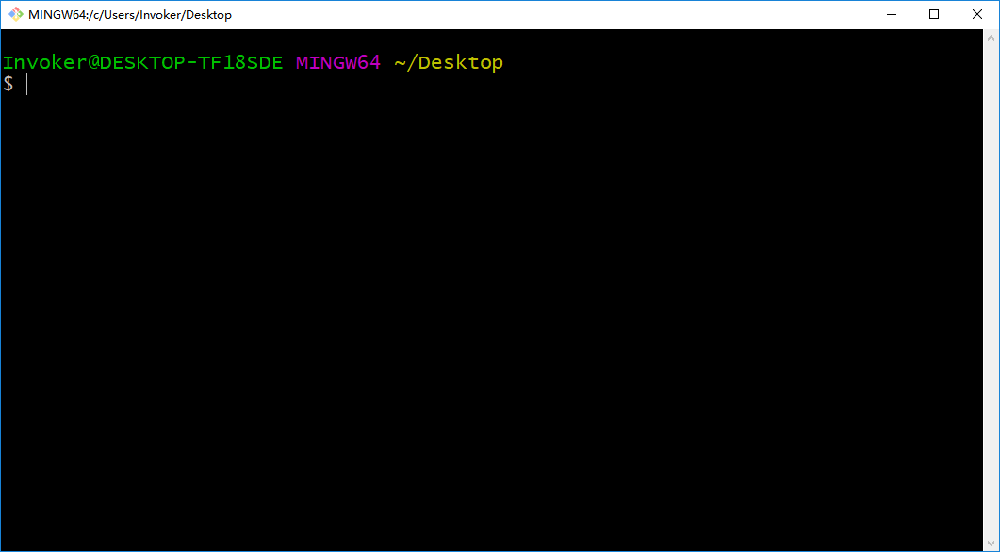

# js基础 day-01


# 介绍

* JavaScript：一门运行在**浏览器**端的**脚本 编程 语言**
* 浏览器：软件
* 脚本：戏剧的剧本。只要按照固定的流程走一遍，就可以把整部戏演完了。但是如果中间有演员出事了，戏就暂停了。这个脚本指的是JavaScript的一个特点：如果执行到某一行出错了，后面的就不会再继续执行了。
* 编程：编辑程序，编辑需要逻辑，需要脑子；
* **学习特点：首先你要分析逻辑过程；**
* 语言：有自己一套的规则（语法）和单词，把这个单词和语法组合起来，表达想表达的意思；语法没有为什么，其核心目的就是为了支持我们所理解的世界；
* 作用：
  * HTML：骨架；HTML结构；
  * CSS：皮肤；样式；
  * JS：**交互**：给骨架设计一系列能响应用户的动作，能和用户交流互动；

## 初体验

* 语法：在script标签内部写JS的代码

```js
<script>
  // JS ：交互
  document.getElementById('box').onclick = function () {  
    alert('你点击了这')
  }
</script>
```

## 引入方式

* 内嵌式：demo学习阶段的主要写法

```
<script>
  alert('hello world');
</script>
```

* 外链式：新建一个JS文件，文件里JS的代码，引入HTML页面内；作为个文件可以重复使用，项目开发阶段使用；

```js
 <script src="./01-demo.js"></script>
```

* 行内式：了解，一般不用

```js
<input type="button" value="点我" onclick="alert('helloworld')">
```


# JS 注释

- 语法：注释更好的屡清楚你的业务逻辑；不会执行

```js
// alert('hello world');  单行注释，一般就是简单的做个说明

/*
* 多行注释
* 一般把想要注释的内容写到这里面来，大段内容；不能 嵌套使用；
*/
```


# 输入输出

* 作用：交互的简单入口，可以给页面输入我们想要输入的信息，页面输出一定的信息；为了与你写的代码更好交流和调试；

* 输入：页面中弹出 输入框，需要输入内容后才能继续；开发不常用，我们只是为了配合学习；
* prompt：提示;

```
prompt("输入框的提示内容");
```

* 输出语法：

```js
// 浏览器会有个弹窗，只要不点击弹窗，后面就不会执行；alert 警告
alert('要输出的内容')  

// 在控制台输出，不阻止下面的执行。调试常用 console控制台 log 日志；！！！
console.log('要输出的内容')；  
console.log('要输出的内容',1);   可逗号隔开，输出多个值；
// 查看JS的执行情况：鼠标点击右键，或者键盘F12，看Console控制台；


// 在页面body中显示，把解析HTML结构；
document.write('<div>文字</div>')
```


# 变量

* 作用：语法的一部分，编程语言，得有一些数据；比如前面说的prompt("输入框的提示内容");，用户输入数据，变量接收；本质就是存**数据**的；
* 变量：与之对应叫常量（一直不变的量）;

## 语法

* 使用`var`这个关键字，告诉浏览器，我们要定义一个变量，使用`=`号告诉浏览器，我们要把**右边的数据存储**到**变量（单词）**里面；直接参加我们需要的计算；

```js

// 关键字var声明时 赋值
var num1 = 10;
var num2 = 20;
console.log(num1 + num2);//计算两个数字的和

// prompt 有返回值；
var pwd = prompt('请输入你的很行卡密码');
console.log(pwd);


// 过程：定义变量、变量赋值
// 变量声明 没有赋值
var a;
// 变量赋值
a = 10;


// 声明时赋值，再次改变值；
var b = 100;
b = 200;

// 变量自己给自己赋值运算
var a = 10;
// 把右侧计算的结果，赋值 给左侧
a = a + 1;
```

* 存储




## 命名

* 范围：字母、数字、下划线、$符号
* **变量名字不能用数字作为开头**

```js
// 变量不能使用数字开头
var 15a = 10;

// 会在控制台中报错：Uncaught SyntaxError: Unexpected number
// Uncaught - 未捕获的
// SyntaxError - 语法错误

// Unexpected - 意料之外的
// number - 数字
// 翻译过来就是： 这行有一个语法错误，你的数字不符合语法要求
```

* 变量名字不能使用JavaScript语法中的关键字和保留字
* 关键字：在JavaScript语法中，具有特殊意义的单词，比如我们学习过的用于声明变量的`var`；后面要学习的if else for wihle case break....

```js
// 变量名字不能使用关键字
var var = 20;
// 会在控制台中报错： Uncaught SyntaxError: Unexpected token var
// token - 标记，记号，在编程中我们翻译成 '标识符'
// 意思是这行有一个语法错误，出现了一个意料之外的标识符 var
```

* 保留字：JavaScript是不断发展的，以前的功能用了以前的关键字，将来要加入新的功能的时候，可能要用到新的关键字，所有JavaScript在一开始的时候就保留了部分单词，以便将来把保留的单词作为关键字

* 变量名字是区分大小写的；

```js
// 变量名字是区分大小写的
var a = 10;
console.log(a);// 正常输出

console.log(A);// 在控制台中报错：Uncaught ReferenceError: A is not defined
// ReferenceError - 引用错误
// not defined - 未定义
// 意思是 A 这个变量我们没有定义就使用了，可见a和A是不一样的，不是同一个变量
```

* 如何定义呢？
  * 设置和你公司业务有关系的变量，取英文的翻译
  * 使用驼峰（第一个单词的第一个字母小写，第二个单词的搜首字母大写）；getData
  * 个人习惯：get_data

```js
// 驼峰 getData
var userName = '张三';
var password = '123456';

// 个人习惯 get_data
```


## 交换值

* 交换两个变量的值：想生活中两杯水怎么把水相互换下？
* 步骤：
  * 1.新声明个变量C；
  * 2.把A变量赋值过去给C；
  * 3.把B变量给A，把C变量值给A；


## 补充

```js
//1 变量可以一次性声明多个
var a,b,c,d;

// 2 还可以声明多个的同时进行赋值；
var a = 10;
var a = 10,b = 20,c = 30;


//3 变量也可以作为另一个变量的值
var a = 10;
// 赋值给b（复制了一份）,a再次变化时，b不受影响；
var b = a;
```


# 数据类型

* 变量：用于接受数据，数据的类型不同；
* 怎么区别不同？
  * 值的大小，比如：5 6区别
  * 类型：我 、1；
* 为什么不同？生活中需要不同的类型描述不同的事情，程序源于生活又高于生活；
* 基本类型：数字（NaN）类型、 字符串类型、布尔类型、null（值）、undefined类型； 
* 复杂类型：对象Object；


# 基本类型

* 数字（NaN）类型、 字符串类型、布尔类型、null（值）、undefined类型；

## 数字(number)类型

* 所有的数字都是数字类型，如：10，99.8，-12...
* NaN：**not a number，不是某个数，泛指，不知道指哪个数，但是为数字类型；**


## 字符串(string)类型

* 语法：**一定要带引号，单双无所谓；**只要你戴上引号，就是字符串；

```js
var a = 'abc';

console.log(a);
```

* 程序中，默认把一对引号，认为就是字符串的结束；

```js
console.log("小明说:"小红明天真漂亮"");
```

* 此时会在控制台中报错： Uncaught SyntaxError: missing ) after argument list；在想要转义的字符前面加上一 `\`；

```js
// 单双引号可以相互包着，能显示；
console.log('小明说:"小红明天真漂亮'");
```

* 转译字符：把**特殊的字符**转成 JS 可以读的字符；
* 特殊的字符：`""  '' \`

```js
console.log("小明说:\"小红明天真漂亮\"");
```

## 布尔(boolean)类型

* 语法：标示某个结果，存在或者不存在（不成立、假）；只有两个值；

```js
var a = 5>4; // 存在；
console.log(a)  // 输出true,表示存在，成立；

var b = false; // 不存在
```

## null值

* 值：null用来表示尚未存在的对象（**复杂类型**）；**专门赋值为null；**
* **其实null不是简单类型，为复杂类型；这里把它归结为简单类型，只是因为它的值是单个的，为null，我们拿过来用**，先有印象；

```js
var a = null;
```

## undefined类型

* undefined类型：undefined值；
* 变量没有赋值，**也不知道是啥**，不是空；默认赋值为undefined

```js
var a;
console.log(a);// 输出undefined
```


# 查看数据类型

* 作用：不同的数据类型，参与运算结果不同；需要判断数据是什么类型；
* 语法：反应判断当前值的类型的说明；

```js
typeof 数据;
typeof(数据);

console.log(typeof 123);// number
console.log(typeof 'abc');//string

console.log(typeof null); // Object

console.log(typeof true); // boolean
console.log(typeof undefined); // undefined
```

* 案例：老板输入绩效工资，加上默认的基本工资，计算当月的工资
* 实现：
  * 使用prompt()弹出输入框，让老板输入绩效工资，
  * 使用变量接受数据；
  * 根据公式算出总的工资；
  * 告诉用户 alert()；
* 解决：
  * prompt()弹出输入框得到数据是字符串，默认的。
  * 字符串 +，**临近字符串的数据类型变为字符串；变成字符串的拼接；**
  * 需要把字符串转为数字类型；


# 数据类型转换

* 目的：数据参与运算，保证**数据类型**一致，才能得到预期的结果；


## 其他类型 转 数字类型

* 其他：字符串类型、布尔类型、null值 、undefined类型；

### Number()

* 语法：把需要转的值或者变量放入括号内部；
* 结果：肯定能转成功；
  * 数字
  * NaN

```js

var res0 = Number('abc');
console.log(res0); // 输出数字NaN


var res1 = Number('123');
console.log(res1); // 输出数字123
console.log(typeof res1); // 输出 number

var res2 = Number(true);
console.log(res2);// 输出 1
console.log(typeof res2); // 输出number

var res3 = Number(null);
console.log(res3); // 输出0
console.log(typeof res3); // 输出number

var res4 = Number(undefined);
console.log(res4); // 输出 NaN  , NaN 就是 not a  number 的缩写，表示某个结果不是某个数字
console.log(typeof res4); // 输出 number
```

### parseInt()

* 将其他类型为数字**整数**；
* 只能接受**字符串**，纯字符串、true、null、undefined都是NaN；
  * 如果**字符串前面是数字**，可以把前面的数字转化为数字类型；
  * 如果字符串中前面不是数字，转NaN；

```js
var res1 = parseInt('123');
console.log(res1); // 输出 123 
console.log(typeof res1); // 输出number

var res2 = parseInt('12a');
console.log(res2);// 输出 12
console.log(typeof res2);// 输出number

var res3 =parseInt('a123');
console.log(res3); // 输出 NaN
console.log(typeof res3); // 输出number


var res4 = parseInt('abc');  //其他 true null undefined
console.log(res4,typeof res4);  // 输出NaN
```

### parseFloat()

* parseFloat这个方法用于转换字符串转换成小数(在编程中，小数也称浮点数)
* 非数字类型只能接受**字符串**，纯字符串、true、null、undefined都是NaN；
  - 如果**字符串前面是数字**，可以把前面的数字转化为数字类型；
  - 如果字符串中前面不是数字，转NaN；

```js
var res1 = parseInt('123.123');
console.log(res1); // 输出 123.123
console.log(typeof res1); // 输出number

var res2 = parseInt('12.12a');
console.log(res2);// 输出 12.12
console.log(typeof res2);// 输出number

var res3 =parseInt('a12.3');
console.log(res3); // 输出 NaN
console.log(typeof res3); // 输出number
```

* 小结：
  * 字符串 + ：拼接 ，+  对于字符串比较特别；字符串的语法；
  * 字符串 转 数字：
    * 数字
    * NaN


## 其它类型 转 字符串类型

* 其他类型：数字类型、boolean类型、null（值）、undefined类型（值undefined）

### String()

* 特点：有引号就行了；

* 语法：转呗；反正最后就是用单双引号包起来了；

```js
var res1 = String(123);
console.log(res1);  // 输出字符串的 123
console.log(typeof res1); // 输出 string

var res2 = String(true);
console.log(res2); // 输出字符串的 true
console.log(typeof res2); // 输出 string

var res3 = String(undefined);
console.log(res3); // 输出 字符串 undefined
console.log(typeof res3);// 输出 string

var res4 = String(null);
console.log(res4); // 输出 字符串null
console.log(typeof res4); // 输出 string
```

### .toString()

* 语法：undefined和null不能使用这个方式变成字符串；因为后面undefined和null没有该方法；
* .方法：对象的方案；

```js
var res1 = (123).toString();
console.log(res1); // 输出字符串123
console.log(typeof res1); // 输出string

var res2 = true.toString();
console.log(res2); // 输出字符串true
console.log(typeof res2); // 输出string

var res3 = undefined.toString();
console.log(res3); // 报错：Cannot read property 'toString' of undefined

var res4 = null.toString();
console.log(res4); //报错： Cannot read property 'toString' of null
```


## 其它类型 转 布尔类型

* 其他类型：字符串类型、数字类型、null（值）、undefined类型（值）
* 特点：返回一个布尔值；true、false；

### Boolean(数据)

* 语法：

```js
var res1 = Boolean(123);
console.log(res1);// 输出true
console.log(typeof res1); // 输出 boolean

var res2 = Boolean('abc');
console.log(res2);// 输出true
console.log(typeof res2); // 输出 boolean

var res3 = Boolean(undefined);
console.log(res3);// 输出false
console.log(typeof res3); // 输出 boolean

var res4 = Boolean(null);
console.log(res4);// 输出false
console.log(typeof res4); // 输出 boolean
```

* 在js里面，我们在转换其它类型为布尔类型的时候，只有6个情况是false

```js
var res1 = Boolean(0);
console.log(res1); //输出false

var res3 = Boolean(NaN);
console.log(res3); //输出false


var res2 = Boolean('');// 空字符，里面啥没有，空格也没有；
console.log(res2); //输出false


var res6 = Boolean(false);
console.log(res6); //输出false


var res5 = Boolean(null);
console.log(res5); //输出false

var res4 = Boolean(undefined); 
console.log(res4); //输出false
```


# 操作符

* 数据运算：数据参加比较、运算；
* 不同的数据类型参加运算，会有问题；比如上面的 字符串+数字；
* **关注：常规需要什么；返回什么；**

## 算术操作符

* 需要：数字类型参加运算；
* 返回：就是数字类型计算的结果；

```js
// +  -  *  /  % 
// ++ --
```

### 字符串+

* **字符串+**：与字符串临近的类型，转为字符串；里面存在一个**隐式转化**；看不到的转化；
* 隐式转化：在字符串+情况下，数字隐转为字符串；
* 情况：
  * 字符串 + ；
  * +字符串；

```js
// 字符串 +
// 从左到右执行，数字相加，字符串拼接
var res3 = 10+10+"abc"+"def";
console.log(res3);  //输出 20abcdef
```

### 字符串 其他

* 字符串遇见 * / -；
* 隐式转化：字符串会转为数字，再次参加运算；

```
var res3 = '456' - 123; 
console.log(res3); // 输出 数字 333

// 'abc' 隐式转化为NaN，所有输出NaN；
var res4 = 'abc' - 123;
console.log(res4); // 输出NaN
```

* 其实字符串遇见 * / % 一样的结果；

* 自己去试：

  * 其它的类型：null（值）、undefined、Boolean自己去体验；
  * **最终都是参与了隐式转化**（只是我们看不见这个转化过程，但是实质还是这些数据被Number()；

### 自增++、自减--

* `++`自增操作符的作用是让一个数字在原来的基础上自增

```js
var a = 10;
a++;
console.log(a);// 输出11
// a++ 的过程相当于 a = a + 1

var a = 10;
++a;
console.log(a); // 输出11
```

* 区别：同理 **--**
  * **a++** : 参与运算的时候，会先用原来的值先运算，再自增；（**写在后面就后加**）
  * **++a**: 参与运算的时候，会先在原来的基础上自增，再使用新的值参与运算（**写在前面就先加**）

```js
var a = 10;
var b = a++ + 10; // 运算的时候，使用a的原来值10参与加法运算，10+10赋值给b之后，再实现a的自增
console.log(b); // 输出20
console.log(a); // 输出 11

var c = 10;
var d = ++a + 10; // 运算的时候，先执行a的自增，再使用a自增后的值11和10相加，最终结果是 11 + 10
console.log(d); // 输出21
console.log(c); // 输出11
```

* 用处：这个自增操作符会在后面学习`循环语法for`的时候会遇到；

  


## 比较操作符

* 需要：**常规：数字类型参与比较；**

* 语法：比较两个值的大小，**常规比较就是数字**
* 返回：**比较后的结果，对或错，Boolean值；标示状态成立与否；**

```js
// 语法：>  <  >=  <=
// 常规操作
4 > 5 // 输出false

// 非归操作：非数字类型要比较的话，就要隐式转换为数字；
// 类型不同：非数字类，转为数字类；
// 非常规：自己去试null 、undefined、boolean；还是会隐式转化为数字；
console.log( "abc" < 5); // 输出 false
```

---

* `==` 和 `===` 是用来比较两个数据是否相等的;
* 需要：所有类型都可以；

* 返回：对或错Boolean值；标示状态成立与否；

```js
// 语法：== 	 !=  ===  !==
```

* 区别：
  * `==` 
    * **同类型：比较值是否一样；特别NaN==NaN  false**
    * **不同类型：转为数字类型，看值是否一样；**
  * `===` 
    * **同类型：再看值；**
    * **不同类型：false**;

```js
// 同类型：比值；返回都是true
console.log(11 == 11);
console.log("abc" == "abc");
console.log(null == null);
console.log(undefined == undefined);

// 同类型：特别的NaN，返回false
console.log(NaN==NaN)  

// 不同类型：非数字类转数字，
console.log("11" == 11);  // true，所以为true;


// 下面的为了解：有精力的同学可以啃下；目前不是我们的重点；
// 不同类型：特别的null 、undefined
// undefined和null与其他数在进行相等判断时不进行类型转换。
console.log(null==0)         //false
console.log(0 == undefined); //false

// ECMAScript认为undefined是从null派生出来的，所以把它们定义为相等的;
console.log(null==undefined)  // true
```

* 拓展：[JS中Null与Undefined的区别](https://www.cnblogs.com/dyh-air/articles/7943295.html)
* `!=` 和`!==` 是比较两个数据是否不相等的；

```js
// 输出 false ,比较两个数据的值是否不相等, 此时两个数据的 值 都 4 ，相等，结果是 false
console.log('4'!= 4); 

// 输出 true ，比较两个数据的类型和值是否不相等，此时两个数据的类型不相等，结果是 true
console.log('4'!== 4); 
```


## 逻辑操作符

* 语法：&&  ||  ！

* 需要：
  * 常规：左右两边需要 true 或 false，**布尔类型的值进行逻辑判断，**
  * 非常规：需要转Boolean值；
* **返回：用Boolean值进行逻辑判断后，把最后一个成立或不成立的结果返回；**

* `&&` 且：所有条件都要满足的情况下；

```js
true&&true  //true;
true&&false    //false;

1&&2   // 2;


console.log("abc"&&1);  
console.log(null&&0);
```

* 特点：遇见有一个false，那么就直接返回false;

```js
// 用户在登录的时候要用户名和密码同时正确才能登录
var userName = prompt('请输入用户名');
var password = prompt('请输出密码');
console.log(userName === 'admin' && password === '123456');
// 只有 && 两边的 结果都是 true ，最终结果返回最后一个成立的结果；
```

---

* `||` 或：只要你有满足的条件就行；

* 特点：只有有一个true，那么就直接返回是true的这个结果;

```js
// 只要年龄小5岁 或者 身高小于120cm 就可以免费乘坐
var age = parseInt(prompt('请输入你的年龄'));
var height = parseFloat(prompt('请输入你的身高'));
console.log(age < 5 || height < 120);
// || 或者：两边的结果有一个是true，最终结果就是true
```

* `!` ：去反；常规Boolean值去反；不要去玩非常规了，没有意义；

```js
var res = true;
console.log(!res);
```


## 赋值运算符

* 语法：给变量赋值；

```js
var a = 1;

// 配合算术运算符在里面；
+=  -=  *=  /=  %=
```

* `+=` 的作用是简写加法，有**运算**在里面的赋值；

```js
// = 的作用就是把右边的结果赋值(存储)给左边的变量之类的容器
var a = 10;

// 相当于是 a = a + 2; 就是一个简写的语法
// -=   *=   /=   %= 除了运算规则不同，作用是一样的，都是简写
a += 2; 
console.log(a); // 输出12

// 非常规
var a = 'cc';
a +=2;
```


## 优先级

* 大致优先级：
  * 括号先算
  * 其次算算术：++a优先;
  * 再次算比较  > ==
  * 然后算逻辑 && ||
  * 最后算赋值 =

* 观察代码

```javascript
var a = 200 === (10 + 10) * 10 > 1;

// 先算括号
200===20*10>1

// 在算计算
200===200>1

// 再算比较，算左侧；
true>1;

// 比较
1>1;

// false
console.log(a); 
```

* 具体计算优先级

```javascript
1. 第一优先级： [] . ()
2. 第二优先级： ++ -- !
3. 第三优先级： *  /  %
4. 第四优先级： +  -
5. 第五优先级： >   >=   <   <=
6. 第六优先级： ==   !=    ===    !==  
7. 第七优先级： &&
8. 第八优先级： || 
9. 第九优先级： = += -= *= /= %=  
```

